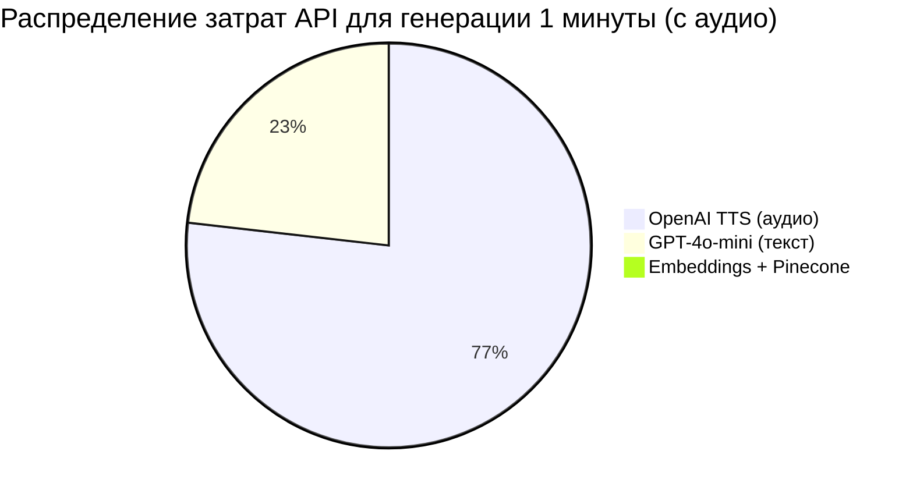
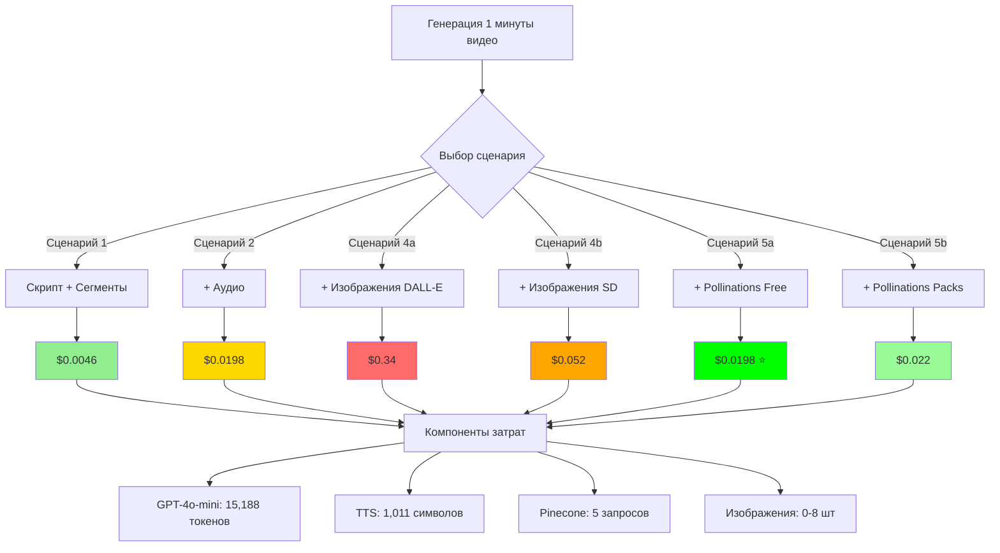
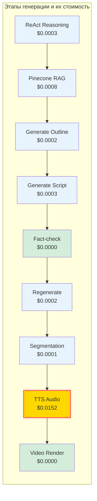
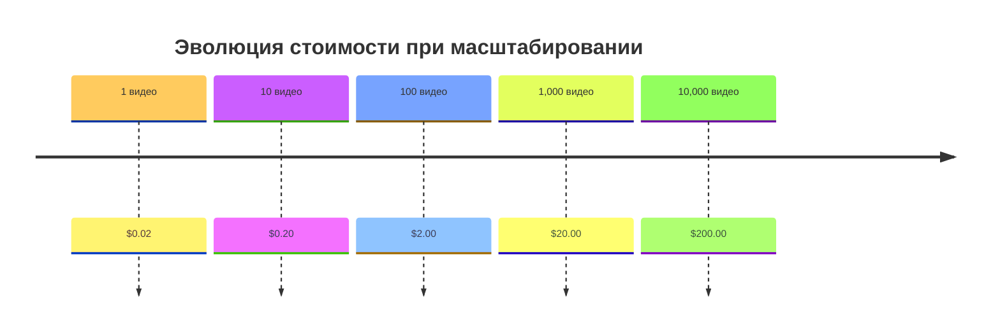
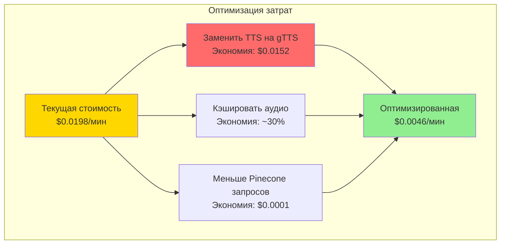

## API Pricing Comparison

| API Service | Unit | Price | Usage per 1min | Cost |
|------------|------|-------|----------------|------|
| **GPT-4o-mini (input)** | 1M tokens | $0.150 | 10,632 tokens | $0.0016 |
| **GPT-4o-mini (output)** | 1M tokens | $0.600 | 4,556 tokens | $0.0027 |
| **OpenAI TTS-1** | 1K chars | $0.015 | 1,011 chars | $0.0152 |
| **Cohere Embeddings** | 1M tokens | $0.100 | 2,560 tokens | $0.0003 |
| **Pinecone Queries** | 1M requests | $0.200 | 5 requests | $0.0000 |
| **Pollinations Z-Image-Turbo** ⭐ | 1 image | 0.002 pollen | 8 images | **$0.00*** |
| **Pollinations P-Image-Edit** | 1 image | 0.01 pollen | 8 images | **$0.00*** |
| **DALL-E 3** (optional) | 1 image | $0.040 | 8 images | $0.3200 |
| **Stable Diffusion** (alt.) | 1 image | $0.004 | 8 images | $0.0320 |

**Total Standard (with audio):** $0.0198  
**Total with Pollinations Free:** $0.0198 ⭐ (бесплатные начисления)  
**Total with Pollinations Packs:** $0.022 (при покупке pollen)  
**Total with SD images:** $0.0518  
**Total with DALL-E images:** $0.3398

\**При использовании бесплатных начислений (Flower tier: 0.4 pollen/hr = 200 images/hr)*

## Cost Breakdown by Component

```
Сценарий 2 (Скрипт + Сегменты + Аудио):
────────────────────────────────────────────────

1. Text Generation (GPT-4o-mini)
   ├─ ReAct Reasoning          $0.0003
   ├─ Pinecone RAG             $0.0008
   ├─ Outline Generation       $0.0002
   ├─ Script Generation        $0.0003
   ├─ Fact-check Regeneration  $0.0002
   └─ Segmentation             $0.0001
   SUBTOTAL:                   $0.0019

2. Embeddings & Vector Search
   ├─ Cohere Embeddings        $0.0003
   └─ Pinecone Queries         $0.0000
   SUBTOTAL:                   $0.0003

3. Audio Generation
   └─ OpenAI TTS-1             $0.0152
   SUBTOTAL:                   $0.0152

4. Video Rendering
   └─ MoviePy (local)          $0.0000
   SUBTOTAL:                   $0.0000

────────────────────────────────────────────────
TOTAL:                         $0.0198 (~2¢)
````
