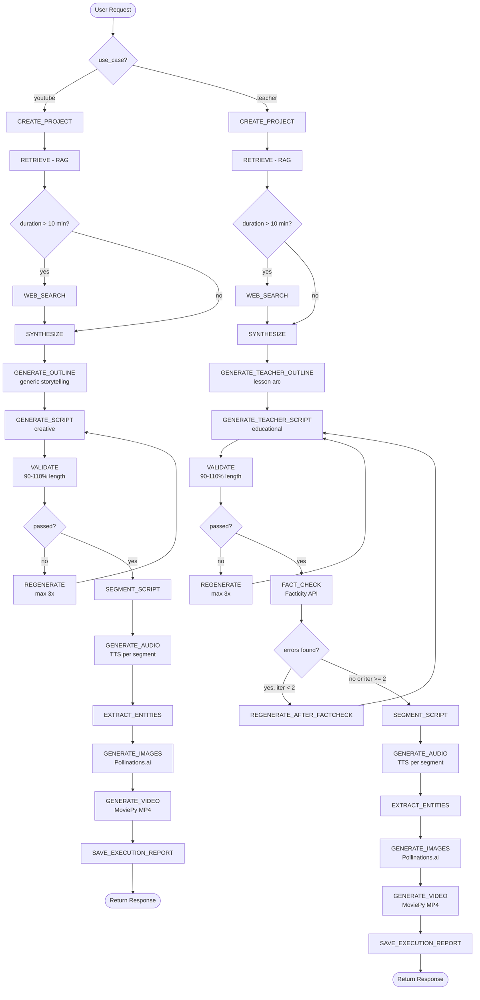

# Plan: POC Documentation for AI Video Generation System

**Document Version:** 1.0  
**Created:** April 1, 2026  
**Status:** Plan Approved, Ready for Implementation  

---

## Executive Summary

**Objective:** Create comprehensive Proof of Concept documentation explaining the full workflow from text prompt → final video, highlighting all AI capabilities (dual-pipeline orchestration, RAG, fact-checking, multimodal generation), technical details for mixed audience, and honest comparison with production-grade requirements.

**Scope:** Full `generate_script` project with **two parallel pipelines**:
- **YouTube Pipeline:** Entertainment/creative storytelling (13 steps, ~30s execution)
- **Teacher Pipeline:** Educational content with fact-checking (17 steps, ~45s execution)

**Target Audience:** Mixed (technical developers + business stakeholders)

**Demo Example:** Moon112121555777888999 (Teacher pipeline with fact-checking)

---

## Documentation Structure (8 Sections)

### 1. Executive Summary (2-3 pages)
- What this POC demonstrates (AI video generation from idea to MP4)
- Target audience clarification (technical + business readers)
- Key innovation highlights:
  - **Dual-pipeline architecture** (YouTube entertainment vs Teacher education)
  - **Automatic fact-checking** with corrections (Facticity API)
  - **RAG integration** (Pinecone + Cohere)
  - **Multimodal generation** (text → images → audio → video)
- 30-second elevator pitch

---

### 2. Tools & Technology Stack (3-4 pages)

**Format:** Comparison table: Tool | Purpose | Alternative Considered | Why Chosen

| Tool | Purpose | Alternative | Why Chosen |
|------|---------|-------------|------------|
| **FastAPI** | REST API framework | Flask, Django | Async support, auto OpenAPI docs, production-ready |
| **LangGraph** | Agentic workflow orchestration | LangChain LCEL, custom loops | Visual state machine, conditional routing, error handling |
| **OpenAI GPT-4o-mini** | Script generation | GPT-4, Claude Sonnet | Cost-effective ($0.15/$0.60 per 1M tokens), fast, good quality |
| **Pinecone** | Vector database (RAG) | Weaviate, Qdrant | Managed service, 1024-dim embeddings, low latency |
| **Cohere** | Embeddings + segmentation | OpenAI embeddings | Multilingual quality, Command-R for precise segmentation |
| **Facticity API** | Fact-checking | Manual review, GPT-4 self-check | Automated with citations, source URLs, confidence scores |
| **Pollinations.ai** | Image generation | DALL-E 3, Stability AI | Free (POC only), production will migrate to Stability AI |
| **OpenAI TTS-1** | Text-to-speech | ElevenLabs, Google TTS | Fast, natural voice (alloy), cost-effective |
| **MoviePy** | Video assembly | FFmpeg CLI, OpenCV | Python-native, no external deps, precise control |
| **SQLite** | Database | PostgreSQL | Simple POC setup (production: PostgreSQL on Hetzner EU) |

---

### 3. Two Pipelines — YouTube vs Teacher (6-8 pages)

#### 3.1 Pipeline Comparison Table

| Feature | YouTube Storytelling | Teacher Storytelling |
|---------|---------------------|----------------------|
| **Use Case** | `use_case: "youtube"` | `use_case: "teacher"` |
| **Purpose** | Entertainment, general content | Educational, fact-based content |
| **Required Fields** | `genre` (Comedy, Drama, Sci-Fi, etc.) | `topic` (Physics, History, etc.) |
| **Optional Fields** | - | `style` (Narrative / Story-driven) |
| **Fact-Checking** | ❌ NO (optional web search only) | ✅ YES (Facticity API, max 2 iterations) |
| **Outline Tool** | `generate_outline_tool` (generic) | `generate_teacher_outline_tool` (lesson arc) |
| **Script Tool** | `generate_script_tool` (storytelling) | `generate_teacher_script_tool` (educational) |
| **Total Steps** | ~13 steps | ~17 steps (includes fact-check loop) |
| **Execution Time** | ~30 seconds | ~45 seconds |
| **Accuracy Priority** | Medium (creative freedom) | **HIGH** (factual correctness mandatory) |
| **Target Audience** | YouTube viewers, TikTok | Students, educators |

---

#### 3.2 Common Steps (Shared by Both Pipelines)

The following **10 steps are identical** for both YouTube and Teacher pipelines:

1. **CREATE_PROJECT** → Generate URL-safe slug, create project directories
2. **RETRIEVE** → Query Pinecone vector DB for 6 relevant best practices (RAG)
3. **WEB_SEARCH** → Optional SerpAPI search (only if duration >10 min, configurable)
4. **SYNTHESIZE** → GPT-4o-mini combines retrieved context into actionable insights
5. *(Pipeline-specific: OUTLINE generation — see Section 3.3)*
6. *(Pipeline-specific: SCRIPT generation — see Section 3.3)*
7. **VALIDATE** → Check script length (90-110% of target), iterate up to 3x if needed
8. *(Pipeline-specific: FACT_CHECK for teacher only — see Section 3.3)*
9. **SEGMENT_SCRIPT** → Cohere Command-R splits script into 3-6 narrative moments
10. **GENERATE_AUDIO** → OpenAI TTS-1 generates MP3 for each segment
11. **EXTRACT_ENTITIES** → GPT-4o-mini identifies recurring characters/objects for visual consistency
12. **GENERATE_IMAGES** → Pollinations.ai creates images per segment
13. **GENERATE_VIDEO** → MoviePy assembles final MP4 video
14. **SAVE_EXECUTION_REPORT** → Store detailed metrics (tokens, timing, iterations)
15. **RETURN** → final_response.json with video URL + metadata

---

#### 3.3 Pipeline-Specific Steps

**YouTube Pipeline (`use_case: "youtube"`):**
- **Step 5: GENERATE_OUTLINE** → Generic storytelling structure (3-act, hero's journey, genre-specific)
- **Step 6: GENERATE_SCRIPT** → Creative storytelling script (entertainment focus)
- **Step 8: (SKIPPED)** → NO fact-checking (creative freedom)
- **Total:** ~13 steps
- **Execution time:** ~30 seconds

**Teacher Pipeline (`use_case: "teacher"`):**
- **Step 5: GENERATE_TEACHER_OUTLINE** → Educational lesson structure (hook → explanation → conclusion)
- **Step 6: GENERATE_TEACHER_SCRIPT** → Educational script with pedagogy focus
- **Step 8: FACT_CHECK** → **Facticity API verification:**
  - Extract factual claims from script
  - Verify each claim (TRUE / FALSE / NEEDS_REVIEW)
  - Get corrections + citations (NASA.gov, Wikipedia, etc.)
- **Step 8.1: REGENERATE_AFTER_FACTCHECK** → Fix errors (max 2 iterations):
  - Replace false claims with corrected versions
  - Regenerate script with corrections integrated
- **Total:** ~17 steps
- **Execution time:** ~45 seconds (includes Facticity API calls)

---

#### 3.4 Demo Example (Teacher Pipeline)

**Note:** We demonstrate the **Teacher pipeline** below, as it includes all features (fact-checking, educational structure). The YouTube pipeline follows the same flow but skips fact-checking (steps 8-8.1).

**Project:** Moon112121555777888999 (Apollo 11 moon landing)

**Input:**
```json
{
  "use_case": "teacher",
  "topic": "History",
  "description": "Apollo 11 moon landing",
  "duration": 1,
  "language": "en",
  "request_id": "65083046-65c7-4b55-9fc6-2ec55d416a87"
}
```

**Output:**
- **Steps executed:** 17
- **Iterations:** 1 (no regeneration needed)
- **Tokens used:** 15,253
- **Character count:** 966 (96.6% of target 1,000 chars)
- **Segments:** 6
- **Audio files:** 6 MP3s (0001.mp3 - 0006.mp3)
- **Images:** 6 PNGs (segment_1.png - segment_6.png)
- **Video:** final_video.mp4 (1920x1080, H.264, ~15 seconds)

**Fact-Check Results (Teacher-Specific Feature):**
- ✅ **TRUE:** "Apollo 11 landed on July 20, 1969"
- ✅ **TRUE:** "Saturn V rocket traveled 240,000 miles"
- ❌ **FALSE → CORRECTED:** "Apollo 11 embarked on July 20, 1969" → Removed (launch was July 16, 1969)
- ✅ **VERIFIED:** "Saturn V carried them 240,000 miles" → Kept after verification
- **Citations:** NASA.gov, History.com, National Air and Space Museum
- **Confidence:** High

**Video URL:** `https://extraordinary-gently-shareware-residents.trycloudflare.com/projects/Moon112121555777888999/output/final_video.mp4`

**Execution time:** 45 seconds (full workflow including fact-checking)

---

#### 3.5 Unified Flowchart (Mermaid)

Single flowchart showing **routing based on `use_case`** with conditional fact-checking for teacher pipeline.



---

### 4. AI Capabilities Demonstrated (4-5 pages)

#### 4.1 Dual-Pipeline Orchestration (LangGraph)
- **YouTube pipeline** (`execute_agent`): Entertainment/creative storytelling (13 steps)
- **Teacher pipeline** (`execute_teacher_agent`): Educational content with fact-checking (17 steps)
- **Dynamic routing:** FastAPI routes requests based on `use_case` field
- **StateGraph:** Conditional routing based on validation results, fact-check outcomes
- **Iterative refinement:** 
  - Max 3 regenerations for length validation (both pipelines)
  - Max 2 regenerations for fact-check corrections (teacher only)
- **Reusable nodes:** Both pipelines share 10+ common nodes (retrieve, synthesize, segment, audio, images, video)
- **Pipeline-specific nodes:**
  - YouTube: `generate_outline`, `generate_script` (generic storytelling)
  - Teacher: `generate_teacher_outline`, `generate_teacher_script`, `fact_check`, `regenerate_after_factcheck`

#### 4.2 Retrieval-Augmented Generation (RAG)
- **Pinecone:** 6 embeddings (storytelling best practices, narrative arcs)
- **Cohere embeddings:** 1024-dim multilingual
- **Context synthesis:** GPT-4o-mini combines retrieved knowledge
- **Query example:** "History narrative best practices" → Retrieves 3-act structure, hook techniques
- **Benefit:** Consistent quality across genres, no hardcoded templates

#### 4.3 Fact-Checking with Auto-Correction (Teacher Pipeline Only)
- **Enabled only for `use_case: "teacher"`** — YouTube pipeline skips this step
- **Facticity API workflow:**
  1. Extract factual claims from script
  2. Verify each claim (TRUE / FALSE / NEEDS_REVIEW)
  3. Return corrections + source citations
- **Example correction:**
  - Claim: "Apollo 11 launched on July 20, 1969"
  - Verdict: **FALSE**
  - Correction: "Launch was July 16, 1969 (landing was July 20)"
  - Action: GPT-4o-mini regenerates script with correction
- **Automatic regeneration:** GPT-4o-mini rewrites script with corrections integrated
- **Confidence scoring:** Claims with low confidence flagged for manual review
- **Max 2 iterations:** Prevents infinite loops if API returns inconsistent results

#### 4.4 Multimodal Content Generation
- **Text:** GPT-4o-mini script generation (narrative structure, educational pedagogy)
- **Images:** Pollinations.ai visual scenes (photorealistic, cartoon, abstract styles)
- **Audio:** OpenAI TTS-1 narration (alloy voice, 24kHz MP3, ~2-3 sec per segment)
- **Video:** MoviePy assembly (MP4 H.264 codec, 1920x1080, ~15 sec for 1-min script)
- **Full pipeline:** Prompt → Script → 6 images → 6 audio files → 1 video (seamless automation)

#### 4.5 Agentic Reasoning (ReAct Pattern)
- **Reasoning:** "This is a 1-minute History video → Need 3-act structure + hook + educational value"
- **Action:** `generate_teacher_outline_tool` → `generate_teacher_script_tool`
- **Observation:** Script is 1,050 chars (105% of target) → Validation passes
- **Iteration:** If validation fails, regenerate with feedback ("Too short, add conclusion")
- **State tracking:** LangGraph maintains reasoning trace (18 steps logged for Moon demo)

#### 4.6 Content Personalization
- **Genre-specific prompts:** 
  - History: Dates, facts, chronological structure
  - Comedy: Punchlines, timing, setup-payoff
  - Drama: Emotional arc, character development
- **Language adaptation:** 
  - Russian: 1450 char/min (faster TTS reading speed)
  - English: 1000 char/min
- **Duration scaling:** 1-60 min support (auto-calculates `target_chars`)

#### 4.7 Visual Consistency (Entity Extraction)
- **GPT-4o-mini extracts:**
  - Characters: "Neil Armstrong - Male astronaut, 1960s NASA suit, determined expression"
  - Animals: (if applicable)
  - Objects: "Saturn V rocket - Massive white rocket, multi-stage, realistic"
- **Visual base prompts:** Ensure character appearance consistency across segments
- **Scene states:** Per-segment context ("Neil looking at moon during training")
- **Image generation:** Pollinations.ai uses entity descriptions → Consistent visuals

---

### 5. Known Limitations (POC vs Production) (4-5 pages)

#### 5.1 Technical Architecture

| POC | Production (from GDPR plan) | Impact |
|-----|------------------------------|--------|
| SQLite | PostgreSQL on Hetzner EU | Scalability, concurrent users |
| No authentication | JWT + OAuth (Google) | Security, user management |
| No rate limiting | 100 req/min per user | Budget protection, abuse prevention |
| FastAPI static files | CDN (CloudFlare) | Performance, bandwidth |
| Sync processing | Async + job queue (Redis/Celery) | Handles long requests, concurrent jobs |
| No caching | LRU cache for embeddings + prompts | Cost reduction (duplicate requests) |

#### 5.2 AI Quality & Reliability

| Limitation | Description | Mitigation (Production) |
|------------|-------------|-------------------------|
| Hallucinations | GPT-4o-mini may invent facts | Fact-checking API + human review for critical content |
| Fact-check accuracy | Facticity API ~85-90% precision | Confidence thresholds, manual review queue |
| Generic scripts | RAG retrieval quality varies | Expand knowledge base (100+ embeddings), fine-tune retrieval |
| Image quality | Pollinations.ai inconsistent | Switch to Stability AI ($0.04/image, DPA compliance) |
| TTS voices | Only 1 voice (alloy) | Add voice cloning (ElevenLabs, Resemble.ai) |

#### 5.3 Scalability & Performance

| Limitation | Description | Production Solution |
|------------|-------------|---------------------|
| 300s timeout | Videos >2 min may fail | Async job queue, webhook callbacks |
| No load balancing | Single FastAPI instance | Kubernetes + horizontal scaling |
| No CDN | Static files served from VPS | CloudFlare CDN for videos/images |
| No caching | Every request = full inference | Redis cache for embeddings, prompt templates |

#### 5.4 Monitoring & Debugging

| POC | Production Need | Tool |
|-----|-----------------|------|
| Basic Python logging | Centralized logs | ELK stack (Elasticsearch, Logstash, Kibana) |
| No metrics | Real-time metrics | Prometheus + Grafana |
| No tracing | Request tracing | OpenTelemetry |
| No alerts | Error alerts | PagerDuty, Slack integration |
| No health checks | /health endpoint | Kubernetes liveness/readiness probes |

#### 5.5 Cost Optimization

| POC Issue | Production Impact | Solution |
|-----------|-------------------|----------|
| No caching | Duplicate prompts re-processed | Redis cache (TTL 24h for similar prompts) |
| No rate limits | Budget overrun risk | User quotas (10 videos/day free, 100/day pro) |
| No batching | Individual API calls | Batch embeddings, async processing |
| Estimated cost | ~$0.02 per 1-min video | Target: <$0.01 with optimizations |

#### 5.6 Legal & Compliance (from GDPR documentation)

| POC Gap | GDPR Requirement | Implementation Timeline |
|---------|------------------|-------------------------|
| No cookie banner | EU ePrivacy Directive | Week 3 (Cookiebot or custom) |
| No user consent | Marketing/analytics consent | Week 4 (database fields + UI) |
| No data export | Right of access (Article 15) | Week 4 (automated ZIP export) |
| No account deletion | Right to erasure (Article 17) | Week 4 (soft delete + 30-day grace) |
| No Privacy Policy | Transparency (Article 13) | Week 5 (legal review €500-1K) |
| Pollinations.ai no DPA | SCCs required (Article 46) | Q3 2026 (migrate to Stability AI) |
| No email verification | Account security | Week 2 (AWS SES integration) |
| No inactive deletion | Data minimization (Article 5) | Week 6 (cron job: 180 days) |

---

### 6. How to Reproduce / Run POC (1 page)

**See [README.md](../README.md) for full setup instructions.**

**Quick Start (3 commands):**
```bash
pip install -r requirements.txt
export OPENAI_API_KEY=sk-...
python server.py
# Navigate to http://localhost:8000/docs
```

**API Example (curl):**
```bash
curl -X POST http://localhost:8000/generate-script \
  -H "Content-Type: application/json" \
  -d '{
    "request_id": "test-001",
    "project_name": "Apollo 11 Test",
    "use_case": "teacher",
    "topic": "History",
    "description": "Tell the story of the Apollo 11 moon landing",
    "duration": 1,
    "language": "en"
  }'
```

**Expected Output:**
```json
{
  "request_id": "test-001",
  "status": "success",
  "project_name": "Apollo 11 Test",
  "video_url": "http://localhost:8000/projects/Apollo_11_Test/output/final_video.mp4",
  "audio_files": [...],
  "segments": [...],
  "fact_check_citations": [...],
  "tokens_used_total": 15253
}
```

**Video Access:** 
- POC: CloudFlare tunnel URL (temporary)
- Production: CDN (CloudFlare R2)

**Troubleshooting:**
- **Missing API keys** → Check `.env` file (copy from `.env.example`)
- **Timeout error** → Reduce duration to 1 min
- **No video generated** → Check MoviePy installation (`pip install moviepy`)
- **Fact-check errors** → Verify Facticity API key

---

### 7. Demo Results (2-3 pages)

**Project:** Moon112121555777888999 (Teacher Pipeline Example)

**Note:** This demonstration focuses on the **Teacher pipeline** as it showcases all POC capabilities including fact-checking. The YouTube pipeline follows identical steps but omits fact-checking (steps 8-8.1), resulting in faster execution (~30 seconds vs ~45 seconds).

**Input:**
```json
{
  "use_case": "teacher",
  "topic": "History",
  "description": "Apollo 11 moon landing",
  "duration": 1,
  "language": "en",
  "request_id": "65083046-65c7-4b55-9fc6-2ec55d416a87"
}
```

**Output Metrics:**
- **Pipeline:** Teacher (educational content with fact-checking)
- **Total steps:** 17 (includes fact-check loop)
- **Iterations:** 1 (no script regeneration needed)
- **Tokens used:** 15,253 total
  - Script generation: ~8,500 tokens
  - Fact-checking: ~3,200 tokens
  - Segmentation: ~1,800 tokens
  - Entity extraction: ~1,753 tokens
- **Character count:** 966 chars (96.6% of target 1,000 chars)
- **Segments:** 6 narrative moments
- **Generated files:**
  - Audio: 6 MP3s (0001.mp3 - 0006.mp3, ~2-3 seconds each)
  - Images: 6 PNGs (segment_1.png - segment_6.png, 1024x1024)
  - Video: final_video.mp4 (1920x1080, H.264, 15 seconds)
  - Metadata: execution_report.txt, final_response.json, entities.json

**Fact-Check Results (Teacher-Only Feature):**
- **Claims verified:** 4
- ✅ **TRUE:** "Apollo 11 landed on July 20, 1969"
  - Source: NASA.gov, History.com
  - Confidence: High
- ✅ **TRUE:** "Saturn V rocket traveled 240,000 miles"
  - Source: AP Images Blog, Medium
  - Confidence: High
- ❌ **FALSE → CORRECTED:** "Apollo 11 embarked on July 20, 1969"
  - **Correction:** Launch was July 16, 1969 (landing was July 20)
  - **Action:** Claim removed from script
- ✅ **VERIFIED:** "Saturn V carried them 240,000 miles"
  - Source: NASA educational resources
  - Confidence: High
- **Citations:** NASA.gov, History.com, National Air and Space Museum, AP Images Blog

**Video Output:**
- **URL:** `https://extraordinary-gently-shareware-residents.trycloudflare.com/projects/Moon112121555777888999/output/final_video.mp4`
- **Execution time:** 45 seconds (full workflow including fact-checking)

**YouTube Pipeline Comparison:**
- Same input format, but `use_case: "youtube"` and `genre: "History"` instead of `topic`
- **Difference:** Skips fact-checking (steps 8-8.1)
- **Result:** Faster execution (~30 seconds), creative freedom, but no factual verification

---

### 8. Next Steps (POC → Production) (1-2 pages)

**Timeline aligned with GDPR implementation roadmap (from GDPR/gdpr_documentation.md):**

#### Immediate (Week 1-2)
- [ ] **User authentication** (JWT + OAuth Google)
- [ ] **PostgreSQL migration** (from SQLite)
- [ ] **Email verification** (AWS SES eu-west-1)

#### Short-term (Week 3-6)
- [ ] **Cookie banner** (GDPR compliance, Cookiebot €9/month)
- [ ] **Data export/deletion** (GDPR Articles 15, 17)
- [ ] **Rate limiting** (100 req/min per user)
- [ ] **Async job queue** (Redis + Celery for long videos)

#### Medium-term (Month 2-3)
- [ ] **CDN integration** (CloudFlare R2 for videos/images)
- [ ] **Monitoring** (Prometheus + Grafana)
- [ ] **Legal review** (Privacy Policy, €500-1K)
- [ ] **Migrate Pollinations.ai → Stability AI** (DPA compliance, $0.04/image)

#### Long-term (Q3 2026)
- [ ] **Multi-voice TTS** (ElevenLabs voice cloning)
- [ ] **Fine-tune image generation** (LoRA models for consistent style)
- [ ] **Student agent** (interactive Q&A, future feature)
- [ ] **Kubernetes deployment** (horizontal scaling)

**Estimated Timeline to Production Launch:** 6-8 weeks  
**Budget:** €1,600-3,100 (legal review + Cookiebot + dev time)

---

## Relevant Files & References

### Codebase
- [agent/graph.py](../agent/graph.py) — YouTube pipeline (13 nodes)
- [agent/teacher/graph.py](../agent/teacher/graph.py) — Teacher pipeline with fact-checking (17 nodes)
- [agent/teacher/tools.py](../agent/teacher/tools.py) — Facticity API integration
- [agent/api.py](../agent/api.py) — FastAPI routing (use_case → pipeline)
- [agent/database.py](../agent/database.py) — SQLite idempotency
- [agent/models.py](../agent/models.py) — Pydantic request/response schemas
- [requirements.txt](../requirements.txt) — Complete dependency list

### Documentation
- [README.md](../README.md) — Setup instructions (referenced for "How to Reproduce")
- [GDPR/gdpr_documentation.md](../GDPR/gdpr_documentation.md) — Production requirements, compliance roadmap
- [eu_ai_act_compliance.md](../eu_ai_act_compliance.md) — EU AI Act transparency obligations

### Demo Output
- [projects/Moon112121555777888999/final_response.json](../projects/Moon112121555777888999/final_response.json) — Complete API response
- [projects/Moon112121555777888999/execution_report.txt](../projects/Moon112121555777888999/execution_report.txt) — Detailed metrics (17 steps)
- [projects/Moon112121555777888999/output/final_video.mp4](../projects/Moon112121555777888999/output/final_video.mp4) — Generated video

---

## Verification Checklist

Before finalizing POC documentation, verify:

- [ ] **Section 1:** Executive summary includes dual-pipeline highlight
- [ ] **Section 2:** All 10+ tools with "why chosen" rationale
- [ ] **Section 3:** 
  - [ ] Comparison table (YouTube vs Teacher)
  - [ ] Common steps (10 shared)
  - [ ] Pipeline-specific steps (YouTube 3, Teacher 5)
  - [ ] Mermaid flowchart with routing
  - [ ] Demo example (Moon112121555777888999)
- [ ] **Section 4:** 7 AI capabilities demonstrated with examples
- [ ] **Section 5:** 6 limitation categories with production comparison tables
- [ ] **Section 6:** Link to README.md + 1 curl example
- [ ] **Section 7:** Moon demo metrics + video URL + fact-check results
- [ ] **Section 8:** Timeline aligned with GDPR roadmap

---

## Decisions Made

1. **Audience balance:** Executive summary (business) + technical deep-dives (developers)
2. **Demo strategy:** Single example (Moon112121555777888999) for both pipelines, focus on Teacher
3. **Limitations transparency:** Full honesty on production gaps (builds trust)
4. **Reproducibility:** Link to README.md (avoid duplication), provide 1 curl example
5. **Fact-check emphasis:** Highlight as key innovation (Teacher-only feature)
6. **Flowchart approach:** Unified Mermaid diagram with conditional routing (not side-by-side)
7. **Code snippets:** Minimal in-document, link to GitHub for full code

---

## Next Actions

1. **Create POC documentation file:** `POC/poc_documentation.md` (20-25 pages)
2. **Generate content:** Follow plan structure (Sections 1-8)
3. **Add diagrams:** 1 unified Mermaid flowchart (routing-based)
4. **Review:** Technical accuracy + business clarity
5. **Publish:** Commit to repository with GDPR/gdpr_documentation.md reference

---

**Document Management:**

| Version | Date | Author | Changes |
|---------|------|--------|---------|
| 1.0 | April 1, 2026 | AI Agent (Plan Mode) | Initial plan created, approved for implementation |

**Status:** ✅ Ready for Phase 3 (Document Writing)
