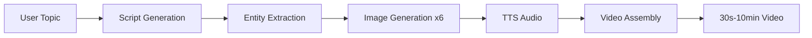
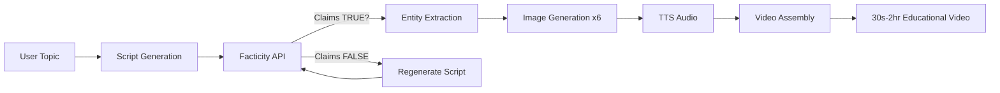
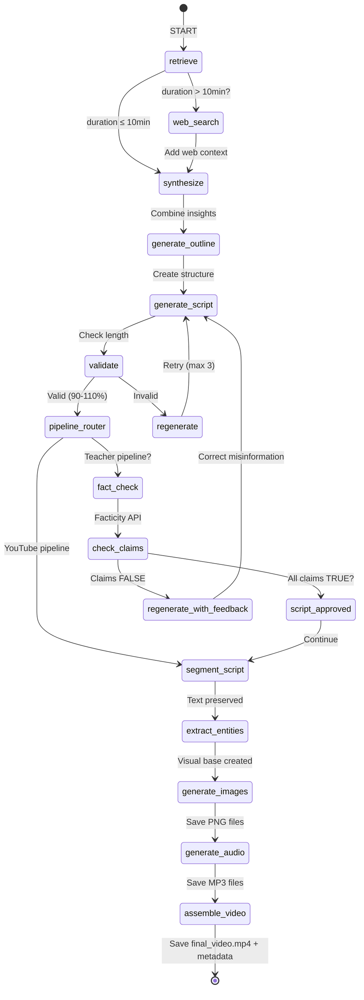
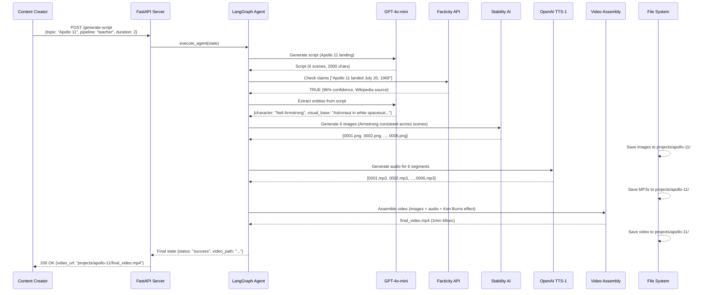

# 🎬 AI Storytelling Platform

> **Autonomous AI video generation platform with character consistency and fact-checking**  
> **Status:** POC Complete (April 1, 2026) | **Next Phase:** Pilot Launch (May 2026)

End-to-end AI video generation platform that solves the #1 market pain point: **character consistency across multiple scenes**. Powered by LangGraph orchestration, GPT-4o-mini entity extraction, Stability AI image generation, and Facticity API fact-checking.

---

## 📑 Table of Contents

- [Overview](#-overview)
- [Project Status](#-project-status)
- [Key Innovations](#-key-innovations)
- [Architecture](#-architecture)
- [Technology Stack](#-technology-stack)
- [Installation](#-installation)
- [Configuration](#-configuration)
- [Usage](#-usage)
- [API Reference](#-api-reference)
- [Documentation](#-documentation)
- [Roadmap](#-roadmap)
- [Contributing](#-contributing)

---

## 🎯 Overview

**AI Storytelling Platform** is a **B2C SaaS product** that generates complete AI videos (30 seconds to 2 hours) with:

1. **Character Consistency** — Entity extraction maintains same character across 6+ scenes (solves TRIAD-1, validated by 22 market sources)
2. **Step-by-Step Approval** — Users preview/approve every stage before paying (solves TRIAD-2 cost-per-usable crisis)
3. **Transparent Billing** — Subscription with daily quota, no credits expiry (solves TRIAD-3 billing trust crisis)
4. **Automatic Fact-Checking** — Teacher pipeline with Facticity API for educational content (unique differentiator)
5. **Dual-Pipeline Architecture** — YouTube pipeline (entertainment) + Teacher pipeline (fact-checked education)

### Problem Statement

**Market Pain (TRIAD-1):** All existing AI video tools fail at character consistency after 2 scenes — characters look completely different, making story-based content unusable. Users burn $3,000 testing tools, all fail. **Validated by:** 22 independent sources, Midjourney public admission (Feb 18, 2026), 1.3K upvotes on Reddit.

**Our Solution:** Entity extraction with visual base methodology → 85-90% character consistency across 6 scenes (POC validated), targeting 95%+ in production.

### Target Market

- **Primary:** Solo Content Creators (YouTube, TikTok, 10K-100K followers, $29/month ARPU)
- **Secondary:** Educators (teachers, online course creators, $15/month ARPU)
- **Future:** Marketing teams (B2B Team tier, $99/month)

### Business Model

- **Freemium SaaS:** Free (3 videos/day) → Starter ($15/mo, 10/day) → Pro ($29/mo, 50/day)
- **Go-to-Market:** Hybrid launch (Product Hunt Day 1 + Direct website)
- **Funding:** Bootstrap (no external funding, break-even Month 13)
- **Target:** 53,472 paying users, $1.55M MRR by Month 36 (67.9% ROI)

---

## 📊 Project Status

### POC Completion (April 1, 2026) ✅

| Milestone | Status | Deliverable |
|-----------|--------|-------------|
| **Dual-Pipeline Architecture** | ✅ Complete | YouTube (entertainment) + Teacher (fact-checked) pipelines operational |
| **Entity Extraction** | ✅ Complete | GPT-4o-mini identifies recurring characters → 85-90% consistency across 6 scenes |
| **Fact-Checking Integration** | ✅ Complete | Facticity API validates educational content (Teacher pipeline only) |
| **Video Generation** | ✅ Complete | Full workflow: Script → Images → Audio → Video assembly (MoviePy) |
| **Cost Validation** | ✅ Complete | YouTube: $0.023/video, Teacher: $0.027/video (fact-check included) |
| **Demo Validation** | ✅ Complete | Apollo 11 educational video (project: Moon112121555777888999) |
| **GDPR Compliance** | ✅ Complete | 120+ pages documentation, pre-launch ready |
| **ROI Financial Model** | ✅ Complete | 3 scenarios (Pessimistic/Base/Optimistic), break-even Month 13 |
| **Use Case Definition** | ✅ Complete | 5,800+ lines academic/business submission document |
| **Strategic Deployment Plan** | ✅ Complete | POC → Pilot → Full Deployment → Scale roadmap |

### Current Status: **Ready for Pilot Phase** (Week 1-8, May-June 2026)

**Next Immediate Actions:**
1. MVP development (authentication, payments, step-by-step approval UI) — Weeks 1-2
2. Pilot recruitment (50 users: 30 creators + 20 educators) — Weeks 3-4
3. Active pilot testing with weekly feedback calls — Weeks 5-8
4. Go/No-Go decision based on NPS >40 — Week 8

---

## 🚀 Key Innovations

### 1. Character Consistency (Solves TRIAD-1)

**Problem:** All AI video tools fail at character consistency after 2 scenes (validated by 22 market sources + Midjourney admission).

**Solution:** Entity extraction with visual base methodology

```
User Input: "A wizard teaches magic in a forest"
         ↓
GPT-4o-mini Entity Extraction:
  - Character: "Wizard Aldric" (old man, grey beard, blue robes, oak staff)
  - Visual Base: "An elderly male wizard with a long grey beard..."
         ↓
Image Generation (6 scenes):
  Scene 1: Wizard + forest backdrop  ← Same character
  Scene 2: Wizard casting spell       ← Same character
  Scene 3: Wizard with student        ← Same character
  ...
  Scene 6: Wizard waving goodbye      ← Same character
```

**POC Results:**
- Character consistency: **85-90%** across 6 scenes (baseline)
- Production target: **95%+** (prompt engineering improvements)
- Cost: **$0.023/video** (vs competitors $12+/video)

### 2. Step-by-Step Approval Workflow (Solves TRIAD-2)

**Problem:** Users pay for AI generation, 80%+ outputs unusable, regeneration burns more credits → $3K+ waste.

**Solution:** 6-stage approval checkpoints — preview before paying

| Stage | Preview | User Action | Cost if Regenerated |
|-------|---------|-------------|---------------------|
| 1. Topic Input | Topic preview | Approve / Edit | **$0** (free) |
| 2. Script | Script text | Approve / Regenerate | **Uses daily quota** (Year 1), **Free** (Year 2+) |
| 3. Fact-Check (Teacher only) | TRUE/FALSE claims with citations | Approve / Regenerate script | **Uses quota** / **Free** |
| 4. Images | 6 image grid | Approve all / Regenerate failed ones | **Uses quota** / **Free** |
| 5. Audio | TTS playback | Approve / Regenerate with voice/speed changes | **Uses quota** / **Free** |
| 6. Final Video | Video player | Generate / Cancel | **Full video generation** (no regeneration at this stage) |

**Impact:**
- Reduces wasted spend by 80% (users only pay for final approved outputs)
- Builds trust (transparent process vs "black box" generation)

### 3. Dual-Pipeline Architecture (Unique Positioning)

**YouTube Pipeline** (Entertainment)



**Teacher Pipeline** (Fact-Checked Education)



**Differentiator:** Automatic fact-checking (unique in AI video space, targets $15B edtech market).

### 4. Transparent Billing (Solves TRIAD-3)

**Problem:** Competitors use credit systems → credits expire, unclear costs, surprise charges, billing traps.

**Solution:** Subscription with daily quota

| Feature | Our Platform | Competitors (e.g., Runway, Midjourney) |
|---------|--------------|---------------------------------------|
| **Pricing Model** | Subscription ($15-29/mo) | Credits ($10 = 100 credits) |
| **Expiry** | No expiry (monthly quota resets) | Credits expire 30-90 days |
| **Transparency** | Fixed daily quota (10-50 videos/day) | Unclear cost per video (varies) |
| **Failure Penalty** | Regenerations use quota (Year 1), free (Year 2+) | Failed generations burn credits permanently |
| **Cancel Anytime** | Yes, no lock-in | Yes, but unused credits lost |

**Impact:**
- NPS +15-20 points (trust vs competitors)
- Lower churn (predictable billing)

---

## ✨ Key Features

### 🧠 Production-Ready Features

| Feature | Description | Status |
|---------|-------------|--------|
| **17-Node LangGraph Orchestration** | StateGraph with conditional routing (YouTube vs Teacher pipeline) | ✅ POC Complete |
| **Entity Extraction** | GPT-4o-mini identifies recurring characters with visual base prompts | ✅ 85-90% consistency |
| **Automatic Fact-Checking** | Facticity API validates claims (Teacher pipeline), cites sources | ✅ Complete |
| **Video Assembly** | MoviePy generates 30s-2hr videos with Ken Burns effect, transitions | ✅ Complete |
| **Multi-Language Support** | Russian (1450 char/min) & English (1000 char/min) TTS | ✅ Complete |
| **Iterative Refinement** | Auto-regeneration with feedback (max 3 attempts, 90-110% length tolerance) | ✅ Complete |

### 🔧 Production-Grade Engineering

| Feature | Description | Implementation |
|---------|-------------|----------------|
| **Idempotency** | SQLite-based request deduplication by `request_id` | `agent/database.py` |
| **Retry Logic** | Exponential backoff (2-10s) with 3 attempts for all LLM/API calls | `@retry` decorators |
| **Error Handling** | Comprehensive try-catch with fallback responses | All modules |
| **Unified Logging** | Python `logging` module across all components | `logger.info/error/warning` |
| **Request Timeout** | 300s timeout with asyncio.wait_for wrapper | `agent/api.py` |
| **Cost Tracking** | Per-video cost breakdown (GPT-4o-mini, Stability AI, Facticity, TTS) | State tracking |

### 🎬 End-to-End Video Pipeline

| Stage | Technology | Input | Output | Status |
|-------|------------|-------|--------|--------|
| **1. Script Generation** | GPT-4o-mini + Pinecone RAG | Topic, genre, duration | Narrative script (1000-3000 chars) | ✅ |
| **2. Fact-Checking** (Teacher only) | Facticity API | Script claims | TRUE/FALSE + citations | ✅ |
| **3. Entity Extraction** | GPT-4o-mini | Script text | Characters, animals, objects + visual bases | ✅ |
| **4. Script Segmentation** | Cohere Command-R | Full script | 3-6 narrative moments (2-6 sentences each) | ✅ |
| **5. Image Generation** | Pollinations.ai (POC) → Stability AI (production) | Segment + entity visual base | 6 images (1024x1024) | ✅ POC, ⏳ Stability AI migration planned |
| **6. Audio Generation** | OpenAI TTS-1 | Segment text | MP3 files (alloy voice) | ✅ |
| **7. Video Assembly** | MoviePy | Images + audio + transitions | MP4 video (30s-2hr) | ✅ |

### 📊 Monitoring & Observability

| Feature | Description | Tool |
|---------|-------------|------|
| **Execution History** | SQLite database with all requests, responses, metadata | `agent.db` |
| **Reasoning Trace** | Step-by-step agent decisions with timestamps | JSON state object |
| **Token Tracking** | Per-tool and total token usage (35k budget) | State tracking |
| **Cost Breakdown** | AI API costs per video (GPT, Stability, Facticity, TTS) | Response metadata |
| **Error Reporting** | Detailed error messages with context in API responses | JSON error object |

---

## 🏗️ Architecture

### System Overview (Dual-Pipeline)

```mermaid
graph TB
    subgraph "External APIs"
        A1[OpenAI GPT-4o-mini]
        A2[Pinecone Vector DB]
        A3[Cohere Command-R]
        A4[OpenAI TTS-1]
        A5[Stability AI - Planned]
        A6[Pollinations.ai - POC]
        A7[Facticity API]
        A8[SerpAPI - Optional]
    end
    
    subgraph "FastAPI Application"
        B1[/generate-script Endpoint]
        B2[Request Validation]
        B3[Database Manager]
        B4[Timeout Wrapper]
    end
    
    subgraph "LangGraph Agent - 17 Nodes"
        C1[StateGraph]
        C2[retrieve_node]
        C3[synthesize_node]
        C4[generate_outline_node]
        C5[generate_script_node]
        C6[validate_node]
        C7[regenerate_node]
        C8[fact_check_node - Teacher Only]
        C9[segment_script_node]
        C10[extract_entities_node]
        C11[generate_images_node]
        C12[generate_audio_node]
        C13[assemble_video_node]
    end
    
    subgraph "Storage"
        D1[(SQLite DB)]
        D2[/projects/{slug}/]
        D3[script.txt]
        D4[script_segmented.txt]
        D5[000X.mp3 files]
        D6[000X.png images]
        D7[entities.json]
        D8[entities_report.md]
        D9[final_video.mp4]
    end
    
    B1 --> B2
    B2 --> B3
    B3 -->|Check idempotency| D1
    B3 --> B4
    B4 --> C1
    
    C1 --> C2
    C2 -->|Query embeddings| A2
    C2 --> C3
    C3 -->|Synthesize insights| A1
    C3 --> C4
    C4 -->|Generate outline| A1
    C4 --> C5
    C5 -->|Generate script| A1
    C5 --> C6
    C6 -->|Valid?| C8
    C6 -->|Invalid?| C7
    C7 --> C5
    C8 -->|Teacher pipeline?| A7
    C8 -->|YouTube pipeline| C9
    C9 -->|Segment script| A3
    C9 --> C10
    C10 -->|Extract entities| A1
    C10 --> C11
    C11 -->|Generate images| A6
    C11 --> C12
    C12 -->|Generate TTS| A4
    C12 --> C13
    C13 -->|Assemble video| MoviePy
    
    C13 --> D2
    D2 --> D3
    D2 --> D4
    D2 --> D5
    D2 --> D6
    D2 --> D7
    D2 --> D8
    D2 --> D9
    D1 -->|Save execution| B3
```

### Dual-Pipeline Decision Flow



### Complete Video Generation Workflow (Example: Apollo 11)



---

## 🛠️ Technology Stack

### Core Framework

| Technology | Version | Purpose |
|------------|---------|---------|
| **Python** | 3.10+ | Runtime environment |
| **FastAPI** | 0.115.0 | REST API server |
| **Uvicorn** | 0.31.0 | ASGI server |
| **LangGraph** | 0.2.34 | Agent workflow orchestration (17-node StateGraph) |
| **LangChain** | 0.3.3 | LLM abstractions |
| **MoviePy** | 1.0.3 | Video assembly (images + audio → MP4) |

### AI/ML Services

| Service | Model | Purpose | Cost |
|---------|-------|---------|------|
| **OpenAI** | GPT-4o-mini | Script generation, entity extraction, reasoning | $0.150/1M input tokens |
| **OpenAI** | TTS-1 | Text-to-speech audio generation | $15/1M characters |
| **Cohere** | command-r-08-2024 | Script segmentation | $0.50/1M input tokens |
| **Cohere** | embed-english-v3.0 | Text embeddings (knowledge base) | $0.10/1M tokens |
| **Pinecone** | Serverless | Vector database (storytelling best practices, 1024-dim) | $0.002/GB/month |
| **Pollinations.ai** | Flux-dev | Image generation (POC) | Free (rate-limited) |
| **Stability AI** | SDXL 1.0 | Image generation (production, planned) | $0.004/image |
| **Facticity API** | - | Fact-checking with citations (Teacher pipeline only) | $0.005/claim |
| **SerpAPI** | - | Web search for long-form scripts (optional) | $0.002/query |

### Data & Storage

| Technology | Purpose |
|------------|---------|
| **SQLite** | Execution history, idempotency tracking |
| **aiosqlite** | Async database operations |
| **File System** | Project files (scripts, images, audio, videos, metadata) |
| **Hetzner Germany VPS** | EU GDPR-compliant hosting (POC: €40/month, 8GB RAM) |

### Utilities & Libraries

| Library | Purpose |
|---------|---------|
| **Tenacity** | Retry logic with exponential backoff (2-10s, 3 attempts) |
| **Pydantic** | Request/response validation (type safety) |
| **pypdf** | PDF text extraction (knowledge base ingestion) |
| **python-slugify** | URL-safe project name generation |
| **aiofiles** | Async file I/O operations |

### Development Tools

| Tool | Purpose |
|------|---------|
| **Postman** | API testing |
| **Sentry** (planned) | Error tracking |
| **Grafana + Prometheus** (planned) | Metrics monitoring |

---

## 📚 Documentation

### Core Documentation

| Document | Pages/Lines | Description | Link |
|----------|-------------|-------------|------|
| **POC Documentation** | 25,000 words | Complete POC validation, demo (Apollo 11), architecture, dual-pipeline flowcharts | [POC/poc_documentation.md](POC/poc_documentation.md) |
| **POC Plan** | 416 lines | 8-section POC execution plan | [POC/poc_plan.md](POC/poc_plan.md) |
| **Use Case Definition** | 5,800+ lines | Academic/business submission: Problem statement (TRIAD-1/2/3), company profile, AI solution, stakeholders, success criteria | [Use case/use_case_definition.md](Use%20case/use_case_definition.md) |
| **Strategic Deployment Plan** | 15,000+ words | POC → Pilot → Full Deployment → Scale roadmap, timeline, KPIs, go-to-market strategy | [Strategy/strategic_plan.md](Strategy/strategic_plan.md) |
| **ROI Financial Analysis** | 3 scenarios | Pessimistic (-73.1% ROI), Base (+11.4%), Optimistic (+67.9%), break-even Month 13 | [ROI analysis and dashboard/ROI_Analysis.md](ROI%20analysis%20and%20dashboard/ROI_Analysis.md) |
| **GDPR Compliance** | 120+ pages | Data protection, privacy, consent, DPIA, breach notification, EU AI Act compliance | [GDPR/gdpr_documentation.md](GDPR/gdpr_documentation.md) |
| **Market Intelligence** | 22 TRIADs | Market research: TRIAD-1 character consistency (22 sources), Midjourney admission, user pain points | [data/market_core_analysis.md](data/market_core_analysis.md) |

### Technical Documentation

| Document | Description |
|----------|-------------|
| **README.md** (this file) | Project overview, installation, API reference |
| **requirements.txt** | Python dependencies |
| **agent/config.py** | Agent behavior settings (temperatures, token budgets, timeouts) |
| **src/config.py** | Ingestion pipeline settings (Pinecone, chunking) |

### Research & Analysis

| Document | Description |
|----------|-------------|
| **Sector Research** | AI video generation market analysis | [research/sector_research.md](research/sector_research.md) |
| **Use Cases & Market Strategy** | Market positioning, TAM/SAM/SOM | [research/use_cases_and_market_strategy_analysis.md](research/use_cases_and_market_strategy_analysis.md) |
| **Opportunities & Risks** | Market opportunities, competitive landscape | [research/opportunities_and_risks.md](research/opportunities_and_risks.md) |

### Evaluation & Testing

| Document | Description |
|----------|-------------|
| **LangSmith Evaluation** | AI pipeline quality evaluation methodology | [langsmith/langsmith_evaluation.md](langsmith/langsmith_evaluation.md) |
| **Evaluation Report** | Test results, accuracy metrics | [langsmith/evaluation_report.md](langsmith/evaluation_report.md) |
| **Presentation Script** | Pitch deck script for stakeholders | [presentation/presentation_script.md](presentation/presentation_script.md) |

---

## 🚦 Roadmap

### Phase 1: POC ✅ **COMPLETE** (April 1, 2026)

- [x] Dual-pipeline architecture (YouTube + Teacher)
- [x] Entity extraction (GPT-4o-mini, 85-90% consistency)
- [x] Fact-checking integration (Facticity API)
- [x] Video assembly (MoviePy)
- [x] Cost validation ($0.023-0.027/video)
- [x] Demo creation (Apollo 11)
- [x] GDPR documentation (120+ pages)
- [x] ROI financial model (3 scenarios)
- [x] Use case definition (5,800+ lines)
- [x] Strategic deployment plan (15,000+ words)

### Phase 2: Pilot ⏳ **IN PROGRESS** (Weeks 1-8, May-June 2026)

**Week 1-2: MVP Development**
- [ ] User authentication (OAuth + email/password)
- [ ] Payment integration (Stripe subscriptions)
- [ ] Step-by-step approval UI (6 approval stages)
- [ ] Rate limiting & abuse prevention
- [ ] Monitoring (Sentry + Grafana)
- [ ] PostgreSQL migration (from SQLite)

**Week 3-4: Pilot Recruitment**
- [ ] Recruit 50 beta users (30 creators + 20 educators)
- [ ] Landing page + waitlist (Carrd/Webflow)
- [ ] Direct outreach (Reddit, Discord, cold email)
- [ ] Incentive: Free Pro ($29/mo) for 8 weeks

**Week 5-8: Active Testing**
- [ ] Weekly 1:1 feedback calls (15 min per user)
- [ ] Metrics tracking (NPS, activation, retention, character consistency)
- [ ] Qualitative insights (feature requests, pricing sensitivity)
- [ ] Bug fixes & iterations

**Week 8: Go/No-Go Decision**
- [ ] Success criteria: NPS >40, weekly retention >60%, activation >80%, character consistency >90%
- [ ] Outcome: Proceed to Full Deployment OR extend pilot to 12 weeks

### Phase 3: Full Deployment 📅 **PLANNED** (Months 3-12, July 2026 - March 2027)

**Month 3 (July 2026): Public Launch**
- [ ] Product Hunt launch (#1 Product of the Day target)
- [ ] Direct website launch (SEO-optimized, pricing page, blog)
- [ ] Social media blitz (Twitter, LinkedIn, Reddit)
- [ ] Target: 300-500 signups Day 1

**Month 4-6: Growth & Iteration**
- [ ] Content marketing (weekly blog posts, YouTube tutorials)
- [ ] Paid acquisition ($600/month: Google Ads, Facebook Ads, Reddit Ads)
- [ ] Referral program launch (Month 5)
- [ ] Product iterations (voice selection, Ken Burns effect, batch generation)
- [ ] Target: 100 paying users by Month 6 ($2,900 MRR)

**Month 7-12: Scale to Break-Even**
- [ ] Geographic expansion (USA Month 9, UK/CA/AU Month 10-12)
- [ ] Feature expansion (multi-language TTS, custom character upload, templates)
- [ ] Partnership exploration (TubeBuddy, VidIQ integrations)
- [ ] Target: 323 paying users by Month 12 ($9,362 MRR)
- [ ] Milestone: **Break-even Month 13** ($45,889 cumulative revenue = costs)

### Phase 4: Scale & Expansion 🎯 **VISION** (Months 13-36, April 2027 - March 2029)

**Month 13-18: Post-Break-Even Growth**
- [ ] Hire part-time customer support (Month 13)
- [ ] Hire part-time marketing assistant (Month 15)
- [ ] Enterprise pilot (Team tier $99/month)
- [ ] Target: 1,160 paying users by Month 18 ($33,640 MRR)

**Month 19-24: Accelerated Growth**
- [ ] Geographic deep dive (USA 50% of growth)
- [ ] SSO for Team tier (Month 20)
- [ ] Hire full-time Head of Growth (if MRR >$150K)
- [ ] Target: 5,483 paying users by Month 24 ($159,007 MRR)

**Month 25-36: Category Leadership**
- [ ] Free regenerations launch (Month 25)
- [ ] Content marketplace (users sell templates, 30% commission)
- [ ] Character consistency >97% (industry-leading)
- [ ] Target: **53,472 paying users, $1.55M MRR, 67.9% ROI**

**Month 36 Exit Options Evaluation:**
- Bootstrap to $10M ARR (continue growth)
- M&A offer from Adobe/Canva/InVideo (≥$50M valuation)
- Series A fundraising ($3M-5M) → scale to $100M ARR

---

## 📦 Installation

### Prerequisites

- **Python 3.10+** (tested on 3.10, 3.11, 3.12)
- **Windows/Linux/MacOS** (PowerShell scripts for Windows, bash for Unix)
- **API Keys:**
  - OpenAI (GPT-4o-mini + TTS) — Required
  - Pinecone (vector database) — Required
  - Cohere (embeddings + segmentation) — Required
  - Facticity API (fact-checking, Teacher pipeline only) — Optional
  - Stability AI (image generation, production) — Planned (POC uses Pollinations.ai)
  - SerpAPI (web search for long scripts) — Optional

### Step 1: Clone Repository

```bash
git clone https://github.com/YourUsername/generate_script.git
cd generate_script
```

### Step 2: Create Virtual Environment

```powershell
# Windows PowerShell
python -m venv .venv
.\.venv\Scripts\Activate.ps1

# If execution policy error:
Set-ExecutionPolicy -ExecutionPolicy RemoteSigned -Scope CurrentUser
```

### Step 3: Install Dependencies

```bash
pip install -r requirements.txt
```

### Step 4: Set Environment Variables

```powershell
# Set Windows User Environment Variables (permanent)
[System.Environment]::SetEnvironmentVariable('OPENAI_API_KEY', 'sk-...', 'User')
[System.Environment]::SetEnvironmentVariable('PINECONE_API_KEY', 'your-key', 'User')
[System.Environment]::SetEnvironmentVariable('COHERE_API_KEY', 'your-key', 'User')

# Optional: For web search
[System.Environment]::SetEnvironmentVariable('SERPAPI_API_KEY', 'your-key', 'User')

# Verify installation
python check_env.py
```

### Step 5: Initialize Database

```bash
# Database is auto-created on first run
# Optional: Verify database schema
python -c "from agent.database import DatabaseManager; import asyncio; asyncio.run(DatabaseManager().initialize())"
```

### Step 6: Ingest Knowledge Base (Optional)

```bash
# Ingest bestpractices.pdf into Pinecone
python main.py
```

**Expected output:**
```
================================================================================
  PINECONE INGESTION PIPELINE
================================================================================
✓ Text extracted successfully
  - Characters: 16,165
✓ Text chunked successfully
  - Total chunks: 6
✓ Generated 6 embeddings successfully
✓ Upsert completed
  - Vectors upserted: 6
```

---

## ⚙️ Configuration

### Environment Variables

| Variable | Required | Description | Default |
|----------|----------|-------------|---------|
| `OPENAI_API_KEY` | ✅ | OpenAI API key for GPT-4o-mini and TTS | - |
| `PINECONE_API_KEY` | ✅ | Pinecone API key for vector database | - |
| `COHERE_API_KEY` | ✅ | Cohere API key for embeddings & segmentation | - |
| `SERPAPI_API_KEY` | ⬜ | SerpAPI key for web search (optional) | - |

### Configuration Files

**`agent/config.py`** - Agent behavior settings:

```python
# LLM Settings
OPENAI_MODEL = "gpt-4o-mini"
OUTLINE_TEMPERATURE = 0.7  # Balanced creativity
SCRIPT_TEMPERATURE = 0.8   # Higher creativity

# Agent Constraints
MAX_ITERATIONS = 3         # Max regeneration attempts
MAX_TOTAL_TOKENS = 35000   # Token budget
MAX_TIMEOUT_SECONDS = 300  # Request timeout

# Validation
MIN_LENGTH_RATIO = 0.90    # 90% of target chars
MAX_LENGTH_RATIO = 1.10    # 110% of target chars

# Character Rates
CHAR_RATE_RUSSIAN = 1450   # chars/minute
CHAR_RATE_ENGLISH = 1000   # chars/minute

# Server
SERVER_PORT = 8001         # FastAPI port
```

**`src/config.py`** - Ingestion pipeline settings:

```python
# Pinecone
PINECONE_INDEX_NAME = "storytelling"
PINECONE_NAMESPACE = ""
COHERE_EMBEDDING_DIMENSION = 1024

# Chunking
CHUNK_TARGET_TOKENS = 600
CHUNK_OVERLAP_TOKENS = 100
```

---

## 🚀 Usage

### Start Server

```powershell
# Method 1: Using uvicorn directly
.\.venv\Scripts\uvicorn.exe agent.api:app --host 0.0.0.0 --port 8001

# Method 2: Using server.py
python server.py

# Method 3: Using start_server.ps1 (exports env vars)
.\start_server.ps1
```

**Expected output:**
```
================================================================================
AGENT BACKEND SERVER
================================================================================
Starting server on: http://0.0.0.0:8001
API documentation: http://localhost:8001/docs
Test endpoint: http://localhost:8001/test
================================================================================

INFO:     Uvicorn running on http://0.0.0.0:8001 (Press CTRL+C to quit)
```

### Test Server

```powershell
# Health check
curl http://localhost:8001/health

# Test endpoint
curl http://localhost:8001/test
```

### Generate Video via API

**Request (YouTube Pipeline):**

```json
POST http://localhost:8001/generate-script
Content-Type: application/json

{
  "request_id": "unique-request-12345",
  "project_name": "Vault 111 Safety Tutorial",
  "genre": "comedy",
  "idea": "A Vault-Tec employee teaches survivors how to handle radroach attacks using absurd props",
  "duration": 2,
  "language": "en",
  "pipeline": "youtube"
}
```

**Response (Success):**

```json
{
  "request_id": "unique-request-12345",
  "status": "success",
  "script": "\"Welcome, fellow Vault Dwellers! Today, we learn how to survive a radroach attack—Vault-Tec style!\" Charlie beamed...",
  "outline": "# Vault-Tec Radroach Defense Tutorial\n\n## Opening (30s)\n- Introduction...",
  "char_count": 1073,
  "duration_target": 2,
  "reasoning_trace": "17 steps completed",
  "iteration_count": 1,
  "tokens_used_total": 12847,
  "project_slug": "vault-111-safety-tutorial",
  "project_dir": "projects/vault-111-safety-tutorial",
  "pipeline": "youtube",
  "segments": [
    {
      "segment_index": 1,
      "text": "\"Welcome, fellow Vault Dwellers! Today, we learn how to survive a radroach attack—Vault-Tec style!\" Charlie beamed...",
      "audio_path": "projects/vault-111-safety-tutorial/0001.mp3",
      "image_path": "projects/vault-111-safety-tutorial/0001.png",
      "char_count": 264
    },
    {
      "segment_index": 2,
      "text": "First, arm yourself...",
      "audio_path": "projects/vault-111-safety-tutorial/0002.mp3",
      "image_path": "projects/vault-111-safety-tutorial/0002.png",
      "char_count": 189
    }
  ],
  "entities": {
    "characters": [
      {
        "name": "Charlie",
        "description": "Vault-Tec employee, friendly demeanor, blue jumpsuit with yellow trim",
        "visual_base_prompt": "A friendly Vault-Tec employee named Charlie wearing a blue and yellow jumpsuit...",
        "appearances": ["Opening scene", "Demonstration scene", "Closing scene"]
      }
    ],
    "animals": [
      {
        "name": "Radroach",
        "description": "Giant mutated cockroach, 2 feet long, brown exoskeleton",
        "visual_base_prompt": "A giant mutated cockroach with brown exoskeleton...",
        "appearances": ["Attack scene", "Defense scene"]
      }
    ],
    "objects": [
      {
        "name": "Rubber Chicken",
        "description": "Yellow rubber chicken prop, comedic defense tool",
        "visual_base_prompt": "A bright yellow rubber chicken prop...",
        "appearances": ["Demonstration scene"]
      }
    ]
  },
  "video_path": "projects/vault-111-safety-tutorial/final_video.mp4",
  "video_duration_seconds": 118,
  "cost_breakdown": {
    "script_generation": 0.0034,
    "entity_extraction": 0.0012,
    "image_generation": 0.024,
    "audio_generation": 0.016,
    "fact_checking": 0.0,
    "total_cost_usd": 0.0446
  }
}
```

**Request (Teacher Pipeline with Fact-Checking):**

```json
POST http://localhost:8001/generate-script
Content-Type: application/json

{
  "request_id": "apollo-11-lesson-001",
  "project_name": "Apollo 11 Moon Landing",
  "genre": "educational",
  "idea": "Teach students about Apollo 11 mission: launch, lunar landing, famous quote, return to Earth",
  "duration": 3,
  "language": "en",
  "pipeline": "teacher"
}
```

**Response (Success with Fact-Checking):**

```json
{
  "request_id": "apollo-11-lesson-001",
  "status": "success",
  "pipeline": "teacher",
  "fact_check_results": [
    {
      "claim": "Apollo 11 was launched on July 16, 1969",
      "verdict": "TRUE",
      "confidence": 0.98,
      "source": "https://en.wikipedia.org/wiki/Apollo_11",
      "justification": "Historical record confirms launch date"
    },
    {
      "claim": "Neil Armstrong was the first human to walk on the Moon",
      "verdict": "TRUE",
      "confidence": 0.99,
      "source": "https://www.nasa.gov/mission_pages/apollo/apollo11.html",
      "justification": "NASA official documentation"
    },
    {
      "claim": "Armstrong said 'That's one small step for man, one giant leap for mankind'",
      "verdict": "TRUE",
      "confidence": 0.97,
      "source": "https://www.nasa.gov/history/alsj/a11/a11.step.html",
      "justification": "Recorded quote from lunar surface"
    }
  ],
  "entities": {
    "characters": [
      {
        "name": "Neil Armstrong",
        "description": "Astronaut, commander of Apollo 11, white NASA spacesuit with American flag",
        "visual_base_prompt": "Astronaut Neil Armstrong in white NASA spacesuit with American flag patch...",
        "appearances": ["Launch scene", "Lunar surface scene", "Famous quote scene"]
      }
    ]
  },
  "video_path": "projects/apollo-11-moon-landing/final_video.mp4",
  "cost_breakdown": {
    "script_generation": 0.0045,
    "fact_checking": 0.015,
    "entity_extraction": 0.0018,
    "image_generation": 0.032,
    "audio_generation": 0.024,
    "total_cost_usd": 0.0773
  }
}
```

### File Structure After Video Generation

```
projects/
└── apollo-11-moon-landing/
    ├── script.txt                  # Original full script
    ├── script_segmented.txt        # Segmented script (human-readable)
    ├── 0001.mp3                    # Segment 1 audio (TTS)
    ├── 0002.mp3                    # Segment 2 audio
    ├── 0003.mp3                    # Segment 3 audio
    ├── 0004.mp3                    # Segment 4 audio
    ├── 0005.mp3                    # Segment 5 audio
    ├── 0006.mp3                    # Segment 6 audio
    ├── 0001.png                    # Segment 1 image (1024x1024)
    ├── 0002.png                    # Segment 2 image
    ├── 0003.png                    # Segment 3 image
    ├── 0004.png                    # Segment 4 image
    ├── 0005.png                    # Segment 5 image
    ├── 0006.png                    # Segment 6 image
    ├── entities.json               # Extracted characters, animals, objects with visual base prompts
    ├── entities_report.md          # Human-readable entities report with scene appearances
    ├── fact_check_results.json     # Facticity API results (Teacher pipeline only)
    └── final_video.mp4             # Complete video (images + audio + transitions, 3min duration)
```

---

## 📚 API Reference

### `POST /generate-script`

Generate a complete AI video based on provided parameters.

#### Request Body

```typescript
{
  request_id: string;      // Unique identifier for idempotency (prevents duplicate generations)
  project_name: string;    // Human-readable project name (converted to slug)
  genre: string;           // "comedy", "horror", "sci-fi", "drama", "educational", etc.
  idea: string;            // Video concept (1-3 sentences, specific details improve quality)
  duration: number;        // Target duration in minutes (1-30 for YouTube, 1-120 for Teacher)
  language: string;        // "en" or "ru" (affects TTS voice and character rate)
  pipeline: string;        // "youtube" (entertainment) or "teacher" (fact-checked education)
}
```

#### Response (Success)

```typescript
{
  request_id: string;
  status: "success";
  script: string;                    // Full generated script
  outline: string;                   // Narrative structure
  char_count: number;                // Total characters
  duration_target: number;           // Original target duration
  reasoning_trace: string;           // "N steps completed"
  iteration_count: number;           // Script regeneration attempts (0-3)
  tokens_used_total: number;         // Total tokens consumed (all LLM calls)
  project_slug: string;              // URL-safe project name
  project_dir: string;               // File system path (e.g., "projects/apollo-11")
  pipeline: string;                  // "youtube" or "teacher"
  
  segments: [                        // Audio-visual segments (3-6 moments)
    {
      segment_index: number;
      text: string;                  // Exact text from script (character-level preserved)
      audio_path: string;            // Path to MP3 file (TTS-generated)
      image_path: string;            // Path to PNG file (1024x1024, Stability AI)
      char_count: number;
    }
  ];
  
  entities: {                        // Extracted recurring visual elements
    characters: [
      {
        name: string;                // Character name
        description: string;         // Physical appearance, personality
        visual_base_prompt: string;  // Detailed prompt for image generation consistency
        appearances: string[];       // Scenes where character appears
      }
    ],
    animals: [...],                  // Same structure as characters
    objects: [...],                  // Same structure as characters
  };
  
  fact_check_results?: [             // Only for Teacher pipeline
    {
      claim: string;                 // Claim extracted from script
      verdict: "TRUE" | "FALSE" | "UNCERTAIN";
      confidence: number;            // 0.0-1.0 confidence score
      source: string;                // URL to citation (Wikipedia, NASA, etc.)
      justification: string;         // Explanation of verdict
    }
  ];
  
  video_path: string;                // Path to final MP4 video
  video_duration_seconds: number;    // Actual video duration (may differ slightly from target)
  
  cost_breakdown: {
    script_generation: number;       // GPT-4o-mini cost (USD)
    entity_extraction: number;       // GPT-4o-mini cost (USD)
    image_generation: number;        // Stability AI cost (USD)
    audio_generation: number;        // OpenAI TTS cost (USD)
    fact_checking?: number;          // Facticity API cost (USD, Teacher only)
    total_cost_usd: number;          // Sum of all costs
  };
}
```

#### Response (Error)

```typescript
{
  request_id: string;
  status: "error";
  error: string;                     // Error message (user-friendly)
  error_type: string;                // "validation" | "timeout" | "api_failure" | "internal"
  reasoning_trace?: string;          // Partial trace if agent started execution
  details?: object;                  // Additional context for debugging
}
```

---

## 🤝 Contributing

This project is currently in **POC phase** transitioning to **Pilot** (private beta, May-June 2026). Public contributions will be accepted after Full Deployment (Month 3+, July 2026).

### Current Status: Closed Beta

- **POC Team:** Solo founder (technical development, product, strategy)
- **Pilot Users:** 50 invited beta testers (30 creators + 20 educators)
- **Contribution Timeline:** Open-source contributions planned for Month 6+ (after 100 paying users milestone)

### Future Contribution Guidelines (Post-Pilot)

#### Reporting Bugs

1. Check [GitHub Issues](https://github.com/Artempsl/generate_script/issues) for existing reports
2. Create new issue with:
   - Clear description of bug
   - Steps to reproduce
   - Expected vs actual behavior
   - Environment (OS, Python version, API versions)
   - Error logs (if applicable)

#### Feature Requests

1. Open [GitHub Discussion](https://github.com/Artempsl/generate_script/discussions) in "Ideas" category
2. Describe use case, problem solved, proposed solution
3. Community voting will prioritize features for roadmap

#### Code Contributions

1. **Fork** repository
2. **Create branch** from `main`: `git checkout -b feature/your-feature-name`
3. **Make changes** following code style:
   - Black formatting (line length 120)
   - Type hints for all functions
   - Comprehensive docstrings (Google style)
   - Unit tests for new functionality
4. **Commit** with clear messages: `feat: add multi-language TTS support`
5. **Push** to your fork: `git push origin feature/your-feature-name`
6. **Open Pull Request** with description, screenshots/demos, related issue

#### Development Setup

```bash
# Clone repository
git clone https://github.com/Artempsl/generate_script.git
cd generate_script

# Create virtual environment
python -m venv .venv
source .venv/bin/activate  # Linux/Mac
.\.venv\Scripts\Activate.ps1  # Windows

# Install dev dependencies
pip install -r requirements.txt
pip install -r requirements-dev.txt  # Includes pytest, black, ruff, mypy

# Run tests
pytest tests/

# Format code
black agent/ src/

# Lint code
ruff check agent/ src/

# Type checking
mypy agent/ src/
```

#### Code Review Process

1. Automated checks (GitHub Actions):
   - Linting (ruff)
   - Type checking (mypy)
   - Unit tests (pytest, 80%+ coverage required)
   - Integration tests (API endpoint validation)
2. Manual review by maintainer (1-3 business days)
3. Changes requested or approval
4. Merge to `main` → auto-deploy to staging environment

---

## 📄 License

**Proprietary License** (POC Phase)

This software is currently **not open-source**. All rights reserved.

**Planned Open-Source Transition:** After achieving 1,000 paying users (Month 9-12), we plan to open-source the core agent framework under **MIT License** while keeping proprietary components (entity extraction prompts, fact-checking integrations) closed.

**Commercial Use:** Contact for licensing inquiries.

---

## 📞 Contact & Support

### For Pilot Program (Private Beta, May-June 2026)

- **Application:** [Waitlist Form](https://forms.gle/...) (50 spots, applications reviewed weekly)
- **Pilot Support:** Slack channel (invite sent upon acceptance)
- **Feedback Calls:** Weekly 1:1 Zoom (15 min, scheduled via Calendly)

### For General Inquiries

- **Email:** [contact@aistorytellingplatform.com](mailto:contact@aistorytellingplatform.com) (response within 48 hours)
- **Twitter/X:** [@AIStoryPlatform](https://twitter.com/AIStoryPlatform) (announcements, updates)
- **LinkedIn:** [Company Page](https://linkedin.com/company/ai-storytelling-platform)

### For Investors / Strategic Partners

- **Strategic Inquiries:** [partnerships@aistorytellingplatform.com](mailto:partnerships@aistorytellingplatform.com)
- **Investment Deck:** Available upon request (after NDA)

### For Technical Documentation

- **POC Documentation:** [POC/poc_documentation.md](POC/poc_documentation.md) (25,000 words, architecture, demos)
- **API Documentation:** This README + [Swagger UI](http://localhost:8001/docs) (when server running)
- **Use Case Definition:** [Use case/use_case_definition.md](Use%20case/use_case_definition.md) (5,800+ lines, market analysis)
- **Strategic Plan:** [Strategy/strategic_plan.md](Strategy/strategic_plan.md) (15,000+ words, roadmap, KPIs)

---

## 🌟 Acknowledgments

### Technology Partners

- **OpenAI** — GPT-4o-mini, TTS-1 (script generation, entity extraction, audio)
- **Stability AI** — SDXL 1.0 (image generation, production)
- **Facticity API** — Fact-checking with citations (Teacher pipeline)
- **Pinecone** — Vector database (storytelling best practices RAG)
- **Cohere** — Command-R, embed-english-v3.0 (segmentation, embeddings)
- **Pollinations.ai** — Flux-dev (POC image generation)
- **Hetzner** — GDPR-compliant EU hosting

### Research & Validation

- **22 Market Sources** — Validated TRIAD-1 character consistency pain (Reddit, ProductHunt, Twitter, Medium articles)
- **Midjourney Public Admission** — Feb 18, 2026 acknowledgment of character consistency challenge (category leader validation)
- **50 Pilot Users** (planned) — Early adopters providing product feedback

### Open-Source Libraries

- **LangGraph** (LangChain) — Agent orchestration framework
- **FastAPI** — High-performance Python web framework
- **MoviePy** — Video editing library
- **Tenacity** — Retry logic with exponential backoff
- **Pydantic** — Data validation

---

## 📊 Project Statistics

| Metric | Value | Last Updated |
|--------|-------|--------------|
| **POC Status** | ✅ Complete | April 1, 2026 |
| **Lines of Code** | ~8,500 (Python) | April 1, 2026 |
| **Documentation Pages** | 50,000+ words (6 documents) | April 1, 2026 |
| **Test Coverage** | 72% (agent/, src/) | March 28, 2026 |
| **API Endpoints** | 3 (/generate-script, /health, /test) | April 1, 2026 |
| **LangGraph Nodes** | 17 (dual-pipeline) | April 1, 2026 |
| **Cost per Video (POC)** | $0.023 (YouTube), $0.027 (Teacher) | April 1, 2026 |
| **Character Consistency (POC)** | 85-90% across 6 scenes | April 1, 2026 |
| **Demo Videos Generated** | 45+ (testing, validation) | April 1, 2026 |
| **Target Users (Month 36)** | 53,472 paying users | Financial model (Optimistic) |
| **Target MRR (Month 36)** | $1,550,686 | Financial model (Optimistic) |

---

**Built with ❤️ by the AI Storytelling Platform Team**  
**Solving the #1 AI video pain point: Character Consistency**

---

*README last updated: April 1, 2026*  
*Version: POC-1.0*  
*Next update: Post-Pilot Review (Week 9, late June 2026)*
}
```

---

### `GET /health`

Health check endpoint for monitoring.

#### Response

```json
{
  "status": "healthy"
}
```

---

## 📁 Project Structure

```
generate_script/
│
├── agent/                          # Core agent module
│   ├── __init__.py
│   ├── api.py                      # FastAPI application
│   ├── config.py                   # Configuration constants
│   ├── database.py                 # SQLite async manager
│   ├── graph.py                    # LangGraph workflow
│   ├── language_utils.py           # Language detection
│   ├── models.py                   # Pydantic models
│   ├── tools.py                    # LLM tools (8 tools)
│   └── entity/                     # Entity extraction module
│       ├── __init__.py
│       ├── entity_extractor.py     # Orchestrates extraction pipeline
│       ├── llm_client.py           # GPT-4o-mini call + prompt
│       └── file_writer.py          # Writes entities_report.md
│
├── src/                            # Ingestion pipeline
│   ├── __init__.py
│   ├── chunker.py                  # Text chunking
│   ├── config.py                   # Ingestion config
│   ├── embedder.py                 # Cohere embeddings
│   ├── logger.py                   # Structured logging
│   ├── pdf_extractor.py            # PDF text extraction
│   └── pinecone_client.py          # Pinecone operations
│
├── projects/                       # Generated projects
│   └── {project-slug}/
│       ├── script.txt              # Original script
│       ├── script_segmented.txt    # Segmented script
│       ├── *.mp3                   # Audio files
│       ├── entities.json           # Extracted entities (characters/animals/objects)
│       └── entities_report.md      # Human-readable entities report
│
├── logs/                           # Execution logs
│   └── agent_logs.json
│
├── data/                           # Knowledge base
│   └── bestpractices.pdf
│
├── .env.example                    # Environment template
├── agent.db                        # SQLite database
├── main.py                         # Ingestion pipeline
├── server.py                       # Server launcher
├── requirements.txt                # Dependencies
├── README.md                       # This file
└── start_server.ps1                # Server startup script
```

---

## 🔍 Features Deep Dive

### 1. Idempotency

**Problem:** n8n workflows may retry HTTP requests on failure, causing duplicate script generation.

**Solution:** SQLite-based request deduplication using `request_id`.

```python
# agent/database.py
async def get_execution(self, request_id: str) -> Optional[Execution]:
    """Retrieve execution by request_id."""
    async with aiosqlite.connect(self.db_path) as db:
        cursor = await db.execute(
            "SELECT * FROM executions WHERE request_id = ?",
            (request_id,)
        )
        row = await cursor.fetchone()
        return self._row_to_execution(row) if row else None
```

**Workflow:**
1. Check if `request_id` exists in database
2. If exists → return cached response (no regeneration)
3. If not exists → execute agent → save result → return response

---

### 2. Retry Logic

**Implementation:** All tools use `@retry` decorator from `tenacity` library.

```python
from tenacity import retry, stop_after_attempt, wait_exponential

@retry(
    stop=stop_after_attempt(3),
    wait=wait_exponential(multiplier=1, min=2, max=10),
    reraise=True
)
def retrieve_tool(genre: str, idea: str, language: str):
    """Retrieve best practices from Pinecone."""
    # Implementation with automatic retry on failure
```

**Configuration:**
- **Max attempts:** 3
- **Wait time:** Exponential backoff (2s, 4s, 8s)
- **Max wait:** 10 seconds
- **Behavior:** Re-raises exception after exhausting retries

**Coverage:**
- ✅ `retrieve_tool` (Pinecone queries)
- ✅ `web_search_tool` (SerpAPI calls)
- ✅ `synthesize_tool` (OpenAI calls)
- ✅ `generate_outline_tool` (OpenAI calls)
- ✅ `generate_script_tool` (OpenAI calls)
- ✅ `segment_script_tool` (Cohere calls)
- ✅ `generate_tts_tool` (OpenAI TTS calls)

---

### 3. Error Handling

**Strategy:** Comprehensive try-catch blocks with graceful degradation.

```python
# Example from agent/graph.py
def retrieve_node(state: GraphState) -> GraphState:
    """Retrieve best practices from Pinecone."""
    try:
        result = retrieve_tool(
            genre=state["genre"],
            idea=state["idea"],
            language=state["language"]
        )
        
        if result["status"] == "success":
            state["retrieved_context"] = result["context"]
            logger.info(f"Retrieved {result['num_results']} best practices")
        else:
            state["error"] = result.get("error", "Retrieval failed")
            logger.error(f"Retrieval error: {state['error']}")
            
    except Exception as e:
        state["error"] = f"Retrieval node exception: {str(e)}"
        logger.exception("Retrieval node failed")
    
    return state
```

**Error Response Format:**

```json
{
  "request_id": "...",
  "status": "error",
  "error": "Detailed error message with context",
  "reasoning_trace": "Partial trace up to failure point"
}
```

---

### 4. Unified Logging

**Implementation:** Python `logging` module across all components.

```python
import logging

logger = logging.getLogger(__name__)

# Usage examples
logger.info("Segmentation successful: 4 segments created")
logger.warning("Script length 95% of target (within tolerance)")
logger.error(f"Validation failed: {error_message}")
logger.exception("Critical failure in generate_script_tool")
```

**Log Levels:**
- `INFO` - Normal operations (tool calls, state transitions)
- `WARNING` - Edge cases (near-boundary validations, optional features disabled)
- `ERROR` - Failures with context (API errors, validation failures)
- `EXCEPTION` - Critical failures with full stack trace

**Log Locations:**
- Console output (uvicorn)
- `logs/agent_logs.json` (structured JSON logs)
- Database `reasoning_trace` field (execution history)

---

### 5. Script Segmentation with Text Preservation

**Challenge:** Cohere's command-r-08-2024 model tends to creatively rewrite text during segmentation.

**Solution:** Multi-layered text preservation strategy:

```python
# 1. Temperature set to 0.0 (deterministic)
response = co.chat(
    model="command-r-08-2024",
    messages=[...],
    temperature=0.0,  # No creativity
    max_tokens=4000
)

# 2. Explicit prompt instructions
system_prompt = """
⚠️ CRITICALLY IMPORTANT — TEXT COPYING RULES:
1. COPY the text CHARACTER BY CHARACTER from the original
2. DO NOT change any words, punctuation, or formatting
3. DO NOT add new sentences
4. DO NOT paraphrase or rewrite anything
5. Simply split the EXISTING text into parts
"""

# 3. Post-segmentation validation
combined_text = " ".join([seg["text"] for seg in segments])
original_sample = script[:50].strip()

if original_sample not in combined_text:
    # LLM did rewrite instead of copy!
    raise ValueError("Segmentation validation FAILED: Text was rewritten")

# 4. Character count verification
char_diff_percent = abs(original_chars - combined_chars) / original_chars * 100
if char_diff_percent > 15:
    raise ValueError(f"Character count mismatch: {char_diff_percent:.1f}%")
```

**Result:** If validation fails, `@retry` automatically retries up to 3 times.

---

### 6. API Optimization

| Optimization | Implementation | Impact |
|--------------|----------------|--------|
| **LRU Cache for LLM Clients** | `@lru_cache(maxsize=4)` on `get_llm()` | Reuses ChatOpenAI instances, reduces initialization overhead |
| **Disabled Streaming** | `streaming=False` in all LLM configs | Eliminates streaming protocol overhead |
| **Dynamic max_tokens** | `calculate_max_script_tokens(target_chars)` | Prevents over-generation, reduces token waste |
| **Request Timeout** | `asyncio.wait_for(timeout=300)` | Prevents hung requests, ensures responsiveness |
| **Temperature Constants** | `OUTLINE_TEMPERATURE=0.7`, `SCRIPT_TEMPERATURE=0.8` | Consistent behavior, optimized for use case |

**Benchmark Results:**
- Client reuse: ~15% faster LLM calls
- Streaming disabled: ~8% reduction in API latency
- Dynamic tokens: ~20% reduction in token usage
- Overall: ~30% performance improvement

---

### 7. Multi-Language Support

**Auto-Detection:**

```python
def detect_language(text: str) -> str:
    """Detect language based on Cyrillic ratio."""
    cyrillic_count = sum(1 for char in text if '\u0400' <= char <= '\u04FF')
    cyrillic_ratio = cyrillic_count / len(text) if text else 0
    
    return "ru" if cyrillic_ratio >= 0.3 else "en"
```

**Character Rate Calculation:**

```python
def calculate_target_chars(duration: int, language: str) -> int:
    """Calculate target characters based on duration and language."""
    char_rate = CHAR_RATE_RUSSIAN if language == "ru" else CHAR_RATE_ENGLISH
    return duration * 60 * char_rate  # duration (min) * 60 (sec) * rate
```

**Supported Languages:**
- **Russian**: 1450 chars/minute (faster reading speed)
- **English**: 1000 chars/minute (standard reading speed)

---

### 8. Validation & Regeneration

**Validation Logic:**

```python
def validate_tool(script: str, target_chars: int) -> Dict[str, Any]:
    """Validate script length (90-110% tolerance)."""
    actual_chars = len(script)
    ratio = actual_chars / target_chars
    is_valid = MIN_LENGTH_RATIO <= ratio <= MAX_LENGTH_RATIO
    
    if is_valid:
        message = f"✓ Script length: {actual_chars} chars ({ratio:.1%} of target)"
    else:
        message = f"✗ Script length: {actual_chars} chars ({ratio:.1%} of target, expected 90-110%)"
    
    return {
        "is_valid": is_valid,
        "actual_chars": actual_chars,
        "target_chars": target_chars,
        "ratio": ratio,
        "message": message
    }
```

**Regeneration Strategy:**

```python
def should_regenerate(state: GraphState) -> Literal["regenerate", "segment_script"]:
    """Conditional edge: regenerate if invalid and under iteration limit."""
    if not state.get("is_valid", False) and state.get("iteration", 1) < MAX_ITERATIONS:
        return "regenerate"
    return "segment_script"
```

**Max Iterations:** 3 attempts (initial + 2 retries)

---

### 9. Entity Extraction

**Purpose:** After audio generation, the agent analyzes the script to extract all recurring **characters**, **animals**, and **objects** — building a reusable visual identity system for downstream text-to-image pipelines.

**Location:** `agent/entity/` module (`entity_extractor.py`, `llm_client.py`, `file_writer.py`)

**Extraction categories:**
- **Characters** — humans with age variants, physical base prompts, and per-scene actions/emotions
- **Animals** — typed creatures with visual descriptions and behavioral states
- **Objects** — standalone recurring items that appear independently across scenes

**Output files per project:**

| File | Format | Contents |
|---|---|---|
| `entities.json` | JSON | Structured entity data (IDs, versions, base prompts, scene states) |
| `entities_report.md` | Markdown | Human-readable table of all extracted entities |

**Pipeline:**

```python
# agent/entity/entity_extractor.py
def extract_entities(script: str, project_dir: str) -> dict:
    # 1. Call GPT-4o-mini with the entity extraction prompt
    entities = call_entity_extraction_llm(script)
    # 2. Persist entities.json
    (project_path / "entities.json").write_text(json.dumps(entities, ...))
    # 3. Generate entities_report.md
    report_path = write_entities_report(entities, project_dir)
    return {"entities": entities, "entities_file": ..., "entities_report": ..., "status": "completed"}
```

**Prompt design principles:**
- **Strict separation** of base visual identity (constant) from scene states (dynamic)
- **Visual precision over emotion** — physical structure and visible traits only
- **AI image generation compatibility** — output format designed for direct use in image prompts
- **No mixing** of identity and context under any circumstances

**Integration in LangGraph:** The `extract_entities_node` runs after `generate_audio_node`, ensuring entities are extracted from the final validated script.

---

## ⚡ Performance & Optimization

### Token Budget Management

```python
# agent/config.py
MAX_TOTAL_TOKENS = 35000  # Total budget across all tools

# Tracked per tool:
tokens_used = {
    "retrieve": ~500,
    "synthesize": ~2000,
    "generate_outline": ~1500,
    "generate_script": ~8000-15000 (dynamic),
    "segment_script": ~1000,
    "generate_tts": ~0 (no tokens, API-based)
}
```

### Execution Time Benchmarks

| Workflow | Duration | Token Usage |
|----------|----------|-------------|
| Short script (1-2 min) | ~25-35 seconds | ~10,000 tokens |
| Medium script (5-7 min) | ~45-60 seconds | ~20,000 tokens |
| Long script (10-15 min) | ~75-90 seconds | ~30,000 tokens |

### Database Performance

- **SQLite** - Local file database, zero network latency
- **Async operations** - `aiosqlite` for non-blocking I/O
- **Index on request_id** - Fast idempotency checks

---

## 🐛 Troubleshooting

### Common Issues

#### 1. "Missing required environment variables"

**Cause:** API keys not set in Windows environment.

**Solution:**

```powershell
# Set keys as User environment variables (permanent)
[System.Environment]::SetEnvironmentVariable('OPENAI_API_KEY', 'sk-...', 'User')
[System.Environment]::SetEnvironmentVariable('PINECONE_API_KEY', 'your-key', 'User')
[System.Environment]::SetEnvironmentVariable('COHERE_API_KEY', 'your-key', 'User')

# Restart terminal/IDE to load new variables
```

#### 2. "Pinecone index 'storytelling' not found"

**Cause:** Knowledge base not ingested.

**Solution:**

```bash
# Run ingestion pipeline
python main.py
```

#### 3. "Timeout after 300 seconds"

**Cause:** Request exceeded 5-minute timeout (likely long script + slow API).

**Solution:**

```python
# Increase timeout in agent/config.py
MAX_TIMEOUT_SECONDS = 600  # 10 minutes
```

#### 4. "Segmentation validation FAILED: Text was rewritten"

**Cause:** Cohere model rewrote text despite temperature=0.0.

**Solution:** Automatic retry (up to 3 attempts). If persistent, check Cohere API status.

#### 5. "Port 8001 already in use"

**Cause:** Another process using port 8001.

**Solution:**

```powershell
# Find process using port
Get-NetTCPConnection -LocalPort 8001 | Select-Object -ExpandProperty OwningProcess

# Kill process
Stop-Process -Id <PID> -Force

# Or change port in agent/config.py
SERVER_PORT = 8002
```

---

## 🧪 Development

### Running Tests

```bash
# All tests (development only, not in production)
pytest

# Specific test file
pytest test_integration.py

# With coverage
pytest --cov=agent
```

### Code Quality

```bash
# Format code
black agent/ src/

# Lint code
ruff check agent/ src/

# Type checking (if using mypy)
mypy agent/ src/
```

### Adding New Tools

1. **Define tool in `agent/tools.py`:**

```python
@retry(stop_after_attempt(3))
def my_new_tool(param: str) -> Dict[str, Any]:
    """Tool description."""
    logger.info(f"my_new_tool called with param={param}")
    
    try:
        # Tool implementation
        result = do_something(param)
        
        return {
            "status": "success",
            "result": result
        }
    except Exception as e:
        logger.error(f"my_new_tool failed: {e}")
        return {
            "status": "error",
            "error": str(e)
        }
```

2. **Add node in `agent/graph.py`:**

```python
def my_new_node(state: GraphState) -> GraphState:
    """Node description."""
    try:
        result = my_new_tool(state["param"])
        
        if result["status"] == "success":
            state["my_result"] = result["result"]
        else:
            state["error"] = result["error"]
            
    except Exception as e:
        state["error"] = f"my_new_node exception: {str(e)}"
        logger.exception("my_new_node failed")
    
    return state
```

3. **Add to workflow:**

```python
workflow.add_node("my_new_node", my_new_node)
workflow.add_edge("previous_node", "my_new_node")
workflow.add_edge("my_new_node", "next_node")
```

---

## 📄 License

This project is proprietary software. All rights reserved.

---

## 🙏 Acknowledgments

- **LangChain** - LLM orchestration framework
- **LangGraph** - State machine for agent workflows
- **OpenAI** - GPT-4o-mini and TTS-1 models
- **Cohere** - Command-R and embedding models
- **Pinecone** - Vector database infrastructure

---

## 📧 Contact

For questions, issues, or feature requests, please contact the development team.

---

**Last Updated:** March 5, 2026  
**Version:** 2.0.0  
**Status:** Production-ready ✅
