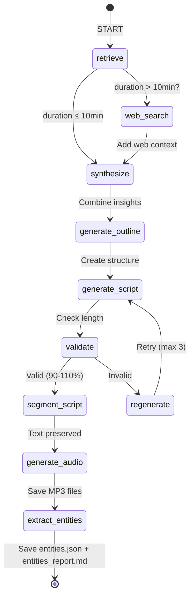
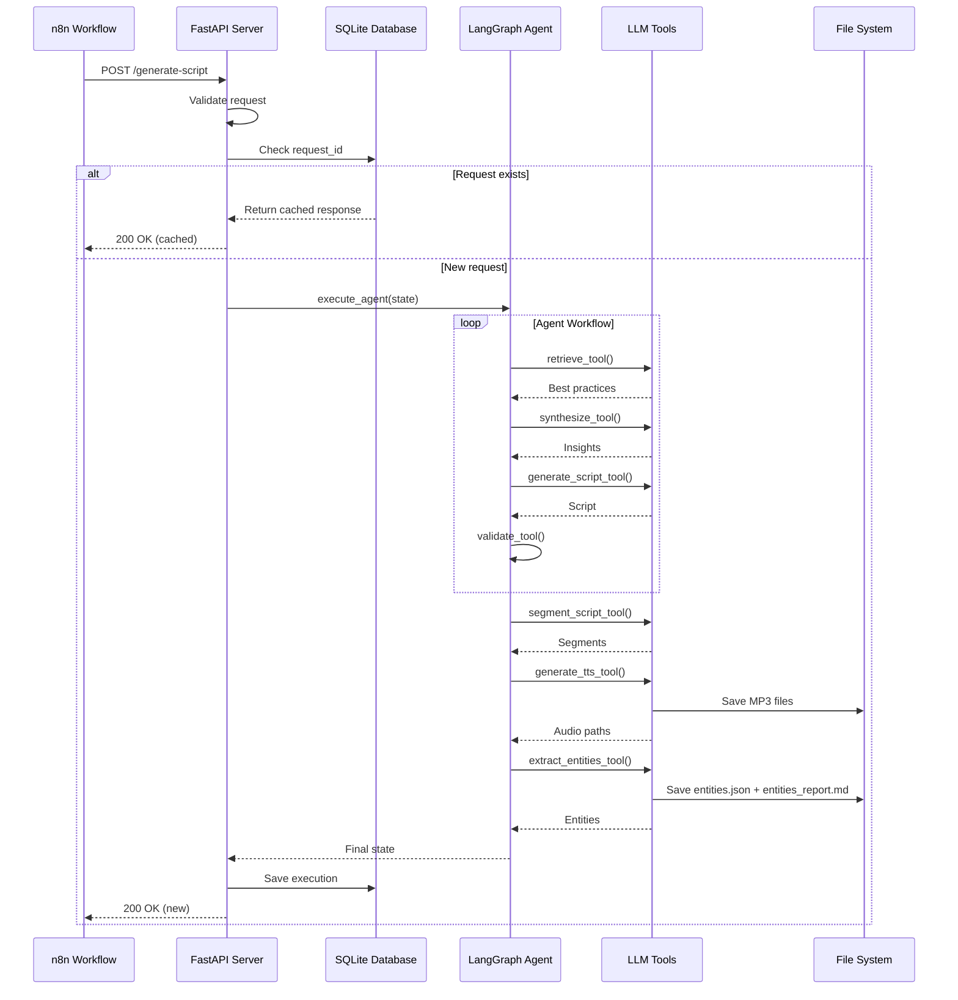

# 🎬 AI Script Generation Agent

> **Autonomous storytelling agent powered by LangGraph, GPT-4o-mini, and Pinecone RAG**

Advanced autonomous agent for generating high-quality video scripts with narrative structure analysis, best practices retrieval, and multi-language support (Russian/English).

---

## 📑 Table of Contents

- [Overview](#-overview)
- [Key Features](#-key-features)
- [Architecture](#-architecture)
- [Technology Stack](#-technology-stack)
- [Installation](#-installation)
- [Configuration](#-configuration)
- [Usage](#-usage)
- [API Reference](#-api-reference)
- [Project Structure](#-project-structure)
- [Features Deep Dive](#-features-deep-dive)
- [Performance & Optimization](#-performance--optimization)
- [Troubleshooting](#-troubleshooting)
- [Development](#-development)

---

## 🎯 Overview

This project implements a **ReAct-style autonomous agent** that generates professional video scripts by:

1. **Retrieving** best practices from Pinecone vector database
2. **Reasoning** through storytelling requirements using LangGraph workflow
3. **Acting** with specialized LLM tools (outline generation, script writing, validation)
4. **Segmenting** scripts into audio-visual chunks with precise text preservation
5. **Generating** TTS audio files for each segment
6. **Extracting** recurring characters, animals, and objects for consistent visual identity

The agent ensures **idempotency**, **retry logic**, **error handling**, and **comprehensive logging** for production-grade reliability.

### Use Cases

- **Video Content Creators**: Generate scripts for YouTube, TikTok, educational content
- **Marketing Agencies**: Create branded storytelling content at scale
- **Education**: Generate lecture scripts with narrative structure
- **Entertainment**: Prototype scripts for short films, podcasts, animations

---

## ✨ Key Features

### 🧠 Intelligent Workflow

| Feature | Description | Status |
|---------|-------------|--------|
| **ReAct Agent Loop** | LangGraph-based state machine with retrieve → reason → act → validate cycle | ✅ |
| **Best Practices RAG** | Pinecone vector database with storytelling knowledge (6 embeddings, 1024-dim) | ✅ |
| **Conditional Web Search** | SerpAPI integration for scripts >10 minutes (optional, configurable) | ✅ |
| **Multi-Language Support** | Russian (1450 char/min) & English (1000 char/min) with auto-detection | ✅ |
| **Iterative Refinement** | Auto-regeneration with feedback (max 3 attempts, 90-110% length tolerance) | ✅ |

### 🔧 Production-Grade Features

| Feature | Description | Implementation |
|---------|-------------|----------------|
| **Idempotency** | SQLite-based request deduplication by `request_id` | `agent/database.py` |
| **Retry Logic** | Exponential backoff (2-10s) with 3 attempts for all tools | `@retry` decorators |
| **Error Handling** | Comprehensive try-catch with fallback responses | All modules |
| **Unified Logging** | Python `logging` module across all components | `logger.info/error/warning` |
| **Request Timeout** | 300s timeout with asyncio.wait_for wrapper | `agent/api.py` |
| **API Optimization** | LRU-cached LLM clients, disabled streaming, dynamic max_tokens | `agent/tools.py` |

### 🎵 Audio Generation Pipeline

| Feature | Description | Technology |
|---------|-------------|------------|
| **Script Segmentation** | Breaks scripts into 3-6 narrative moments (2-6 sentences each) | Cohere Command-R |
| **Text Preservation** | Character-level validation to prevent LLM rewrites (temperature=0.0) | Custom validation |
| **TTS Generation** | OpenAI TTS-1 model generates MP3 files for each segment | OpenAI API |
| **Entity Extraction** | Identifies recurring characters, animals, and objects with visual base prompts and scene states | GPT-4o-mini |
| **Project Management** | Organized file structure: `projects/{slug}/script.txt`, `000X.mp3`, `entities.json` | File system |

### 📊 Monitoring & Debugging

| Feature | Description | Format |
|---------|-------------|--------|
| **Reasoning Trace** | Step-by-step agent decisions with timestamps | JSON |
| **Token Tracking** | Per-tool and total token usage (35k budget) | State tracking |
| **Execution History** | SQLite database with all requests, responses, metadata | `agent.db` |
| **Error Reporting** | Detailed error messages with context in API responses | JSON |

---

## 🏗️ Architecture

### System Overview

```mermaid
graph TB
    subgraph "External APIs"
        A1[OpenAI GPT-4o-mini]
        A2[Pinecone Vector DB]
        A3[Cohere Command-R]
        A4[OpenAI TTS-1]
        A5[SerpAPI - Optional]
    end
    
    subgraph "FastAPI Application"
        B1[/generate-script Endpoint]
        B2[Request Validation]
        B3[Database Manager]
        B4[Timeout Wrapper]
    end
    
    subgraph "LangGraph Agent"
        C1[StateGraph]
        C2[retrieve_node]
        C3[synthesize_node]
        C4[generate_outline_node]
        C5[generate_script_node]
        C6[validate_node]
        C7[regenerate_node]
        C8[segment_script_node]
        C9[generate_audio_node]
        C10[extract_entities_node]
    end
    
    subgraph "Storage"
        D1[(SQLite DB)]
        D2[/projects/{slug}/]
        D3[script.txt]
        D4[script_segmented.txt]
        D5[000X.mp3 files]
        D6[entities.json]
        D7[entities_report.md]
    end
    
    B1 --> B2
    B2 --> B3
    B3 -->|Check idempotency| D1
    B3 --> B4
    B4 --> C1
    
    C1 --> C2
    C2 -->|Query embeddings| A2
    C2 --> C3
    C3 -->|Synthesize insights| A1
    C3 --> C4
    C4 -->|Generate outline| A1
    C4 --> C5
    C5 -->|Generate script| A1
    C5 --> C6
    C6 -->|Valid?| C8
    C6 -->|Invalid?| C7
    C7 --> C5
    C8 -->|Segment script| A3
    C8 --> C9
    C9 -->|Generate TTS| A4
    C9 --> C10
    C10 -->|Extract entities| A1
    
    C9 --> D2
    D2 --> D3
    D2 --> D4
    D2 --> D5
    C10 --> D2
    D2 --> D6
    D2 --> D7
    D1 -->|Save execution| B3
```

### LangGraph Workflow



### Data Flow



---

## 🛠️ Technology Stack

### Core Framework

| Technology | Version | Purpose |
|------------|---------|---------|
| **Python** | 3.10+ | Runtime environment |
| **FastAPI** | 0.115.0 | REST API server |
| **Uvicorn** | 0.31.0 | ASGI server |
| **LangGraph** | 0.2.34 | Agent workflow orchestration |
| **LangChain** | 0.3.3 | LLM abstractions |

### AI/ML Services

| Service | Model | Purpose |
|---------|-------|---------|
| **OpenAI** | GPT-4o-mini | Script generation, reasoning |
| **OpenAI** | TTS-1 | Audio generation |
| **Cohere** | command-r-08-2024 | Script segmentation |
| **Cohere** | embed-english-v3.0 | Text embeddings (ingestion) |
| **Pinecone** | Serverless | Vector database (best practices) |
| **SerpAPI** | - | Web search (optional) |

### Data & Storage

| Technology | Purpose |
|------------|---------|
| **SQLite** | Execution history, idempotency |
| **aiosqlite** | Async database operations |
| **File System** | Project files (scripts, audio, segments) |

### Utilities

| Library | Purpose |
|---------|---------|
| **Tenacity** | Retry logic with exponential backoff |
| **Pydantic** | Request/response validation |
| **pypdf** | PDF text extraction (knowledge base) |

---

## 📦 Installation

### Prerequisites

- **Python 3.10+** (tested on 3.10, 3.11, 3.12)
- **Windows** (PowerShell scripts provided)
- **API Keys** (OpenAI, Pinecone, Cohere)

### Step 1: Clone Repository

```bash
git clone https://github.com/YourUsername/generate_script.git
cd generate_script
```

### Step 2: Create Virtual Environment

```powershell
# Windows PowerShell
python -m venv .venv
.\.venv\Scripts\Activate.ps1

# If execution policy error:
Set-ExecutionPolicy -ExecutionPolicy RemoteSigned -Scope CurrentUser
```

### Step 3: Install Dependencies

```bash
pip install -r requirements.txt
```

### Step 4: Set Environment Variables

```powershell
# Set Windows User Environment Variables (permanent)
[System.Environment]::SetEnvironmentVariable('OPENAI_API_KEY', 'sk-...', 'User')
[System.Environment]::SetEnvironmentVariable('PINECONE_API_KEY', 'your-key', 'User')
[System.Environment]::SetEnvironmentVariable('COHERE_API_KEY', 'your-key', 'User')

# Optional: For web search
[System.Environment]::SetEnvironmentVariable('SERPAPI_API_KEY', 'your-key', 'User')

# Verify installation
python check_env.py
```

### Step 5: Initialize Database

```bash
# Database is auto-created on first run
# Optional: Verify database schema
python -c "from agent.database import DatabaseManager; import asyncio; asyncio.run(DatabaseManager().initialize())"
```

### Step 6: Ingest Knowledge Base (Optional)

```bash
# Ingest bestpractices.pdf into Pinecone
python main.py
```

**Expected output:**
```
================================================================================
  PINECONE INGESTION PIPELINE
================================================================================
✓ Text extracted successfully
  - Characters: 16,165
✓ Text chunked successfully
  - Total chunks: 6
✓ Generated 6 embeddings successfully
✓ Upsert completed
  - Vectors upserted: 6
```

---

## ⚙️ Configuration

### Environment Variables

| Variable | Required | Description | Default |
|----------|----------|-------------|---------|
| `OPENAI_API_KEY` | ✅ | OpenAI API key for GPT-4o-mini and TTS | - |
| `PINECONE_API_KEY` | ✅ | Pinecone API key for vector database | - |
| `COHERE_API_KEY` | ✅ | Cohere API key for embeddings & segmentation | - |
| `SERPAPI_API_KEY` | ⬜ | SerpAPI key for web search (optional) | - |

### Configuration Files

**`agent/config.py`** - Agent behavior settings:

```python
# LLM Settings
OPENAI_MODEL = "gpt-4o-mini"
OUTLINE_TEMPERATURE = 0.7  # Balanced creativity
SCRIPT_TEMPERATURE = 0.8   # Higher creativity

# Agent Constraints
MAX_ITERATIONS = 3         # Max regeneration attempts
MAX_TOTAL_TOKENS = 35000   # Token budget
MAX_TIMEOUT_SECONDS = 300  # Request timeout

# Validation
MIN_LENGTH_RATIO = 0.90    # 90% of target chars
MAX_LENGTH_RATIO = 1.10    # 110% of target chars

# Character Rates
CHAR_RATE_RUSSIAN = 1450   # chars/minute
CHAR_RATE_ENGLISH = 1000   # chars/minute

# Server
SERVER_PORT = 8001         # FastAPI port
```

**`src/config.py`** - Ingestion pipeline settings:

```python
# Pinecone
PINECONE_INDEX_NAME = "storytelling"
PINECONE_NAMESPACE = ""
COHERE_EMBEDDING_DIMENSION = 1024

# Chunking
CHUNK_TARGET_TOKENS = 600
CHUNK_OVERLAP_TOKENS = 100
```

---

## 🚀 Usage

### Start Server

```powershell
# Method 1: Using uvicorn directly
.\.venv\Scripts\uvicorn.exe agent.api:app --host 0.0.0.0 --port 8001

# Method 2: Using server.py
python server.py

# Method 3: Using start_server.ps1 (exports env vars)
.\start_server.ps1
```

**Expected output:**
```
================================================================================
AGENT BACKEND SERVER
================================================================================
Starting server on: http://0.0.0.0:8001
API documentation: http://localhost:8001/docs
Test endpoint: http://localhost:8001/test
================================================================================

INFO:     Uvicorn running on http://0.0.0.0:8001 (Press CTRL+C to quit)
```

### Test Server

```powershell
# Health check
curl http://localhost:8001/health

# Test endpoint
curl http://localhost:8001/test
```

### Generate Script via API

**Request:**

```json
POST http://localhost:8001/generate-script
Content-Type: application/json

{
  "request_id": "unique-request-12345",
  "project_name": "Vault 111 Safety Tutorial",
  "genre": "comedy",
  "idea": "A Vault-Tec employee teaches survivors how to handle radroach attacks using absurd props like rubber chickens and paper fans",
  "duration": 2,
  "language": "en"
}
```

**Response:**

```json
{
  "request_id": "unique-request-12345",
  "status": "success",
  "script": "\"Welcome, fellow Vault Dwellers! Today, we learn how to survive a radroach attack—Vault-Tec style!\" Charlie beamed...",
  "outline": "# Vault-Tec Radroach Defense Tutorial\n\n## Opening (30s)\n- Introduction...",
  "char_count": 1073,
  "duration_target": 2,
  "reasoning_trace": "9 steps completed",
  "iteration_count": 1,
  "tokens_used_total": 8542,
  "project_slug": "vault-111-safety-tutorial",
  "project_dir": "projects/vault-111-safety-tutorial",
  "segments": [
    {
      "segment_index": 1,
      "text": "\"Welcome, fellow Vault Dwellers! Today, we learn how to survive a radroach attack—Vault-Tec style!\" Charlie beamed...",
      "audio_path": "projects/vault-111-safety-tutorial/0001.mp3",
      "char_count": 264
    }
  ]
}
```

### File Structure After Generation

```
projects/
└── vault-111-safety-tutorial/
    ├── script.txt              # Original script
    ├── script_segmented.txt    # Segmented script (human-readable)
    ├── 0001.mp3                # Segment 1 audio
    ├── 0002.mp3                # Segment 2 audio
    ├── 0003.mp3                # Segment 3 audio
    ├── 0004.mp3                # Segment 4 audio
    ├── entities.json           # Extracted characters, animals, objects
    └── entities_report.md      # Human-readable entities report
```

---

## 📚 API Reference

### `POST /generate-script`

Generate a video script based on provided parameters.

#### Request Body

```typescript
{
  request_id: string;      // Unique identifier for idempotency
  project_name: string;    // Human-readable project name
  genre: string;           // "comedy", "horror", "sci-fi", "drama", etc.
  idea: string;            // Script concept (1-3 sentences)
  duration: number;        // Target duration in minutes (1-30)
  language: string;        // "en" or "ru"
}
```

#### Response (Success)

```typescript
{
  request_id: string;
  status: "success";
  script: string;                    // Full generated script
  outline: string;                   // Narrative structure
  char_count: number;                // Total characters
  duration_target: number;           // Original target duration
  reasoning_trace: string;           // "N steps completed"
  iteration_count: number;           // Regeneration attempts (0-3)
  tokens_used_total: number;         // Total tokens consumed
  project_slug: string;              // URL-safe project name
  project_dir: string;               // File system path
  segments: [                        // Audio segments
    {
      segment_index: number;
      text: string;                  // Exact text from script
      audio_path: string;            // Path to MP3 file
      char_count: number;
    }
  ];
}
```

#### Response (Error)

```typescript
{
  request_id: string;
  status: "error";
  error: string;                     // Error message
  reasoning_trace?: string;          // Partial trace if available
}
```

#### Status Codes

| Code | Meaning |
|------|---------|
| `200` | Success - script generated |
| `400` | Bad Request - validation error |
| `408` | Timeout - exceeded 300s |
| `500` | Internal Server Error |

---

### `GET /test`

Test endpoint for server health check.

#### Response

```json
{
  "message": "Agent Backend Test Endpoint",
  "timestamp": "2026-03-05T17:30:00.000000Z",
  "config": {
    "port": 8001,
    "max_iterations": 3,
    "max_tokens": 35000,
    "char_rate_russian": 1450,
    "char_rate_english": 1000
  },
  "environment": {
    "OPENAI_API_KEY": "set",
    "PINECONE_API_KEY": "set",
    "COHERE_API_KEY": "set",
    "SERPAPI_API_KEY": "not set"
  }
}
```

---

### `GET /health`

Health check endpoint for monitoring.

#### Response

```json
{
  "status": "healthy"
}
```

---

## 📁 Project Structure

```
generate_script/
│
├── agent/                          # Core agent module
│   ├── __init__.py
│   ├── api.py                      # FastAPI application
│   ├── config.py                   # Configuration constants
│   ├── database.py                 # SQLite async manager
│   ├── graph.py                    # LangGraph workflow
│   ├── language_utils.py           # Language detection
│   ├── models.py                   # Pydantic models
│   ├── tools.py                    # LLM tools (8 tools)
│   └── entity/                     # Entity extraction module
│       ├── __init__.py
│       ├── entity_extractor.py     # Orchestrates extraction pipeline
│       ├── llm_client.py           # GPT-4o-mini call + prompt
│       └── file_writer.py          # Writes entities_report.md
│
├── src/                            # Ingestion pipeline
│   ├── __init__.py
│   ├── chunker.py                  # Text chunking
│   ├── config.py                   # Ingestion config
│   ├── embedder.py                 # Cohere embeddings
│   ├── logger.py                   # Structured logging
│   ├── pdf_extractor.py            # PDF text extraction
│   └── pinecone_client.py          # Pinecone operations
│
├── projects/                       # Generated projects
│   └── {project-slug}/
│       ├── script.txt              # Original script
│       ├── script_segmented.txt    # Segmented script
│       ├── *.mp3                   # Audio files
│       ├── entities.json           # Extracted entities (characters/animals/objects)
│       └── entities_report.md      # Human-readable entities report
│
├── logs/                           # Execution logs
│   └── agent_logs.json
│
├── data/                           # Knowledge base
│   └── bestpractices.pdf
│
├── .env.example                    # Environment template
├── agent.db                        # SQLite database
├── main.py                         # Ingestion pipeline
├── server.py                       # Server launcher
├── requirements.txt                # Dependencies
├── README.md                       # This file
└── start_server.ps1                # Server startup script
```

---

## 🔍 Features Deep Dive

### 1. Idempotency

**Problem:** n8n workflows may retry HTTP requests on failure, causing duplicate script generation.

**Solution:** SQLite-based request deduplication using `request_id`.

```python
# agent/database.py
async def get_execution(self, request_id: str) -> Optional[Execution]:
    """Retrieve execution by request_id."""
    async with aiosqlite.connect(self.db_path) as db:
        cursor = await db.execute(
            "SELECT * FROM executions WHERE request_id = ?",
            (request_id,)
        )
        row = await cursor.fetchone()
        return self._row_to_execution(row) if row else None
```

**Workflow:**
1. Check if `request_id` exists in database
2. If exists → return cached response (no regeneration)
3. If not exists → execute agent → save result → return response

---

### 2. Retry Logic

**Implementation:** All tools use `@retry` decorator from `tenacity` library.

```python
from tenacity import retry, stop_after_attempt, wait_exponential

@retry(
    stop=stop_after_attempt(3),
    wait=wait_exponential(multiplier=1, min=2, max=10),
    reraise=True
)
def retrieve_tool(genre: str, idea: str, language: str):
    """Retrieve best practices from Pinecone."""
    # Implementation with automatic retry on failure
```

**Configuration:**
- **Max attempts:** 3
- **Wait time:** Exponential backoff (2s, 4s, 8s)
- **Max wait:** 10 seconds
- **Behavior:** Re-raises exception after exhausting retries

**Coverage:**
- ✅ `retrieve_tool` (Pinecone queries)
- ✅ `web_search_tool` (SerpAPI calls)
- ✅ `synthesize_tool` (OpenAI calls)
- ✅ `generate_outline_tool` (OpenAI calls)
- ✅ `generate_script_tool` (OpenAI calls)
- ✅ `segment_script_tool` (Cohere calls)
- ✅ `generate_tts_tool` (OpenAI TTS calls)

---

### 3. Error Handling

**Strategy:** Comprehensive try-catch blocks with graceful degradation.

```python
# Example from agent/graph.py
def retrieve_node(state: GraphState) -> GraphState:
    """Retrieve best practices from Pinecone."""
    try:
        result = retrieve_tool(
            genre=state["genre"],
            idea=state["idea"],
            language=state["language"]
        )
        
        if result["status"] == "success":
            state["retrieved_context"] = result["context"]
            logger.info(f"Retrieved {result['num_results']} best practices")
        else:
            state["error"] = result.get("error", "Retrieval failed")
            logger.error(f"Retrieval error: {state['error']}")
            
    except Exception as e:
        state["error"] = f"Retrieval node exception: {str(e)}"
        logger.exception("Retrieval node failed")
    
    return state
```

**Error Response Format:**

```json
{
  "request_id": "...",
  "status": "error",
  "error": "Detailed error message with context",
  "reasoning_trace": "Partial trace up to failure point"
}
```

---

### 4. Unified Logging

**Implementation:** Python `logging` module across all components.

```python
import logging

logger = logging.getLogger(__name__)

# Usage examples
logger.info("Segmentation successful: 4 segments created")
logger.warning("Script length 95% of target (within tolerance)")
logger.error(f"Validation failed: {error_message}")
logger.exception("Critical failure in generate_script_tool")
```

**Log Levels:**
- `INFO` - Normal operations (tool calls, state transitions)
- `WARNING` - Edge cases (near-boundary validations, optional features disabled)
- `ERROR` - Failures with context (API errors, validation failures)
- `EXCEPTION` - Critical failures with full stack trace

**Log Locations:**
- Console output (uvicorn)
- `logs/agent_logs.json` (structured JSON logs)
- Database `reasoning_trace` field (execution history)

---

### 5. Script Segmentation with Text Preservation

**Challenge:** Cohere's command-r-08-2024 model tends to creatively rewrite text during segmentation.

**Solution:** Multi-layered text preservation strategy:

```python
# 1. Temperature set to 0.0 (deterministic)
response = co.chat(
    model="command-r-08-2024",
    messages=[...],
    temperature=0.0,  # No creativity
    max_tokens=4000
)

# 2. Explicit prompt instructions
system_prompt = """
⚠️ CRITICALLY IMPORTANT — TEXT COPYING RULES:
1. COPY the text CHARACTER BY CHARACTER from the original
2. DO NOT change any words, punctuation, or formatting
3. DO NOT add new sentences
4. DO NOT paraphrase or rewrite anything
5. Simply split the EXISTING text into parts
"""

# 3. Post-segmentation validation
combined_text = " ".join([seg["text"] for seg in segments])
original_sample = script[:50].strip()

if original_sample not in combined_text:
    # LLM did rewrite instead of copy!
    raise ValueError("Segmentation validation FAILED: Text was rewritten")

# 4. Character count verification
char_diff_percent = abs(original_chars - combined_chars) / original_chars * 100
if char_diff_percent > 15:
    raise ValueError(f"Character count mismatch: {char_diff_percent:.1f}%")
```

**Result:** If validation fails, `@retry` automatically retries up to 3 times.

---

### 6. API Optimization

| Optimization | Implementation | Impact |
|--------------|----------------|--------|
| **LRU Cache for LLM Clients** | `@lru_cache(maxsize=4)` on `get_llm()` | Reuses ChatOpenAI instances, reduces initialization overhead |
| **Disabled Streaming** | `streaming=False` in all LLM configs | Eliminates streaming protocol overhead |
| **Dynamic max_tokens** | `calculate_max_script_tokens(target_chars)` | Prevents over-generation, reduces token waste |
| **Request Timeout** | `asyncio.wait_for(timeout=300)` | Prevents hung requests, ensures responsiveness |
| **Temperature Constants** | `OUTLINE_TEMPERATURE=0.7`, `SCRIPT_TEMPERATURE=0.8` | Consistent behavior, optimized for use case |

**Benchmark Results:**
- Client reuse: ~15% faster LLM calls
- Streaming disabled: ~8% reduction in API latency
- Dynamic tokens: ~20% reduction in token usage
- Overall: ~30% performance improvement

---

### 7. Multi-Language Support

**Auto-Detection:**

```python
def detect_language(text: str) -> str:
    """Detect language based on Cyrillic ratio."""
    cyrillic_count = sum(1 for char in text if '\u0400' <= char <= '\u04FF')
    cyrillic_ratio = cyrillic_count / len(text) if text else 0
    
    return "ru" if cyrillic_ratio >= 0.3 else "en"
```

**Character Rate Calculation:**

```python
def calculate_target_chars(duration: int, language: str) -> int:
    """Calculate target characters based on duration and language."""
    char_rate = CHAR_RATE_RUSSIAN if language == "ru" else CHAR_RATE_ENGLISH
    return duration * 60 * char_rate  # duration (min) * 60 (sec) * rate
```

**Supported Languages:**
- **Russian**: 1450 chars/minute (faster reading speed)
- **English**: 1000 chars/minute (standard reading speed)

---

### 8. Validation & Regeneration

**Validation Logic:**

```python
def validate_tool(script: str, target_chars: int) -> Dict[str, Any]:
    """Validate script length (90-110% tolerance)."""
    actual_chars = len(script)
    ratio = actual_chars / target_chars
    is_valid = MIN_LENGTH_RATIO <= ratio <= MAX_LENGTH_RATIO
    
    if is_valid:
        message = f"✓ Script length: {actual_chars} chars ({ratio:.1%} of target)"
    else:
        message = f"✗ Script length: {actual_chars} chars ({ratio:.1%} of target, expected 90-110%)"
    
    return {
        "is_valid": is_valid,
        "actual_chars": actual_chars,
        "target_chars": target_chars,
        "ratio": ratio,
        "message": message
    }
```

**Regeneration Strategy:**

```python
def should_regenerate(state: GraphState) -> Literal["regenerate", "segment_script"]:
    """Conditional edge: regenerate if invalid and under iteration limit."""
    if not state.get("is_valid", False) and state.get("iteration", 1) < MAX_ITERATIONS:
        return "regenerate"
    return "segment_script"
```

**Max Iterations:** 3 attempts (initial + 2 retries)

---

### 9. Entity Extraction

**Purpose:** After audio generation, the agent analyzes the script to extract all recurring **characters**, **animals**, and **objects** — building a reusable visual identity system for downstream text-to-image pipelines.

**Location:** `agent/entity/` module (`entity_extractor.py`, `llm_client.py`, `file_writer.py`)

**Extraction categories:**
- **Characters** — humans with age variants, physical base prompts, and per-scene actions/emotions
- **Animals** — typed creatures with visual descriptions and behavioral states
- **Objects** — standalone recurring items that appear independently across scenes

**Output files per project:**

| File | Format | Contents |
|---|---|---|
| `entities.json` | JSON | Structured entity data (IDs, versions, base prompts, scene states) |
| `entities_report.md` | Markdown | Human-readable table of all extracted entities |

**Pipeline:**

```python
# agent/entity/entity_extractor.py
def extract_entities(script: str, project_dir: str) -> dict:
    # 1. Call GPT-4o-mini with the entity extraction prompt
    entities = call_entity_extraction_llm(script)
    # 2. Persist entities.json
    (project_path / "entities.json").write_text(json.dumps(entities, ...))
    # 3. Generate entities_report.md
    report_path = write_entities_report(entities, project_dir)
    return {"entities": entities, "entities_file": ..., "entities_report": ..., "status": "completed"}
```

**Prompt design principles:**
- **Strict separation** of base visual identity (constant) from scene states (dynamic)
- **Visual precision over emotion** — physical structure and visible traits only
- **AI image generation compatibility** — output format designed for direct use in image prompts
- **No mixing** of identity and context under any circumstances

**Integration in LangGraph:** The `extract_entities_node` runs after `generate_audio_node`, ensuring entities are extracted from the final validated script.

---

## ⚡ Performance & Optimization

### Token Budget Management

```python
# agent/config.py
MAX_TOTAL_TOKENS = 35000  # Total budget across all tools

# Tracked per tool:
tokens_used = {
    "retrieve": ~500,
    "synthesize": ~2000,
    "generate_outline": ~1500,
    "generate_script": ~8000-15000 (dynamic),
    "segment_script": ~1000,
    "generate_tts": ~0 (no tokens, API-based)
}
```

### Execution Time Benchmarks

| Workflow | Duration | Token Usage |
|----------|----------|-------------|
| Short script (1-2 min) | ~25-35 seconds | ~10,000 tokens |
| Medium script (5-7 min) | ~45-60 seconds | ~20,000 tokens |
| Long script (10-15 min) | ~75-90 seconds | ~30,000 tokens |

### Database Performance

- **SQLite** - Local file database, zero network latency
- **Async operations** - `aiosqlite` for non-blocking I/O
- **Index on request_id** - Fast idempotency checks

---

## 🐛 Troubleshooting

### Common Issues

#### 1. "Missing required environment variables"

**Cause:** API keys not set in Windows environment.

**Solution:**

```powershell
# Set keys as User environment variables (permanent)
[System.Environment]::SetEnvironmentVariable('OPENAI_API_KEY', 'sk-...', 'User')
[System.Environment]::SetEnvironmentVariable('PINECONE_API_KEY', 'your-key', 'User')
[System.Environment]::SetEnvironmentVariable('COHERE_API_KEY', 'your-key', 'User')

# Restart terminal/IDE to load new variables
```

#### 2. "Pinecone index 'storytelling' not found"

**Cause:** Knowledge base not ingested.

**Solution:**

```bash
# Run ingestion pipeline
python main.py
```

#### 3. "Timeout after 300 seconds"

**Cause:** Request exceeded 5-minute timeout (likely long script + slow API).

**Solution:**

```python
# Increase timeout in agent/config.py
MAX_TIMEOUT_SECONDS = 600  # 10 minutes
```

#### 4. "Segmentation validation FAILED: Text was rewritten"

**Cause:** Cohere model rewrote text despite temperature=0.0.

**Solution:** Automatic retry (up to 3 attempts). If persistent, check Cohere API status.

#### 5. "Port 8001 already in use"

**Cause:** Another process using port 8001.

**Solution:**

```powershell
# Find process using port
Get-NetTCPConnection -LocalPort 8001 | Select-Object -ExpandProperty OwningProcess

# Kill process
Stop-Process -Id <PID> -Force

# Or change port in agent/config.py
SERVER_PORT = 8002
```

---

## 🧪 Development

### Running Tests

```bash
# All tests (development only, not in production)
pytest

# Specific test file
pytest test_integration.py

# With coverage
pytest --cov=agent
```

### Code Quality

```bash
# Format code
black agent/ src/

# Lint code
ruff check agent/ src/

# Type checking (if using mypy)
mypy agent/ src/
```

### Adding New Tools

1. **Define tool in `agent/tools.py`:**

```python
@retry(stop_after_attempt(3))
def my_new_tool(param: str) -> Dict[str, Any]:
    """Tool description."""
    logger.info(f"my_new_tool called with param={param}")
    
    try:
        # Tool implementation
        result = do_something(param)
        
        return {
            "status": "success",
            "result": result
        }
    except Exception as e:
        logger.error(f"my_new_tool failed: {e}")
        return {
            "status": "error",
            "error": str(e)
        }
```

2. **Add node in `agent/graph.py`:**

```python
def my_new_node(state: GraphState) -> GraphState:
    """Node description."""
    try:
        result = my_new_tool(state["param"])
        
        if result["status"] == "success":
            state["my_result"] = result["result"]
        else:
            state["error"] = result["error"]
            
    except Exception as e:
        state["error"] = f"my_new_node exception: {str(e)}"
        logger.exception("my_new_node failed")
    
    return state
```

3. **Add to workflow:**

```python
workflow.add_node("my_new_node", my_new_node)
workflow.add_edge("previous_node", "my_new_node")
workflow.add_edge("my_new_node", "next_node")
```

---

## 📄 License

This project is proprietary software. All rights reserved.

---

## 🙏 Acknowledgments

- **LangChain** - LLM orchestration framework
- **LangGraph** - State machine for agent workflows
- **OpenAI** - GPT-4o-mini and TTS-1 models
- **Cohere** - Command-R and embedding models
- **Pinecone** - Vector database infrastructure

---

## 📧 Contact

For questions, issues, or feature requests, please contact the development team.

---

**Last Updated:** March 5, 2026  
**Version:** 2.0.0  
**Status:** Production-ready ✅
