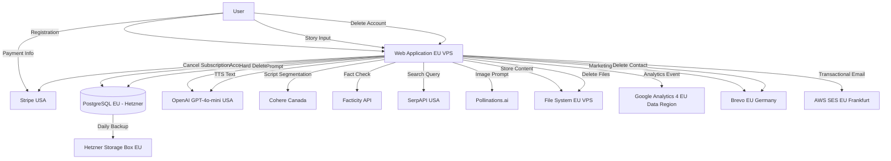

# GDPR Compliance Documentation

**AI Content Generation SaaS Platform**

---

**Document Version:** 1.0  
**Last Updated:** April 1, 2026  
**Next Review:** April 1, 2027  
**Compliance Status:** Pre-Launch Preparation  
**Risk Level:** LOW

**Data Controller:**  
[Your Company Name]  
[Address]  
[City, Country]  
Email: privacy@yourdomain.com

---

## Table of Contents

1. [Executive Summary](#1-executive-summary)
2. [Data Flow Map](#2-data-flow-map)
3. [Processing Activities Register (Article 30)](#3-processing-activities-register-article-30)
4. [Data Protection Impact Assessment (DPIA)](#4-data-protection-impact-assessment-dpia)
5. [Third-Party Data Transfers](#5-third-party-data-transfers)
6. [Data Subject Rights Implementation](#6-data-subject-rights-implementation)
7. [Technical & Organizational Measures](#7-technical--organizational-measures)
8. [Cookie Policy & Consent Management](#8-cookie-policy--consent-management)
9. [Compliance Documentation Maintenance](#9-compliance-documentation-maintenance)
10. [Implementation Roadmap](#10-implementation-roadmap)
11. [Appendices](#11-appendices)

---

## 1. Executive Summary

### 1.1 Product Overview

This AI Content Generation SaaS platform enables users to create educational and entertainment video content through AI-powered script generation, image creation, text-to-speech, and video assembly. The service is designed as a Minimum Viable Product (MVP) targeting individual creators and educators.

**Key Features:**
- AI-powered script generation (OpenAI GPT-4o-mini)
- Image generation (Pollinations.ai)
- Text-to-speech audio (OpenAI TTS-1)
- Video assembly (MP4 output)
- Optional fact-checking (Facticity API)
- Subscription-based pricing (Stripe)

**Target Market:** English-language users in EU and global markets

### 1.2 GDPR Compliance Scope

**Classification:** Standard Risk Processing
- No special category data (Article 9) processing
- No criminal conviction data (Article 10) processing
- No large-scale systematic monitoring
- No decisions based solely on automated processing with legal effects

**Regulatory Framework:**
- **GDPR** (Regulation 2016/679) — primary compliance framework
- **EU AI Act** (Regulation 2024/1689) — LIMITED-RISK classification (transparency obligations only)
- **ePrivacy Directive** (2002/58/EC) — cookie consent requirements

### 1.3 Data Processing Summary

**Personal Data Processed:**
- Account data: Email, password (hashed), optional first name/nickname
- Usage data: Story prompts, generated content, execution logs
- Analytics: Google Analytics 4 (consent-based, EU Data Region)
- Payment data: Stripe Customer ID, subscription status (card data NOT stored)
- Marketing: Email consent, engagement metrics (Brevo)

**Legal Bases:**
- **Contract** (Article 6(1)(b)): Registration, service provision, payment processing
- **Consent** (Article 6(1)(a)): Google Analytics, marketing emails
- **Legitimate Interest** (Article 6(1)(f)): Internal operational metrics (aggregate only)

**International Data Transfers:**
- **USA**: Google Analytics (EU Data Region + SCCs), OpenAI (SCCs), Stripe (EU-US DPF + SCCs), Cohere Canada (SCCs)
- **Transfer Impact Assessment (TIA)** completed — Risk: LOW
- **Supplementary Measures**: EU Data Region (GA4), data minimization (no user IDs to AI services), encryption, short retention

### 1.4 Risk Assessment

**Overall GDPR Risk:** **LOW** ✅

**Protective Measures:**
- EU-only hosting (Hetzner Germany)
- Data minimization (only essential data collected)
- Short retention periods (90 days content, 180 days inactivity)
- Strong encryption (TLS 1.3, bcrypt passwords, AES-256 backups)
- Automated data subject rights (self-service export/deletion)
- Consent-based optional processing (GA4, marketing)
- Standard Contractual Clauses with all non-EU processors

**Remaining Risks:**
- Pollinations.ai (no DPA) — MEDIUM risk, mitigated by generic prompts (no PII), planned migration to Stability AI
- Regulatory challenge to GA4 — LOW risk, mitigated by EU Data Region + TIA + consent

### 1.5 Key Compliance Measures

**Implemented:**
✅ Privacy by Design (data minimization from registration)  
✅ Privacy by Default (marketing/analytics opt-in, not opt-out)  
✅ Data Protection Impact Assessment (DPIA) for AI processing  
✅ Transfer Impact Assessment (TIA) for USA transfers  
✅ Standard Contractual Clauses (SCCs) with major processors  
✅ Cookie consent banner with pre-blocking  
✅ Automated data subject rights (access, erasure, portability)  

**Planned Before Launch:**
- Legal review of Privacy Policy and Terms of Service (€500-1,000)
- Sign remaining DPAs (Cohere, SerpAPI, Facticity)
- Implement cookie consent banner (Cookiebot or custom)
- Deploy user account system with consent management

---

## 2. Data Flow Map

### 2.1 Overview

This section maps all personal data flows through the system, from collection points through processing to deletion.

### 2.2 Data Flow Diagram (Mermaid Format)



### 2.3 Data Flow Table

| Data Type | Collection Point | Purpose | Storage Location | Retention | Third Parties | Legal Basis |
|-----------|------------------|---------|------------------|-----------|---------------|-------------|
| **Email** | Registration form | Account identification, authentication | PostgreSQL (Hetzner DE) | Until account deletion or 210 days inactivity | AWS SES (transactional), Brevo (marketing if consent) | Contract |
| **Password Hash** | Registration form | Authentication | PostgreSQL (Hetzner DE) | Until account deletion | None | Contract |
| **First Name** | Registration form (optional) | Email personalization | PostgreSQL (Hetzner DE) | Until account deletion | Brevo (if marketing consent given) | Contract |
| **OAuth Provider ID** | Google OAuth | Account linking | PostgreSQL (Hetzner DE) | Until account deletion | None | Contract |
| **Story Prompts** | Content generation form | AI script generation | PostgreSQL + File System (Hetzner DE) | 90 days | OpenAI (anonymous), Cohere (anonymous), SerpAPI (anonymous), Facticity (anonymous) | Contract |
| **Generated Scripts** | AI processing | Service delivery | File System (Hetzner DE) | 90 days | Cohere (segmentation), OpenAI TTS (audio generation) | Contract |
| **Generated Images** | AI processing | Service delivery | File System (Hetzner DE) | 90 days | Pollinations.ai (generation) | Contract |
| **Generated Audio** | AI processing | Service delivery | File System (Hetzner DE) | 90 days | None (generated by OpenAI, stored locally) | Contract |
| **Generated Video** | Video assembly | Service delivery | File System (Hetzner DE) | 90 days | None | Contract |
| **Execution Logs** | System processing | Debugging, performance monitoring | PostgreSQL (Hetzner DE) | 90 days | None | Legitimate Interest |
| **Reasoning Traces** | AI agent workflow | Technical debugging | PostgreSQL (Hetzner DE) | 90 days | None | Legitimate Interest |
| **Stripe Customer ID** | Payment processing | Subscription management | PostgreSQL (Hetzner DE) | Until account deletion | Stripe (payment processor) | Contract |
| **Subscription Status** | Stripe webhook | Service access control | PostgreSQL (Hetzner DE) | Until account deletion | None | Contract |
| **GA4 Client ID** | Browser cookie (if consent) | Analytics | Google Analytics EU + USA | 14 months events, 2 months user-level | Google LLC (USA) | Consent |
| **Page Views & Events** | Frontend tracking (if consent) | Service improvement | Google Analytics EU + USA | 14 months | Google LLC (USA) | Consent |
| **Email Engagement** | Brevo tracking (if marketing consent) | Marketing effectiveness | Brevo (EU Germany) | 12 months | None | Consent |
| **Consent Records** | Registration, cookie banner | Proof of consent (legal defense) | PostgreSQL (Hetzner DE) | Until account deletion + 30 days grace | None | Legal Obligation |
| **Consent IP Address** | Registration, cookie banner | Proof of consent (GDPR compliance) | PostgreSQL (Hetzner DE) | Until account deletion + 30 days grace | None | Legal Obligation |
| **Application Logs** | FastAPI logging | Security, error tracking | VPS Disk (Hetzner DE) | 7 days | None | Legitimate Interest |

---

## 3. Processing Activities Register (Article 30)

### Activity 1: User Registration & Authentication

**Data Controller:** [Your Company Name]

**Purpose of Processing:**
- Create and manage user accounts
- Provide authentication and access control
- Enable service usage

**Data Types:**
- Email address (mandatory)
- Password hash (bcrypt, cost factor 12)
- First name (optional)
- Nickname (optional)
- OAuth provider ID (if Google login used)
- Registration timestamp
- Last login timestamp
- Last activity timestamp

**Data Subjects:** Registered users (individuals)

**Legal Basis:** Contract (Article 6(1)(b)) — processing necessary for service provision

**Categories of Recipients:**
- AWS SES (EU Frankfurt) — email verification
- Brevo (EU Germany) — marketing emails (only if consent given)

**International Transfers:**
- None (AWS SES eu-west-1 region stays in EU)
- Brevo: EU-only (Germany)

**Retention Period:**
- Active accounts: Indefinite (until user deletes or inactivity triggers deletion)
- Inactive accounts (no login 165 days): Warning email sent
- Inactive accounts (no login 180 days): Soft delete (30-day grace period)
- Hard delete after 210 days total inactivity

**Technical & Organizational Measures:**
- Password hashing: bcrypt cost factor 12
- Email verification required before service use
- HTTPS/TLS 1.3 for all data in transit
- Database encryption (PostgreSQL SSL)
- JWT authentication (15-min access token, 7-day refresh token)
- Access logging for security monitoring

---

### Activity 2: AI Content Generation

**Data Controller:** [Your Company Name]

**Purpose of Processing:**
- Generate video scripts using AI (OpenAI GPT-4o-mini)
- Create images (Pollinations.ai)
- Generate audio narration (OpenAI TTS-1)
- Assemble final video (local processing)
- Optional fact-checking (Facticity API)

**Data Types:**
- User story prompts (story idea, genre, duration)
- Retrieved RAG context (from Pinecone knowledge base)
- Generated scripts, images, audio, video
- Execution metadata (token usage, iteration count, sources)
- Reasoning traces (AI decision logs)

**Data Subjects:** Registered users

**Legal Basis:** Contract (Article 6(1)(b)) — core service functionality

**Categories of Recipients:**
- OpenAI LLC (USA) — script generation, TTS audio
- Cohere Inc. (Canada) — text segmentation
- Pollinations.ai (location unknown) — image generation
- Facticity API (location TBD) — fact-checking
- SerpAPI LLC (USA) — web search for RAG
- Pinecone Systems Inc. (USA) — vector search (knowledge base only, no user data stored)

**International Transfers:**
- **OpenAI (USA):** SCCs (OpenAI API Terms), 30-day retention, no training on API data
- **Cohere (Canada):** SCCs (Cohere DPA to be signed), PIPEDA compliance
- **Pollinations.ai:** No DPA (free API) — RISK: MEDIUM, mitigated by generic prompts (no PII)
- **Facticity:** TBD (location to be clarified, sign DPA if outside EU)
- **SerpAPI (USA):** DPA to be confirmed
- **Pinecone (USA):** SCCs (Pinecone DPA), but only pre-ingested knowledge base (no user data)

**Data Minimization:**
- **NO user identifiers sent to AI services** (no email, no UUID, no IP)
- Only content data sent (prompts, scripts)
- AI services cannot link requests to individual users

**Retention Period:**
- Generated content: 90 days after creation
- Execution logs: 90 days
- Reasoning traces: 90 days
- User can delete projects immediately via dashboard

**Technical & Organizational Measures:**
- HTTPS/TLS 1.3 for all API calls
- API keys stored in environment variables (600 permissions)
- Data sanitization in logs (no user input in error messages)
- Cron job: Weekly cleanup of files older than 90 days
- Fallback mechanisms (if external API fails, service degrades gracefully)

---

### Activity 3: Payment Processing

**Data Controller:** [Your Company Name]  
**Data Processor:** Stripe Inc. (USA)

**Purpose of Processing:**
- Manage subscription billing
- Process payments
- Track subscription status

**Data Types Stored Locally:**
- Stripe Customer ID (reference only)
- Subscription status (active/canceled/past_due)
- Subscription tier (free/pro)
- Subscription start date

**Data NOT Stored Locally:**
- Credit card numbers (even last 4 digits)
- Billing address
- Transaction amounts (only in Stripe)

**Data Subjects:** Paying users

**Legal Basis:** Contract (Article 6(1)(b)) — payment processing necessary for service

**Categories of Recipients:**
- Stripe Inc. (USA) — payment processor

**International Transfers:**
- **Stripe (USA):** EU-US Data Privacy Framework certified + SCCs
- Stripe PCI DSS Level 1 certified
- Stripe handles all card data (no local PCI scope)

**Retention Period:**
- Subscription data: Until account deletion
- Invoices: Retained by Stripe (users download from Stripe Customer Portal)

**Technical & Organizational Measures:**
- No local storage of payment card data (PCI DSS avoidance)
- Stripe Customer ID only stored (reference for API calls)
- Webhook signature verification (HMAC SHA-256)
- Stripe subscription canceled upon account deletion

---

### Activity 4: Analytics (Google Analytics 4)

**Data Controller:** [Your Company Name]  
**Joint Controller:** Google LLC (USA)

**Purpose of Processing:**
- Understand user behavior and service usage
- Improve service based on usage patterns
- Measure feature effectiveness
- Debug issues and performance monitoring

**Data Types:**
- Page URLs visited
- Events (button clicks, video generation events)
- User UUID (pseudonymized, not email)
- GA4 Client ID (cookie-based)
- Browser/device information (User-Agent)
- Geographic location (country/city from IP, then IP discarded)
- Referrer source

**Data Subjects:** Users who consent to analytics

**Legal Basis:** **Consent** (Article 6(1)(a)) — explicit opt-in via cookie banner required

**Categories of Recipients:**
- Google LLC (USA) — analytics processor

**International Transfers:**
- **Google Analytics 4 (USA):**
  - **EU Data Region enabled** — data stored physically in EU (Belgium/Netherlands/Finland)
  - **SCCs:** Google Ads Data Processing Terms (auto-signed via GA4 setup)
  - **EU-US Data Privacy Framework** certified
  - **Supplementary Measures:**
    - IP anonymization enabled
    - Google Signals DISABLED (no cross-device tracking, no remarketing)
    - Data sharing with Google DISABLED (all toggles off)
    - No user ID sent (only pseudonymized UUID)

**Retention Period:**
- Event data: 14 months (GA4 default)
- User-level data: 2 months (GA4 default)
- After retention: Automatic deletion by Google

**User Control:**
- Cookie banner: "Reject All" or "Reject Analytics" buttons
- Account settings: Toggle "Allow analytics tracking" (can revoke consent anytime)
- On revocation: GA cookies deleted, tracking stopped

**Technical & Organizational Measures:**
- GA4 script pre-blocked until user consent (cookie banner)
- IP anonymization enabled in GA4 configuration
- No PII sent in custom dimensions (no email, no name)
- User UUID pseudonymized (cannot be reversed to email)
- Transfer Impact Assessment (TIA) completed — Risk: LOW

---

### Activity 5: Marketing Communications

**Data Controller:** [Your Company Name]  
**Data Processor:** Brevo (EU Germany)

**Purpose of Processing:**
- Send marketing emails (product updates, tips, offers)
- Measure email engagement (opens, clicks)
- Manage email preferences and unsubscribes

**Data Types:**
- Email address
- First name (if provided)
- User UUID (for tracking unsubscribes)
- Marketing consent status (subscribed/unsubscribed)
- Marketing consent timestamp
- Marketing consent IP address (proof of consent)
- Email engagement metrics (opens, clicks, bounces)

**Data Subjects:** Users who opt-in to marketing

**Legal Basis:** **Consent** (Article 6(1)(a)) — explicit opt-in via registration checkbox + double opt-in confirmation

**Categories of Recipients:**
- Brevo (EU Germany) — email service provider

**International Transfers:** None (Brevo is EU-based in Germany)

**Retention Period:**
- Subscriber data: Until user unsubscribes or account deleted
- Email engagement metrics: 12 months
- Consent proof (timestamp + IP): Until account deletion + 30 days grace

**User Control:**
- Registration: Optional checkbox (unchecked by default) — "I want to receive product updates and tips"
- Double opt-in: Confirmation email required after checkbox
- Every marketing email: One-click unsubscribe link in footer
- Account settings: Toggle "Receive marketing emails" on/off

**Technical & Organizational Measures:**
- Double opt-in prevents fake signups (GDPR best practice)
- Brevo GDPR-compliant (DPA signed, EU hosting)
- Separate lists for transactional vs. marketing emails
- Consent IP address logged (proof for potential complaints)
- Unsubscribe link mandatory in all marketing emails

---

### Activity 6: Transactional Communications

**Data Controller:** [Your Company Name]  
**Data Processor:** AWS SES (EU Frankfurt)

**Purpose of Processing:**
- Send account verification emails
- Send password reset emails
- Send security alerts
- Send account deletion confirmations

**Data Types:**
- Email address
- Verification tokens (temporary, 24-hour expiration)
- Email delivery status (sent/bounced/failed)

**Data Subjects:** All registered users

**Legal Basis:** 
- **Contract** (Article 6(1)(b)) — verification necessary for service
- **Legal Obligation** (Article 6(1)(c)) — security notifications

**Categories of Recipients:**
- AWS SES (EU Frankfurt) — email sending service

**International Transfers:** None (AWS SES eu-west-1 region stays in EU)

**Retention Period:**
- Verification tokens: 24 hours, then auto-deleted
- Email delivery logs: 30 days (AWS SES default)

**Technical & Organizational Measures:**
- AWS SES in eu-west-1 (Frankfurt) — data stays in EU
- Verification tokens hashed and expire after 24 hours
- Email content not logged (only delivery status)
- HTTPS/TLS for all AWS API calls

---

## 4. Data Protection Impact Assessment (DPIA)

### 4.1 Scope of Assessment

**Highest-risk processing activity:** AI processing of user story prompts sent to OpenAI (USA)

This DPIA focuses on the transfer of user-generated content (story ideas, prompts) to OpenAI for script generation, as this involves:
1. International data transfer (EU → USA)
2. User-created content (potentially sensitive topics)
3. Third-party AI service with potential re-identification risks

### 4.2 Description of Processing

**What data is processed:**
- User story prompts (e.g., "Create a video about Apollo 11 moon landing")
- Story parameters (genre, duration target)
- Retrieved RAG context (articles from Pinecone knowledge base)
- System instructions (agent prompts)

**Who processes the data:**
- Your service: Initial processing (user input validation, RAG retrieval)
- OpenAI LLC (USA): GPT-4o-mini API for script generation, TTS-1 API for audio generation

**Volume & scale:**
- Expected MVP usage: 100-500 script generations per day
- Each request: 1-5 KB of text data (prompt + context)
- No large-scale systematic monitoring

**Processing characteristics:**
- Automated AI processing (no human review of OpenAI data)
- No profiling or automated decision-making with legal effects
- No special category data processing (Article 9)

### 4.3 Necessity & Proportionality Assessment

#### Necessity
**Is this processing necessary for the service purpose?**
- **YES** — Core service functionality requires AI script generation
- Alternative considered: Self-hosted LLM (rejected due to cost €500+/month, complexity)
- No viable alternative to cloud AI services for MVP budget

#### Proportionality
**Is the processing proportionate to the purpose?**
- **YES** — Data minimization implemented:
  - NO user identifiers sent (no email, no UUID, no IP)
  - Only content data sent (prompts, context)
  - OpenAI cannot link requests to individual users
- Only necessary data sent (prompt + context, no extraneous metadata)
- User retains full control (can delete content anytime)

**Could less intrusive means achieve the same purpose?**
- Data already minimized (no PII sent)
- OpenAI offers enterprise options (dedicated instances) but cost prohibitive for MVP
- Current configuration is least intrusive viable option

### 4.4 Risk Assessment

| Risk | Likelihood | Impact on Data Subjects | Severity | Mitigation |
|------|-----------|-------------------------|----------|------------|
| **Unauthorized access to user prompts via API key leak** | Medium | Medium (exposure of story ideas, but no PII) | **MEDIUM** | API keys in environment variables (600 perms), regular rotation planned, HTTPS-only |
| **OpenAI data breach exposing user inputs** | Low | Medium (prompts exposed, but cannot link to users) | **LOW-MEDIUM** | No user identifiers sent, OpenAI SOC 2 certified, 30-day retention |
| **Re-identification of users from prompts** | Low | Low (no cross-referencing possible without identifiers) | **LOW** | No user ID sent to OpenAI, requests fully anonymous |
| **US government access to data (CLOUD Act, FISA 702)** | Low | Low (no PII in prompts, cannot identify users) | **LOW** | Data minimization (no user IDs), SCCs, OpenAI privacy commitments |
| **OpenAI using prompts for training** | Very Low | Low (prompts generic, educational/entertainment) | **LOW** | OpenAI policy (March 2023): API data NOT used for training |
| **Application logs containing PII exposed** | Medium | Medium (if logs contain prompts with identifiable info) | **MEDIUM** | Log sanitization (user input truncated to 50 chars, no email logged), 7-day log retention |
| **Prompts containing malicious/illegal content** | Low | Low (content moderation by OpenAI) | **LOW** | OpenAI content policy enforcement, user Terms of Service prohibit illegal content |

### 4.5 Mitigation Measures (Implemented)

**Technical Measures:**

1. **Data Minimization**
   - No user identifiers sent to OpenAI (no email, no UUID, no IP address)
   - OpenAI's "user" parameter NOT used
   - Requests fully anonymous from user perspective

2. **Encryption**
   - HTTPS/TLS 1.3 for all OpenAI API calls
   - API keys stored in environment variables (not hardcoded)
   - Database encryption (PostgreSQL SSL)

3. **Access Control**
   - API keys accessible only to application process (600 file permissions)
   - JWT authentication for users (15-min access tokens)
   - Principle of least privilege (application service user cannot access backups)

4. **Logging Controls**
   - Application logs sanitized (email → `user@*****.com`, user input truncated to 50 chars)
   - No user prompts logged in error messages
   - 7-day log retention (auto-deletion)

5. **Short Retention**
   - Local: 90 days for user content (auto-deletion)
   - OpenAI: 30 days retention, then automatic deletion (per OpenAI policy)

**Contractual Measures:**

1. **Standard Contractual Clauses (SCCs)**
   - OpenAI API Terms include EU Standard Contractual Clauses (Module 2: Controller-Processor)
   - Legally binding data protection obligations on OpenAI

2. **OpenAI Data Commitments**
   - API data NOT used for training (as of March 2023 policy update)
   - 30-day retention, then automatic deletion
   - SOC 2 Type 2 certified (annual audits)
   - No human review of API data (except abuse prevention, encrypted)

3. **Data Processing Agreement (DPA)**
   - OpenAI DPA available and accepted via API Terms

**Organizational Measures:**

1. **User Control**
   - Users can delete generated content anytime via dashboard
   - Account deletion removes all user data within 30 days (+ hard delete after grace period)

2. **Transparency**
   - Privacy Policy discloses OpenAI processing
   - Terms of Service includes data transfer information

3. **Incident Response**
   - If OpenAI breach occurs: Assess if user data compromised (unlikely due to no PII)
   - 72-hour notification to supervisory authority if high risk (GDPR Article 33)

### 4.6 Residual Risk Rating

**After mitigation measures:**

| Risk Category | Residual Risk Level | Justification |
|---------------|---------------------|---------------|
| **Unauthorized access** | LOW | API keys secured, HTTPS, access control |
| **Data breach at processor** | LOW | No PII sent, OpenAI SOC 2 certified, 30-day retention |
| **Re-identification** | VERY LOW | No user identifiers sent, anonymous requests |
| **Government access (USA)** | LOW | No PII to access, data minimization, SCCs |
| **Training data misuse** | VERY LOW | OpenAI policy: no API training |

**Overall Residual Risk:** **LOW** ✅

### 4.7 Acceptability Decision

**Conclusion:** Processing is **ACCEPTABLE** for MVP launch.

**Rationale:**
- Residual risks are LOW after mitigations
- Processing is necessary for core service functionality
- Data minimization eliminates most serious risks (no user identifiers sent)
- Strong contractual safeguards (SCCs, OpenAI commitments)
- Users retain control (can delete content anytime)
- Alternatives (self-hosted LLM) not viable for MVP budget

**Approval:** [Name, Role, Date]

### 4.8 Review Schedule

- **Annual review:** April 1, 2027 (or earlier if material changes)
- **Triggered review:** 
  - Change in OpenAI data policy
  - OpenAI data breach notification
  - EDPB guidance on SCCs or USA transfers
  - User complaints about data handling

---

## 5. Third-Party Data Transfers

### 5.1 Overview

This section documents all international data transfers outside the European Economic Area (EEA) and the legal mechanisms ensuring GDPR compliance.

### 5.2 Transfer Impact Assessment (TIA) Summary

**Regulatory Context:**
- **Schrems II decision (July 2020):** Invalidated EU-US Privacy Shield
- **EDPB Recommendations 01/2020:** Require case-by-case assessment of third-country transfers
- **EU-US Data Privacy Framework (July 2023):** New adequacy decision for certified US companies

**Transfer Mechanisms Used:**
1. Standard Contractual Clauses (SCCs) — Article 46(2)(c)
2. EU-US Data Privacy Framework — Article 45(3) (for Stripe, Google)
3. Supplementary Measures — per EDPB guidance

### 5.3 Transfers to USA

#### 5.3.1 Google Analytics 4

**Recipient:** Google LLC  
**Address:** 1600 Amphitheatre Parkway, Mountain View, CA 94043, USA  
**Role:** Joint Controller / Processor

**Data Transferred:**
- Page URLs (user journey)
- Events (button clicks, video generation events)
- User UUID (pseudonymized, not email)
- GA4 Client ID (cookie-based)
- Browser/device info (User-Agent)
- Geographic location (country/city from IP, then IP anonymized)

**Volume:** ~1,000-5,000 events per day (MVP estimate)

**Purpose:** Service improvement, usage analytics, performance monitoring

**Transfer Mechanism:**
- **Primary:** EU-US Data Privacy Framework (Google LLC certified as of July 2023)
- **Backup:** Standard Contractual Clauses (Google Ads Data Processing Terms)

**Supplementary Measures:**
1. **EU Data Region** — Data stored physically in EU data centers (Belgium/Netherlands/Finland)
2. **IP Anonymization** — Last octet removed before processing
3. **Google Signals DISABLED** — No cross-device tracking, no remarketing
4. **Data Sharing DISABLED** — All Google data sharing toggles off
5. **No PII sent** — User UUID pseudonymized, no email/name in custom dimensions
6. **Consent-based** — Only loads after explicit user consent (cookie banner)

**US Government Access Risk:**
- **Assessment:** LOW
  - No directly identifiable data (pseudonymized UUID)
  - IP anonymized (cannot reverse to identify user)
  - EU Data Region limits exposure (data primarily in EU)
  - HTTPS encryption in transit

**Documentation:**
- Google Ads Data Processing Terms: https://privacy.google.com/businesses/processorterms/
- EU-US DPF certification: https://www.dataprivacyframework.gov/s/participant-search (search "Google LLC")

**Residual Risk:** **LOW** ✅

---

#### 5.3.2 OpenAI (GPT-4o-mini, TTS-1)

**Recipient:** OpenAI OpCo, LLC  
**Address:** 3180 18th Street, San Francisco, CA 94110, USA  
**Role:** Processor

**Data Transferred:**
- User story prompts (content only, NO user identifiers)
- Story parameters (genre, duration)
- Retrieved RAG context (knowledge base articles)
- System instructions (agent prompts)
- Text for TTS audio generation

**Volume:** ~100-500 API requests per day (MVP estimate), ~1-5 KB per request

**Purpose:** AI script generation, text-to-speech audio generation

**NO User Identifiers Sent:**
- ❌ NO email address
- ❌ NO user UUID
- ❌ NO IP address
- ❌ NO session ID
- ❌ OpenAI "user" parameter NOT used

**Transfer Mechanism:**
- **Standard Contractual Clauses** — OpenAI API Terms include Module 2 (Controller-Processor)
- **Note:** OpenAI NOT certified under EU-US Data Privacy Framework (as of April 2026)

**Supplementary Measures:**
1. **Data Minimization** — NO user identifiers sent (requests fully anonymous)
2. **No Cross-Linking** — OpenAI cannot link requests to individual users
3. **Short Retention** — OpenAI retains API data for 30 days, then auto-deletes (per March 2023 policy)
4. **Encryption** — HTTPS/TLS 1.3 for all API calls
5. **No Training Use** — OpenAI policy: API data NOT used for model training

**OpenAI Security Commitments:**
- SOC 2 Type 2 certified (annual audits)
- ISO 27001 certified (information security management)
- Zero data retention mode available (not enabled for MVP, but possible)

**US Government Access Risk:**
- **Assessment:** LOW
  - No PII in requests (cannot identify individual users)
  - Anonymous requests (no user ID cross-referencing possible)
  - OpenAI cannot comply with targeted user data request (no user identifiers stored)
  - 30-day retention limits exposure window

**Documentation:**
- OpenAI API Terms: https://openai.com/policies/terms-of-use
- OpenAI Privacy Policy: https://openai.com/policies/privacy-policy
- OpenAI Data Processing Addendum: https://openai.com/policies/data-processing-addendum

**Residual Risk:** **LOW** ✅

---

#### 5.3.3 Stripe

**Recipient:** Stripe, Inc.  
**Address:** 510 Townsend Street, San Francisco, CA 94103, USA  
**Role:** Processor (Payment Processor)

**Data Transferred (from your service to Stripe):**
- Stripe Customer ID (reference only, no card data)
- Subscription events (create, update, cancel)
- Customer email (for Stripe Customer Portal access)

**Data MANAGED by Stripe (not stored locally):**
- Payment card data (PCI DSS scope)
- Billing address
- Payment history

**Volume:** ~10-50 subscription events per day (MVP estimate)

**Purpose:** Payment processing, subscription management

**Transfer Mechanism:**
- **Primary:** EU-US Data Privacy Framework (Stripe certified as of July 2023)
- **Backup:** Standard Contractual Clauses (Stripe DPA, auto-signed in Dashboard)

**Supplementary Measures:**
1. **No Local Card Storage** — Card data never touches your servers (direct Stripe.js integration)
2. **PCI DSS Avoidance** — Stripe handles all PCI scope (Level 1 certified)
3. **Minimal Local Data** — Only Stripe Customer ID stored locally

**US Government Access Risk:**
- **Assessment:** LOW
  - Card data encrypted in Stripe vault (PCI DSS Level 1)
  - Stripe cannot provide card data even if requested (encrypted at rest with HSM keys)
  - Customer email exposed, but not sensitive in isolation

**Documentation:**
- Stripe Privacy Policy: https://stripe.com/privacy
- Stripe Data Processing Agreement: https://stripe.com/legal/dpa
- EU-US DPF certification: https://www.dataprivacyframework.gov/s/participant-search (search "Stripe, Inc.")

**Residual Risk:** **LOW** ✅

---

#### 5.3.4 Pinecone

**Recipient:** Pinecone Systems Inc.  
**Address:** 401 Park Avenue South, New York, NY 10016, USA  
**Role:** Sub-Processor (Vector Database for RAG)

**Data Transferred:**
- **Knowledge base vectors ONLY** (pre-ingested public articles, educational content)
- **NO user-generated content**
- **NO user data whatsoever**

**Volume:** One-time ingestion (~1,000 article embeddings), then read-only

**Purpose:** Retrieval-Augmented Generation (RAG) — provide context to AI

**Transfer Mechanism:**
- **Standard Contractual Clauses** — Pinecone DPA (available in Pinecone dashboard)

**Supplementary Measures:**
1. **No User Data** — Pinecone index contains only pre-ingested public knowledge base
2. **Read-Only for Users** — Users never add data to Pinecone (only your service ingests articles)
3. **No Personal Data** — Article vectors are public educational content (no PII)

**US Government Access Risk:**
- **Assessment:** MINIMAL
  - No personal data in Pinecone (only public articles)
  - No user-generated content
  - No identifiable information whatsoever

**Documentation:**
- Pinecone Data Processing Addendum: https://www.pinecone.io/legal/dpa/

**Residual Risk:** **MINIMAL** ✅

---

#### 5.3.5 SerpAPI

**Recipient:** SerpAPI LLC  
**Address:** Austin, TX, USA (exact address TBD)  
**Role:** Sub-Processor (Web Search for RAG)

**Data Transferred:**
- Search queries (AI-generated from story context)
- Example: "Apollo 11 mission facts timeline"
- **NO user identifiers**
- **NO user input directly sent** (queries AI-generated)

**Volume:** ~50-200 search queries per day (MVP estimate)

**Purpose:** Retrieve current web search results for RAG context

**Transfer Mechanism:**
- **Standard Contractual Clauses** — TBD (check SerpAPI Terms of Service)

**Supplementary Measures:**
1. **Anonymous Queries** — No user ID sent, queries AI-generated (not direct user input)
2. **Generic Queries** — Queries are factual searches (e.g., historical events, science facts)

**US Government Access Risk:**
- **Assessment:** LOW
  - No personal data in queries
  - Cannot link to individual users

**Action Required:**
- [ ] Review SerpAPI Terms of Service
- [ ] Confirm DPA availability and sign if available
- [ ] Document in legal compliance file

**Residual Risk:** **LOW** (provisional, pending DPA confirmation)

---

### 5.4 Transfers to Canada

#### 5.4.1 Cohere

**Recipient:** Cohere Inc.  
**Address:** 438 University Avenue, Toronto, ON M5G 2K8, Canada  
**Role:** Processor

**Data Transferred:**
- Generated scripts (text only, for segmentation)
- RAG documents (one-time ingestion for embeddings — public knowledge base)
- **NO user identifiers**

**Volume:** ~100-500 API requests per day (MVP estimate)

**Purpose:** Text segmentation (split scripts into TTS-ready segments), embedding generation for RAG

**Transfer Mechanism:**
- **Standard Contractual Clauses** — Cohere DPA (to be requested from cohere.com/legal)
- **Note:** Canada does NOT have EU adequacy decision — SCCs required

**Canada Privacy Laws:**
- **PIPEDA** (Personal Information Protection and Electronic Documents Act) — strong privacy framework, similar to GDPR
- **Alberta PIPA** — provincial privacy law

**Supplementary Measures:**
1. **Anonymous Requests** — No user identifiers sent (same as OpenAI)
2. **Data Minimization** — Only script text sent, no metadata
3. **Canadian Privacy Regime** — PIPEDA enforcement provides reasonable safeguards

**Canadian Government Access Risk:**
- **Assessment:** LOW
  - No personal data in requests
  - Canada privacy laws restrict government access (warrant required)
  - PIPEDA oversight by Privacy Commissioner of Canada

**Action Required:**
- [ ] Request Cohere DPA from cohere.com/legal
- [ ] Sign Cohere DPA
- [ ] Document in legal compliance file

**Residual Risk:** **LOW** ✅

---

### 5.5 Transfers to Unknown Locations

#### 5.5.1 Pollinations.ai

**Recipient:** Pollinations.ai (operator unknown)  
**Address:** Unknown  
**Role:** Sub-Processor (Image Generation)

**Data Transferred:**
- Image generation prompts (e.g., "astronaut on moon, photorealistic")
- **NO user identifiers**
- **NO metadata**

**Volume:** ~300-1,500 image generation requests per day (MVP estimate)

**Purpose:** Generate images for video scenes

**Transfer Mechanism:**
- ❌ **NO Data Processing Agreement** (free public API, no formal terms)

**Risk Assessment:**

| Risk Factor | Level | Mitigation |
|------------|-------|------------|
| **No DPA** | HIGH | Prompts are AI-generated from scripts (not direct user input), no PII possible |
| **Unknown location** | MEDIUM | Assume outside EU (USA or EU unclear) |
| **No contractual safeguards** | HIGH | Free API, no legal agreement |
| **Re-identification risk** | VERY LOW | Prompts describe generic scenes (e.g., "mountain landscape"), no user identifiers |
| **Service criticality** | LOW | Service can function without images (fallback: text-only or placeholder images) |

**Supplementary Measures:**
1. **Prompts are AI-Generated** — Not direct user input, derived from scripts
2. **Generic Prompts** — Describe visual scenes (landscapes, historical figures), no PII possible
3. **No User Identifiers** — No UUID, email, IP sent
4. **Graceful Degradation** — Service continues without images if Pollinations unavailable
5. **Planned Replacement** — Migrate to Stability AI (DPA available, $0.04/image) in Q3 2026

**Residual Risk:** **MEDIUM** ⚠️

**Risk Acceptance:** This risk is **ACCEPTED** for MVP launch, with documented plan to replace with DPA-compliant provider.

**Action Plan:**
- [ ] Document risk acceptance decision (this section)
- [ ] Plan migration to Stability AI or Replicate (Q3 2026)
- [ ] Monitor for Pollinations.ai Terms of Service updates

---

#### 5.5.2 Facticity API

**Recipient:** Facticity.ai (operator TBD)  
**Address:** Unknown  
**Role:** Sub-Processor (Fact-Checking)

**Data Transferred:**
- Extracted claims from generated scripts (e.g., "Apollo 11 landed on July 20, 1969")
- **NO user identifiers**
- **NO original story ideas**

**Volume:** ~50-200 fact-check requests per day (MVP estimate)

**Purpose:** Verify factual claims in educational content

**Transfer Mechanism:**
- **TBD** — Location and DPA status unknown

**Action Required:**
- [ ] Contact Facticity support to clarify:
  1. Data storage location
  2. DPA availability
  3. Data retention period
- [ ] If USA: Require SCCs, document in TIA
- [ ] If EU: No TIA needed, confirm with DPA
- [ ] If no DPA available: Assess risk acceptance or replace provider

**Fallback:** Service degrades gracefully if Facticity unavailable (proceeds with `not_checked` status, no blocking)

**Residual Risk:** **TBD** (pending location clarification)

---

### 5.6 EU-Only Transfers (No TIA Required)

#### 5.6.1 AWS SES (EU Frankfurt)

**Recipient:** Amazon Web Services EMEA SARL  
**Address:** 38 avenue John F. Kennedy, L-1855 Luxembourg  
**Region:** eu-west-1 (Frankfurt, Germany)  
**Role:** Processor

**Data Transferred:**
- Email addresses (transactional emails only: verification, password reset)
- Verification tokens (temporary, 24-hour expiration)
- Email delivery status

**Transfer Mechanism:** None (data stays in EU)

**Documentation:**
- AWS GDPR Data Processing Addendum: https://aws.amazon.com/compliance/gdpr-center/
- AWS Data Privacy FAQ: https://aws.amazon.com/compliance/data-privacy-faq/

**Residual Risk:** **MINIMAL** ✅

---

#### 5.6.2 Brevo (EU Germany)

**Recipient:** Sendinblue GmbH (Brevo)  
**Address:** Köpenicker Str. 126, 10179 Berlin, Germany  
**Role:** Processor

**Data Transferred:**
- Email addresses (marketing emails, only if user consents)
- First name (if provided)
- User UUID (for unsubscribe tracking)
- Email engagement metrics (opens, clicks)

**Transfer Mechanism:** None (data stays in EU)

**Documentation:**
- Brevo GDPR DPA: https://www.brevo.com/legal/termsofuse/
- Brevo Security: https://www.brevo.com/gdpr/

**Residual Risk:** **MINIMAL** ✅

---

### 5.7 TIA Conclusion

**Overall Assessment:** International data transfers to USA and Canada present **LOW risk** after supplementary measures.

**Key Mitigations:**
- ✅ Standard Contractual Clauses with all major processors
- ✅ Data minimization (no user IDs to AI services)
- ✅ EU Data Region for Google Analytics
- ✅ Short retention periods (30-90 days)
- ✅ Encryption in transit (HTTPS/TLS 1.3)
- ✅ Consent-based processing for optional services (GA4, marketing)

**Remaining Actions:**
1. Sign Cohere DPA
2. Confirm SerpAPI DPA
3. Clarify Facticity location and sign DPA
4. Plan Pollinations.ai replacement (Q3 2026)

---

## 6. Data Subject Rights Implementation

### 6.1 Overview

Users have the following rights under GDPR Articles 12-22:

1. Right of Access (Article 15)
2. Right to Rectification (Article 16)
3. Right to Erasure ("Right to be Forgotten") (Article 17)
4. Right to Restriction of Processing (Article 18)
5. Right to Data Portability (Article 20)
6. Right to Object (Article 21)
7. Right not to be subject to automated decision-making (Article 22)

### 6.2 Right of Access (Article 15)

**Implementation:** Self-service automated export

**How users request access:**
1. Log in to account
2. Navigate to: Account Settings → Privacy → "Download My Data"
3. Click button → ZIP archive generated on-the-fly
4. Immediate download (no waiting period)

**Data included in export:**

**File structure:**
```
user_data_export_{user_id}_{timestamp}.zip
├── user_profile.json
├── execution_history.csv
└── projects/
    ├── project_slug_1/
    │   ├── script.txt
    │   ├── 0001.mp3
    │   ├── 0002.mp3
    │   ├── image_001.png
    │   └── final_video.mp4
    └── project_slug_2/
        └── ...
```

**user_profile.json:**
```json
{
  "email": "user@example.com",
  "first_name": "John",
  "nickname": "johnny",
  "registration_date": "2026-01-15T10:30:00Z",
  "last_login": "2026-04-01T08:15:00Z",
  "subscription_tier": "pro",
  "subscription_status": "active",
  "marketing_consent": true,
  "marketing_consent_date": "2026-01-15T10:30:00Z",
  "analytics_consent": true,
  "analytics_consent_date": "2026-01-15T10:31:00Z"
}
```

**execution_history.csv:**
```csv
project_name,genre,language,duration_target,created_at,status,tokens_used,char_count
"Apollo 11 Story",History,en,1,2026-03-20T14:00:00Z,success,15253,966
"Space Adventure",Sci-Fi,en,2,2026-03-21T09:30:00Z,success,22456,1842
```

**Data NOT included (security):**
- Password (even hashed — security best practice)
- API keys or tokens
- Payment card data (user downloads invoices from Stripe directly)

**Response time:** Immediate (GDPR allows up to 30 days, but automation makes instant response possible)

**Logged for audit:** Each access request logged with timestamp (for compliance demonstration)

**Technical implementation:**
```python
# FastAPI endpoint
@app.get("/api/users/me/export")
async def export_user_data(current_user: User):
    # Generate ZIP with user data
    zip_buffer = generate_user_export_zip(current_user.id)
    return StreamingResponse(
        zip_buffer,
        media_type="application/zip",
        headers={
            "Content-Disposition": f"attachment; filename=user_data_{current_user.id}_{datetime.now().isoformat()}.zip"
        }
    )
```

---

### 6.3 Right to Erasure (Article 17)

**Implementation:** Automated account deletion with grace period

#### User-Initiated Deletion

**How users request deletion:**
1. Log in to account
2. Navigate to: Account Settings → Privacy → "Delete Account"
3. Click "Delete Account" button
4. Confirmation email sent with deletion link (prevent accidental deletion)
5. User clicks link in email → soft delete triggered

**Deletion process:**

**Step 1: Soft Delete (Immediate)**
- `deleted_at` timestamp set to NOW()
- User account deactivated (cannot login)
- Confirmation email sent: "Your account has been deleted. You can restore it within 30 days by logging in."

**Step 2: Grace Period (30 days)**
- Account data retained in soft-deleted state
- User can restore account by attempting to login
- If login attempted: `deleted_at` set to NULL, account reactivated
- If no login: Proceed to Step 3 after 30 days

**Step 3: Hard Delete (After 30 days)**

Cron job runs daily at 2 AM UTC:

```sql
-- Find accounts ready for hard delete
SELECT id FROM users WHERE deleted_at < NOW() - INTERVAL '30 days';
```

For each account:

```python
def hard_delete_user(user_id: UUID):
    # 1. Delete from database
    db.execute("DELETE FROM executions WHERE user_id = ?", user_id)
    db.execute("DELETE FROM users WHERE id = ?", user_id)
    
    # 2. Delete file system
    shutil.rmtree(f"projects/{user_id}/")
    
    # 3. Cancel Stripe subscription
    stripe.Subscription.delete(user.stripe_customer_id)
    
    # 4. Delete from Brevo (marketing list)
    brevo.delete_contact(user.email)
    
    # 5. Invalidate GA4 User ID (stop tracking)
    # (No direct API, but user's GA cookies deleted on frontend)
    
    # 6. Log deletion for audit
    log.info(f"Hard deleted user {user_id} after 30-day grace period")
```

**Scope of deletion:**

| Data Type | Action |
|-----------|--------|
| User record (users table) | DELETE |
| Executions (executions table) | DELETE |
| Project files (projects/{user_id}/) | DELETE (rm -rf) |
| Stripe subscription | CANCEL (via API) |
| Brevo contact | DELETE (via API) |
| Google Analytics User ID | Cannot delete from GA (but no new events tracked) |
| Database backups | Immutable (deleted data remains in backups until backups expire after 30 days) |

**Exceptions to erasure (GDPR Article 17(3)):**
- **NO exceptions apply** for this service (no legal retention requirements beyond 30-day grace)
- Accounting records for invoices: Retained by Stripe (not your responsibility)

**Response time:** Immediate soft delete, 30-day grace, then permanent

---

#### Automated Inactive Account Deletion

**Trigger:** User has NOT logged in for **180 days** (6 months)

**Process:**

**Day 165 (15 days before deletion):**
- Email sent: "Your account will be deleted in 15 days due to inactivity"
- `deletion_warning_sent_at` timestamp set
- Email contains "Login to keep your account" button

**Day 180 (if no login after warning):**
- `deleted_at` timestamp set (soft delete)
- Email sent: "Your account has been deactivated. Login within 30 days to restore it."
- 30-day grace period begins

**Day 210 (if no login during grace period):**
- Hard delete (same process as user-initiated deletion)

**User can prevent deletion:**
- Login anytime between Day 165 and Day 210 → `deletion_warning_sent_at` and `deleted_at` reset to NULL
- Account remains active

---

### 6.4 Right to Rectification (Article 16)

**Implementation:** Account settings page with editable fields

**How users rectify data:**
1. Log in to account
2. Navigate to: Account Settings → Profile
3. Edit fields:
   - Email (triggers re-verification)
   - First name
   - Nickname
   - Password
4. Click "Save Changes"

**Email change process:**
1. User enters new email
2. Verification email sent to new address
3. User clicks verification link
4. Old email notified: "Your email was changed"
5. Email updated in database

**Generated content editing:**
- **NOT supported** (user should delete and regenerate instead)
- Rationale: Generated content is AI output (not user-entered data), editing requires full regeneration

**Response time:** Immediate (self-service)

---

### 6.5 Right to Restriction of Processing (Article 18)

**Implementation:** Account suspension (without deletion)

**How users request restriction:**
1. Contact privacy@yourdomain.com
2. Specify reason for restriction (e.g., contesting accuracy of data)
3. Manual review by privacy team
4. If approved: Account marked as `restricted = TRUE`

**Effects of restriction:**
- User cannot generate new content
- Existing content retained (not deleted)
- Account not deleted (data preserved)
- User can still access data (right of access)

**Use cases:**
- User contests accuracy of data (e.g., incorrect email, awaiting correction)
- User objects to processing (pending investigation of objection)

**Response time:** 30 days (manual review required)

---

### 6.6 Right to Data Portability (Article 20)

**Implementation:** Same as Right of Access (automated export)

**Data format:** Machine-readable (JSON, CSV, original media files)

**Portability to competitor:**
- ZIP archive can be re-uploaded to similar service
- JSON and CSV formats are universal

**Data included:**
- User profile (JSON)
- Execution history (CSV)
- Generated content (MP4, MP3, PNG, TXT files)

**Response time:** Immediate (same as Right of Access)

---

### 6.7 Right to Object (Article 21)

**Implementation:** Opt-out mechanisms

#### Objection to Google Analytics (Article 21(1))

**How users object:**
1. **Cookie banner:** Click "Reject All" or "Reject Analytics"
2. **Account settings:** Toggle "Allow analytics tracking" OFF
3. **Browser:** Install "Google Analytics Opt-out Browser Add-on"

**Effect of objection:**
- GA4 cookies deleted (`_ga`, `_ga_*`)
- GA4 script stops executing
- No new events sent to Google Analytics
- Database: `analytics_consent` set to FALSE

#### Objection to Marketing Emails (Article 21(2) — Direct Marketing)

**How users object:**
1. **Email:** Click "Unsubscribe" link in any marketing email (one-click)
2. **Account settings:** Toggle "Receive marketing emails" OFF
3. **Email:** Reply to any marketing email with "UNSUBSCRIBE"

**Effect of objection:**
- Database: `marketing_consent` set to FALSE
- Brevo: Contact moved to "Unsubscribed" list
- NO marketing emails sent (only transactional emails like password reset)

#### Objection to Content Generation

**NOT applicable** — Core service functionality, legal basis is Contract (Article 6(1)(b)), not Legitimate Interest. Users cannot object to core service processing while using the service.

**Response time:** Immediate (automated)

---

### 6.8 Right Not to be Subject to Automated Decision-Making (Article 22)

**Implementation:** NOT applicable

**Rationale:** This service does NOT perform automated decision-making with legal effects or similarly significant effects.

- AI-generated scripts are creative content (user requested), not decisions about the user
- No profiling for credit scoring, employment, health decisions, etc.
- No content moderation that blocks user access (OpenAI content policy, but not your decision)

**No action required** for this right.

---

### 6.9 Response Procedures

**General Procedures:**

1. **Request Receipt:**
   - Log all data subject requests (email timestamp, user ID, request type)
   - Send acknowledgment email: "We received your request and will respond within 30 days."

2. **Identity Verification:**
   - Logged-in users: Identity verified via session authentication
   - Email requests: Verify via confirmation link sent to registered email

3. **Request Processing:**
   - Automated rights (access, erasure, portability): Execute immediately
   - Manual rights (restriction, rectification via email): Review within 30 days

4. **Response:**
   - Send confirmation email with action taken
   - Provide requested data (if access/portability request)
   - Inform user of completion (if erasure request)

5. **Audit Log:**
   - Record all requests in audit log (for supervisory authority inspection)
   - Retain audit log for 3 years (GDPR Article 30 compliance)

**Refusal Conditions (GDPR Article 12(5)):**
- Manifestly unfounded requests (e.g., repeated excessive requests)
- Excessive requests (e.g., 10 access requests in 1 day)
- If refused: Inform user of reason, right to complain to supervisory authority

---

## 7. Technical & Organizational Measures

### 7.1 Technical Security Measures

#### 7.1.1 Access Control

**Authentication:**
- **Password Security:**
  - Hashing: bcrypt with cost factor 12
  - Minimum password length: 8 characters
  - Password strength meter on registration
  - No password reuse (future: check against Have I Been Pwned API)

- **JWT Tokens:**
  - Access token: 15-minute expiration (short-lived)
  - Refresh token: 7-day expiration (HttpOnly cookie, SameSite=Strict)
  - Token revocation: Blacklist in Redis (for immediate logout)

- **OAuth (Google):**
  - Minimal scopes: `openid`, `email` only
  - No profile picture or additional data requested

**Authorization:**
- Principle of least privilege (users can only access own data)
- Database queries: WHERE user_id = current_user.id
- File system: Access restricted to user's own projects/{user_id}/ directory

**Multi-Factor Authentication (MFA):**
- NOT implemented in MVP (future enhancement)

---

#### 7.1.2 Encryption

**Data in Transit:**
- **HTTPS/TLS 1.3** for all web traffic
- HSTS header enabled (force HTTPS)
- No downgrade to TLS 1.0/1.1 (insecure)

**Data at Rest:**
- **PostgreSQL:** SSL enabled, TLS 1.3
- **Passwords:** bcrypt hashed (cost factor 12)
- **File System:** LUKS disk encryption on Hetzner VPS
- **Backups:** AES-256 encrypted before upload to Hetzner Storage Box

**API Keys:**
- Stored in environment variables (`.env` file with 600 permissions)
- NOT hardcoded in source code
- NOT committed to Git (`.env` in `.gitignore`)

---

#### 7.1.3 Logging & Monitoring

**Application Logs:**
- **PII Sanitization:**
  - Email addresses → `user@*****.com`
  - UUIDs → first 8 chars only (`12345678-****`)
  - User input → truncated to 50 chars max
- **Retention:** 7 days (rolling deletion)
- **Storage:** Local disk only (not sent to external log aggregator)

**Security Monitoring:**
- Failed login attempts logged (rate limiting: 5 attempts / 15 min)
- API rate limiting (100 requests / min per user)
- Suspicious activity alerts (future: email on login from new IP)

**Audit Logging:**
- All data subject requests logged (access, erasure, etc.)
- Consent changes logged (marketing, analytics)
- Account changes logged (email change, deletion)
- Retention: 3 years (compliance demonstration)

---

#### 7.1.4 Backup & Recovery

**Database Backups:**
- **Frequency:** Daily (3 AM UTC)
- **Retention:** 30 days (rolling deletion)
- **Encryption:** AES-256
- **Storage Location:** Hetzner Storage Box (Germany), separate from database server
- **Access:** SSH key only (no password authentication)

**Backup Testing:**
- Monthly restore test (verify backups are valid)

**Recovery Time Objective (RTO):** 4 hours (time to restore from backup)

**Recovery Point Objective (RPO):** 24 hours (max data loss: 1 day)

---

#### 7.1.5 Incident Response

**Data Breach Notification:**
- **72-hour notification** to supervisory authority (GDPR Article 33)
- **Without undue delay** notification to users if high risk (GDPR Article 34)

**Incident Response Plan:**
1. **Detection:** Security monitoring, user reports, third-party breach notifications
2. **Containment:** Isolate affected systems, revoke compromised credentials
3. **Assessment:** Determine data affected, number of users, severity
4. **Notification:** 
   - If high risk: Email affected users with mitigation advice
   - Report to supervisory authority (BfDI, Germany) within 72 hours
5. **Remediation:** Fix vulnerability, rotate keys, patch systems
6. **Post-Incident Review:** Document lessons learned, update policies

**Breach Notification Template:**
- What happened (brief description)
- What data was affected (email, prompts, etc.)
- What we're doing to fix it (mitigation steps)
- What users should do (change password, monitor accounts)
- Contact info for questions (privacy@yourdomain.com)

---

### 7.2 Organizational Measures

#### 7.2.1 Data Protection Officer (DPO)

**Assessment:** DPO **NOT required** for MVP.

**Rationale:**
- NOT a public authority (GDPR Article 37(1)(a))
- NOT core activity consisting of large-scale systematic monitoring (GDPR Article 37(1)(b))
- NOT core activity consisting of large-scale processing of special category data (GDPR Article 37(1)(c))

**Current MVP scale:**
- Estimated 100-500 users (not large-scale)
- No special category data (Article 9)
- No systematic monitoring (analytics is consent-based and small-scale)

**Future trigger:** If growth exceeds 10,000 users, reassess DPO requirement.

---

#### 7.2.2 Staff Training

**Current Staff:** Solo developer (MVP)

**When hiring staff:**
- Privacy induction training (GDPR principles, data handling procedures)
- Annual refresher training
- Incident response training

**Topics:**
- GDPR principles (lawfulness, fairness, transparency, data minimization)
- Data subject rights (how to respond to requests)
- Security best practices (password management, phishing awareness)
- Incident reporting (who to notify, when to escalate)

---

#### 7.2.3 Data Processing Agreements (DPAs)

**Status:**

| Processor | DPA Status | Action |
|-----------|-----------|--------|
| Google Analytics | ✅ Auto-signed via GA4 setup | None |
| OpenAI | ✅ Included in API Terms | None |
| Stripe | ✅ Auto-signed in Dashboard | None |
| AWS SES | ✅ AWS GDPR DPA covers all services | None |
| Brevo | ✅ Included in Terms of Service | None |
| Cohere | ⚠️ To be signed | Request from cohere.com/legal |
| Pinecone | ⚠️ To be signed | Available in Pinecone dashboard |
| SerpAPI | ⚠️ To be confirmed | Check Terms of Service |
| Facticity | ⚠️ To be confirmed | Contact Facticity support |
| Pollinations.ai | ❌ No DPA (free API) | Risk accepted, plan migration |

**DPA Requirements:**
- Processor acts only on your instructions
- Confidentiality obligations on processor staff
- Security measures (encryption, access control)
- Sub-processor management (prior authorization)
- Data subject rights assistance
- Deletion upon termination
- Compliance audits (documentation available)

---

#### 7.2.4 Privacy by Design & Default

**Privacy by Design (Article 25(1)):**

Implemented from project inception:
- Data minimization (only email + password mandatory)
- Pseudonymization (UUIDs instead of usernames)
- Encryption everywhere (HTTPS, bcrypt, disk encryption)
- Short retention (90 days content, 7 days logs)
- Anonymous AI requests (no user IDs sent to OpenAI, Cohere, etc.)

**Privacy by Default (Article 25(2)):**

Default settings prioritize privacy:
- Marketing consent: **UNCHECKED** by default (opt-in, not opt-out)
- Analytics consent: **REQUIRES explicit action** (cookie banner, no pre-checked boxes)
- First name: **OPTIONAL** (not mandatory)
- OAuth: **MINIMAL scopes** (email only, no profile data)

---

#### 7.2.5 Policies & Documentation

**Documents Maintained:**
1. **Privacy Policy** (user-facing, based on this documentation)
2. **Cookie Policy** (can be part of Privacy Policy or separate)
3. **Terms of Service** (includes EU AI Act transparency clauses)
4. **This GDPR Compliance Documentation** (internal)
5. **Data Breach Response Plan** (internal)
6. **Data Subject Request Procedures** (internal)
7. **Data Retention Schedule** (internal)

**Version Control:**
- Privacy Policy: Versioned (e.g., "Version 1.2 | Last updated: April 1, 2026")
- Major changes: Notify users via email + re-acceptance required
- Old versions archived (e.g., /privacy/v1.1)

**Accessibility:**
- Privacy Policy and Cookie Policy: Linked in footer of every page
- Privacy Policy: Plain language (avoid legal jargon), short paragraphs
- Cookie Policy: Includes opt-out instructions

---

## 8. Cookie Policy & Consent Management

### 8.1 Cookies Used

| Cookie Name | Purpose | Category | Duration | Provider | Requires Consent? | Domain |
|-------------|---------|----------|----------|----------|-------------------|--------|
| `auth_token` | Store refresh token for authentication | Strictly Necessary | 7 days | Your service | NO | yourdomain.com |
| `cookie_consent` | Store user's cookie preferences | Strictly Necessary | 1 year | Your service | NO | yourdomain.com |
| `_ga` | Google Analytics visitor ID | Analytics | 2 years | Google LLC (USA) | **YES** | yourdomain.com |
| `_ga_*` | Google Analytics session ID | Analytics | 2 years | Google LLC (USA) | **YES** | yourdomain.com |

**No marketing/advertising cookies:** Service does not use remarketing, third-party ad tracking, or social media pixels.

---

### 8.2 Cookie Banner Implementation

#### First Visit (No Prior Consent)

**Banner displayed at bottom of screen:**

```
═══════════════════════════════════════════════════════════════
🍪 Cookie Preferences

We use cookies to provide our service and understand how you use it.

STRICTLY NECESSARY COOKIES (Always Active)
These cookies are essential for the website to function and cannot be disabled.
• Authentication – Keep you logged in
• Cookie preferences – Remember your choices

ANALYTICS COOKIES (Optional)
Help us understand how visitors use our website to improve your experience.
• Google Analytics – Analyzes usage patterns
  Data location: EU (with processing in USA by Google LLC)
  Data shared: Page views, anonymized interactions
  Privacy: IP addresses anonymized

[Cookie Settings] [Reject All] [Accept All]
═══════════════════════════════════════════════════════════════
```

**Button behavior:**
- **"Accept All"** → Set `cookie_consent=all`, `analytics_consent=TRUE`, load GA4 script
- **"Reject All"** → Set `cookie_consent=essential`, `analytics_consent=FALSE`, DO NOT load GA4
- **"Cookie Settings"** → Open expanded modal (see below)

---

#### Cookie Settings Modal (Expanded)

```
═══════════════════════════════════════════════════════════════
Cookie Preferences

STRICTLY NECESSARY (Always Active - Cannot be disabled)

✓ Authentication cookies
  Keep you securely logged in to your account
  Cookie: auth_token | Duration: 7 days

✓ Cookie preference storage
  Remember your cookie consent choices
  Cookie: cookie_consent | Duration: 1 year

─────────────────────────────────────────────────────────────

ANALYTICS COOKIES (Optional)

☐ Google Analytics 4 [Toggle ON/OFF]

What we collect:
• Which pages you visit
• Which buttons you click
• How long you spend on the site
• Your country/city (from IP, then IP is anonymized)
• Browser and device type

What we DON'T collect:
• Your email address or name
• Your exact IP address (anonymized)
• Your generated video content
• Your personal projects

Data protection:
• Stored in: EU data centers (Belgium/Netherlands)
• Processed by: Google LLC (USA) under Standard Contractual Clauses
• Retention: 14 months for events, 2 months for user data
• Your data rights: You can request deletion anytime

Why we use it:
• Understand which features are most useful
• Improve the service based on real usage
• Fix bugs and performance issues

Provider: Google LLC (USA)
Privacy Policy: https://policies.google.com/privacy
Opt-out: https://tools.google.com/dlpage/gaoptout

─────────────────────────────────────────────────────────────

[Save Preferences] [Reject All] [Accept All]
═══════════════════════════════════════════════════════════════
```

---

### 8.3 Technical Implementation

#### Pre-Blocking (Critical for Compliance)

**GA4 script must NOT load until consent given:**

**Before consent:**
```html
<script type="text/plain" data-cookieconsent="analytics">
  <!-- GA4 code here, but NOT executed (type="text/plain") -->
</script>
```

**After consent (Accept All or Analytics toggle ON):**
```javascript
// Change type from text/plain to text/javascript
document.querySelectorAll('script[data-cookieconsent="analytics"]')
  .forEach(script => {
    script.type = 'text/javascript';
    // Re-execute script
    eval(script.innerHTML);
  });
```

**On rejection (Reject All or Analytics toggle OFF):**
```javascript
// Delete GA cookies
document.cookie = '_ga=; Max-Age=0; path=/';
document.cookie = '_ga_*=; Max-Age=0; path=/';

// Stop GA tracking (if already loaded)
if (window.gtag) {
  window['ga-disable-GA_MEASUREMENT_ID'] = true;
}
```

---

#### Consent Storage

**Frontend (cookie):**
```javascript
// Set cookie_consent cookie
document.cookie = `cookie_consent=${consentLevel}; Max-Age=31536000; SameSite=Lax; Secure`;
// consentLevel: 'essential' or 'all'
```

**Backend (database, if user logged in):**
```sql
UPDATE users 
SET analytics_consent = TRUE,
    analytics_consent_date = NOW()
WHERE id = current_user_id;
```

---

#### Consent Withdrawal

**User can change preference anytime:**

1. **Via Account Settings:**
   - Toggle "Allow analytics tracking" OFF
   - Database: `analytics_consent` set to FALSE
   - Frontend: Delete GA cookies, stop GA script

2. **Via Cookie Banner (minimized state):**
   - Click "Cookie Preferences" button in footer
   - Opens Cookie Settings modal
   - User can toggle Analytics OFF

---

### 8.4 Cookie Policy Page

**URL:** `/cookie-policy`

**Content:**
- Complete cookie list (table format)
- Purpose of each cookie
- Duration and expiration
- Third-party links (Google Privacy Policy)
- How to manage cookies:
  - Browser settings instructions (Chrome, Firefox, Safari, Edge)
  - Google Analytics Opt-out Browser Add-on link
  - Our cookie banner settings link

---

### 8.5 Recommended Implementation Tools

**Option 1: Cookiebot (€9/month)**
- GDPR-compliant out of the box
- Auto-scans your website for cookies
- Pre-blocked scripts until consent
- Multi-language support (50+ languages)
- Consent log for compliance demonstration
- https://www.cookiebot.com/

**Option 2: Osano (Free tier available)**
- Similar to Cookiebot
- Free for up to 1 million monthly pageviews
- https://www.osano.com/

**Option 3: Custom Implementation**
- Build cookie banner yourself
- Must ensure GA4 pre-blocking (type="text/plain" until consent)
- Must provide granular controls (Accept/Reject/Settings)
- More development effort, but full control

---

## 9. Compliance Documentation Maintenance

### 9.1 Review Schedule

**Annual Review:** April 1, 2027 (12 months from initial version)

**Triggered Review (immediate reassessment required when):**
- New processing activity added (e.g., new AI API, new analytics tool)
- Material change in data handling (e.g., adding user profiling)
- Regulatory guidance changes:
  - EDPB opinions on SCCs or USA transfers
  - National supervisory authority guidance (BfDI, Germany)
- Data breach occurs (incident review)
- User complaints about data practices

---

### 9.2 Version Control

**Current Version:** 1.0  
**Last Updated:** April 1, 2026  
**Next Review:** April 1, 2027

**Change Log:**
| Version | Date | Changes | Author |
|---------|------|---------|--------|
| 1.0 | April 1, 2026 | Initial GDPR compliance documentation for MVP launch | [Your name] |

**Version Tracking:**
- This document stored in Git repository
- Each update tagged with version number (e.g., `gdpr-v1.1`)
- Old versions archived (maintained for audit trail)

---

### 9.3 Related Documents

**User-Facing Documents:**
1. **Privacy Policy:** https://yourdomain.com/privacy (to be published)
2. **Cookie Policy:** https://yourdomain.com/cookie-policy (to be published)
3. **Terms of Service:** https://yourdomain.com/terms (includes EU AI Act transparency clauses)

**Internal Documents:**
1. **GDPR Questions and Answers:** `/GDPR/questions_and_answers.md` (this folder)
2. **EU AI Act Compliance Documentation:** `/eu_ai_act_compliance.md` (root folder)
3. **Data Breach Response Plan:** (to be created)
4. **Data Subject Request Procedures:** (to be created)

**Third-Party Documents:**
1. **Google Ads Data Processing Terms:** https://privacy.google.com/businesses/processorterms/
2. **OpenAI Data Processing Addendum:** https://openai.com/policies/data-processing-addendum
3. **Stripe Data Processing Agreement:** https://stripe.com/legal/dpa
4. **AWS GDPR DPA:** https://aws.amazon.com/compliance/gdpr-center/
5. **Brevo DPA:** https://www.brevo.com/legal/termsofuse/

---

### 9.4 Supervisory Authority Contact

**Lead Supervisory Authority (Germany):**

**Die Bundesbeauftragte für den Datenschutz und die Informationsfreiheit (BfDI)**  
Graurheindorfer Str. 153  
53117 Bonn, Germany

Phone: +49 (0)228 997799-0  
Fax: +49 (0)228 997799-550  
Email: poststelle@bfdi.bund.de  
Website: https://www.bfdi.bund.de/

**When to contact:**
- Data breach notification (within 72 hours, GDPR Article 33)
- Uncertainty about GDPR interpretation
- User complaint escalation (after internal resolution attempted)

---

### 9.5 Internal Responsibilities

**Data Controller:** [Your Company Name]  
**Contact:** privacy@yourdomain.com

**Key Roles:**

| Role | Responsibility | Current Owner |
|------|---------------|---------------|
| **Data Controller** | Overall GDPR compliance | [CEO/Founder] |
| **Privacy Contact** | Handle data subject requests | [You/privacy@yourdomain.com] |
| **Technical Lead** | Implement security measures | [You/Developer] |
| **Incident Manager** | Data breach response | [You] |

**Future (when team grows):**
- Consider appointing dedicated Privacy Officer (even if DPO not legally required)
- Delegate data subject request handling to customer support team

---

## 10. Implementation Roadmap

### 10.1 Pre-Launch Checklist (MVP)

**Must-Have (Blocking Launch):**

- [ ] **Database**: Implement users table with consent fields (Q15 schema)
- [ ] **Authentication**: JWT tokens (15-min access, 7-day refresh)
- [ ] **Cookie Banner**: Implement with pre-blocking (Cookiebot or custom)
- [ ] **GA4 Setup**: Enable EU Data Region, IP anonymization, disable Google Signals
- [ ] **Privacy Policy**: Draft and publish at /privacy
- [ ] **Cookie Policy**: Draft and publish at /cookie-policy
- [ ] **Terms of Service**: Publish (include EU AI Act Section 1-3 clauses)
- [ ] **Data Export**: Implement /api/users/me/export endpoint
- [ ] **Account Deletion**: Implement soft delete + grace period + hard delete cron job
- [ ] **Consent Logging**: Store marketing_consent_ip and analytics_consent_ip
- [ ] **Sign DPAs**:
  - [ ] Google Analytics (auto-sign in GA4 settings)
  - [ ] OpenAI (included in API Terms, accepted by using API)
  - [ ] Stripe (auto-sign in Stripe Dashboard)
  - [ ] Cohere (request from cohere.com/legal)
  - [ ] AWS SES (covered by AWS GDPR DPA)
  - [ ] Brevo (included in Terms, accepted by signup)

**Recommended (Should-Have):**

- [ ] **Legal Review**: Hire GDPR lawyer to review Privacy Policy and Cookie Policy (€500-1,000)
- [ ] **TIA Documentation**: Complete Transfer Impact Assessment with risk ratings (use template in Section 5)
- [ ] **Pinecone DPA**: Sign (available in Pinecone dashboard)
- [ ] **SerpAPI**: Confirm location, sign DPA if available
- [ ] **Facticity**: Contact support to clarify location, sign DPA if outside EU
- [ ] **Inactive Account Deletion**: Implement 165-day warning email + 180-day soft delete
- [ ] **Email Verification**: Implement mandatory verification before first content generation
- [ ] **Log Sanitization**: Implement custom logging filter (PII sanitization)

**Nice-to-Have (Post-Launch):**

- [ ] **Replace Pollinations.ai**: Migrate to Stability AI or Replicate (Q3 2026)
- [ ] **Password Strength**: Integrate Have I Been Pwned API (check breached passwords)
- [ ] **MFA**: Implement multi-factor authentication (TOTP or SMS)
- [ ] **Security Monitoring**: Implement intrusion detection (e.g., Fail2Ban)
- [ ] **DPO**: Reassess DPO requirement if user base exceeds 10,000

---

### 10.2 Implementation Timeline

**Week 1-2: Core Infrastructure**
- Database schema (users table with consent fields)
- JWT authentication
- Email verification (AWS SES)
- Password hashing (bcrypt)

**Week 3: Consent Management**
- Cookie banner implementation (Cookiebot setup or custom)
- GA4 setup (EU Data Region, IP anonymization)
- Consent storage (database + cookies)

**Week 4: Data Subject Rights**
- Data export endpoint (/api/users/me/export)
- Account deletion flow (soft delete + grace period)
- Account settings page (email, first name, nickname editing)

**Week 5: Legal Documentation**
- Privacy Policy draft (based on this GDPR documentation)
- Cookie Policy draft
- Terms of Service integration (EU AI Act clauses)
- Sign remaining DPAs

**Week 6: Testing & Review**
- QA testing of all consent flows
- Test data export (verify ZIP contents)
- Test account deletion (verify hard delete after 30 days)
- Optional: Legal review (external lawyer)

**Week 7: Launch Preparation**
- Publish Privacy Policy, Cookie Policy, Terms of Service
- Deploy cookie banner to production
- Final security audit

**Week 8: Launch** 🚀

---

### 10.3 Budget Estimate

| Item | Cost | Priority |
|------|------|----------|
| **Development (self)** | €0 (120 hours @ €0/hr if solo) or €9,600 (120 hours @ €80/hr if hired) | MUST |
| **Cookiebot subscription** | €9/month (€108/year) | MUST (or custom implementation) |
| **Legal review (GDPR lawyer)** | €500-1,000 (2-4 hours) | SHOULD |
| **Security audit (optional)** | €1,000-2,000 | NICE |
| **TOTAL (MVP)** | €1,600-3,100 first year (if legal review, Cookiebot, no dev cost) | — |

**Development Time Breakdown:**
- Users table + authentication: 20 hours
- Cookie banner (custom): 16 hours (or €108/year Cookiebot)
- Data subject rights (export, deletion): 24 hours
- Consent management: 12 hours
- Privacy Policy drafting: 8 hours
- Testing: 20 hours
- **TOTAL: 100-120 hours**

---

### 10.4 Post-Launch Maintenance

**Monthly:**
- [ ] Review application logs for security incidents
- [ ] Test backup restore (1st Monday of month)
- [ ] Review failed login attempts (rate limit effectiveness)

**Quarterly:**
- [ ] Review data retention (verify old data deleted: 90-day content, 7-day logs)
- [ ] Review inactive accounts (verify 180-day deletion working)
- [ ] Update Privacy Policy version if any material changes

**Annually:**
- [ ] Full GDPR compliance review (this documentation)
- [ ] Security audit (penetration testing if budget allows)
- [ ] Review DPAs (check for updates to processor terms)
- [ ] Staff training (if team grows)

---

## 11. Appendices

### Appendix A: GDPR Glossary

**Personal Data:** Any information relating to an identified or identifiable natural person (e.g., email, name, IP address, cookie IDs).

**Special Category Data (Article 9):** Sensitive data requiring extra protection: racial/ethnic origin, political opinions, religious beliefs, trade union membership, genetic data, biometric data, health data, sex life, sexual orientation. **NOT processed by this service.**

**Data Controller:** Entity determining purposes and means of processing (your company).

**Data Processor:** Entity processing data on behalf of controller (e.g., OpenAI, Stripe).

**Data Subject:** Individual whose personal data is processed (your users).

**Processing:** Any operation on personal data (collection, storage, use, disclosure, deletion).

**Consent:** Freely given, specific, informed, and unambiguous indication of data subject's wishes (e.g., ticking checkbox).

**Legitimate Interest:** Legal basis allowing processing if necessary for controller's interests AND not overridden by data subject's rights (Article 6(1)(f)).

**Pseudonymization:** Processing to prevent attribution without additional information (e.g., replacing email with UUID).

**Anonymization:** Irreversible removal of personal identifiers (no longer personal data under GDPR).

**Standard Contractual Clauses (SCCs):** EU-approved contract templates for international data transfers (Article 46(2)(c)).

**Transfer Impact Assessment (TIA):** Case-by-case assessment of third-country transfer risks (required after Schrems II).

**Supervisory Authority:** National data protection authority (e.g., BfDI in Germany).

---

### Appendix B: GDPR Article Quick Reference

| Article | Topic | Relevance to Service |
|---------|-------|----------------------|
| **Article 5** | Principles (lawfulness, fairness, transparency, data minimization, storage limitation) | Foundation of all processing |
| **Article 6** | Legal bases (consent, contract, legal obligation, vital interests, public task, legitimate interest) | Contract (core service), Consent (analytics, marketing) |
| **Article 7** | Conditions for consent (freely given, specific, informed, unambiguous) | Marketing emails, cookie banner |
| **Article 9** | Special category data | NOT processed |
| **Article 12** | Transparent communication (clear language, free of charge, within 1 month) | Privacy Policy, data subject requests |
| **Article 13** | Information to be provided at collection | Privacy Policy at registration |
| **Article 15** | Right of access | Self-service export |
| **Article 16** | Right to rectification | Account settings editing |
| **Article 17** | Right to erasure | Account deletion flow |
| **Article 18** | Right to restriction | Manual restriction process |
| **Article 20** | Right to data portability | Same as access (ZIP export) |
| **Article 21** | Right to object | Unsubscribe, analytics opt-out |
| **Article 22** | Automated decision-making | NOT applicable (no decisions with legal effects) |
| **Article 25** | Privacy by design and default | Data minimization, opt-in consent |
| **Article 30** | Records of processing activities | Section 3 (Processing Activities Register) |
| **Article 32** | Security of processing | Section 7 (Technical Measures) |
| **Article 33** | Breach notification to authority (72 hours) | Incident response plan |
| **Article 34** | Breach notification to data subjects | Incident response plan |
| **Article 35** | Data Protection Impact Assessment (DPIA) | Section 4 (OpenAI transfer DPIA) |
| **Article 44-49** | International transfers | Section 5 (Third-Party Transfers, TIA) |
| **Article 46** | International transfers with safeguards (SCCs) | All USA/Canada transfers |

---

### Appendix C: Data Breach Incident Response Template

**Incident Response Procedure:**

**1. DETECTION**
- Source: Security monitoring, user report, processor notification (e.g., OpenAI breach)
- Timestamp: [Record exact time of detection]

**2. CONTAINMENT (Immediate Actions)**
- [ ] Isolate affected systems (disconnect from network if necessary)
- [ ] Revoke compromised credentials (API keys, database passwords)
- [ ] Block unauthorized access (firewall rules, IP blacklisting)
- [ ] Preserve evidence (take server snapshots, save logs)

**3. ASSESSMENT (Within 24 Hours)**
- [ ] Determine breach scope:
  - What data was accessed? (emails, prompts, passwords, etc.)
  - How many users affected? (calculate from database/logs)
  - When did breach occur? (first unauthorized access timestamp)
  - How did breach occur? (vulnerability analysis)
- [ ] Classify severity:
  - **HIGH RISK** if: PII exposed (emails + clear-text data linked to users), passwords compromised, payment data exposed
  - **MEDIUM RISK** if: Anonymous data only (prompts without user link), minimal PII
  - **LOW RISK** if: Public data only, no PII

**4. NOTIFICATION (Within 72 Hours)**

**To Supervisory Authority (GDPR Article 33):**
- **Required if:** Breach likely to result in risk to rights and freedoms of users
- **Deadline:** 72 hours from becoming aware of breach
- **Contact:** BfDI (poststelle@bfdi.bund.de)
- **Information to provide:**
  - Nature of breach (what happened)
  - Categories and number of data subjects affected
  - Categories and number of records affected
  - Contact point (privacy@yourdomain.com)
  - Likely consequences
  - Measures taken to address breach

**To Data Subjects (GDPR Article 34):**
- **Required if:** Breach likely to result in HIGH RISK to users
- **Deadline:** Without undue delay
- **Method:** Email to affected users
- **Template:**

```
Subject: Important Security Notice

Dear [User],

We're writing to inform you of a security incident affecting your account.

WHAT HAPPENED:
[Brief description: e.g., "An unauthorized party gained access to our database on [date]"]

WHAT DATA WAS AFFECTED:
[List: e.g., "Email addresses, project names, and generated scripts from [date range]"]

WHAT WE'RE DOING:
• [Immediate actions: e.g., "We've secured the vulnerability and reset all API keys"]
• [Ongoing actions: e.g., "We're conducting a full security audit"]
• [Future prevention: e.g., "We're implementing additional monitoring"]

WHAT YOU SHOULD DO:
• Change your password immediately (if password breach risk)
• Monitor your account for suspicious activity
• Contact us with any questions: privacy@yourdomain.com

We sincerely apologize for this incident and are committed to protecting your data.

[Your Company Name]
```

**5. REMEDIATION**
- [ ] Fix vulnerability (patch software, update configurations)
- [ ] Rotate all credentials (API keys, database passwords, JWT secrets)
- [ ] Update security measures (enhance monitoring, add 2FA, etc.)
- [ ] Review access controls (principle of least privilege)

**6. POST-INCIDENT REVIEW (Within 2 Weeks)**
- [ ] Document incident (full timeline, root cause analysis)
- [ ] Lessons learned (what went wrong, what went right)
- [ ] Update policies (revise security procedures, training needs)
- [ ] Update DPIA (if new risks identified)

**7. COMPLIANCE LOG**
- [ ] Record incident in compliance audit log (retain 3 years)
- [ ] Store evidence (logs, screenshots, communication records)

---

### Appendix D: Data Subject Request Response Templates

#### Template 1: Access Request Acknowledgment

```
Subject: Data Access Request Received

Dear [User],

We received your request to access your personal data on [date].

Your request is being processed and we will respond within 30 days (by [deadline date]) as required by GDPR.

If you have any questions, please contact privacy@yourdomain.com.

Reference Number: [Generate unique ID for tracking]

Best regards,
[Your Company Name]
```

---

#### Template 2: Access Request Fulfillment (Self-Service)

```
Subject: Your Data is Ready for Download

Dear [User],

Your data export is ready. Click the button below to download your data:

[Download My Data]

This download link expires in 7 days for security reasons.

The ZIP archive contains:
• Your user profile (JSON)
• Project history (CSV)
• Generated content (videos, audio, images, scripts)

If you have any questions, contact privacy@yourdomain.com.

Best regards,
[Your Company Name]
```

---

#### Template 3: Erasure Request Confirmation

```
Subject: Account Deletion Confirmation

Dear [User],

Your account deletion request has been received and processed.

Your account is now deactivated. You can restore it by logging in within the next 30 days.

If you do not log in within 30 days, your account and all associated data will be permanently deleted on [date].

What will be deleted:
• Your account information
• All generated content (videos, scripts, images)
• Project history and execution logs
• Email subscription (marketing)

What will NOT be deleted:
• Invoices (retained by Stripe for accounting purposes)
• Backups (automatically expire within 30 days)

If you change your mind, simply log in to restore your account.

Best regards,
[Your Company Name]
```

---

#### Template 4: Request Refusal (Manifestly Unfounded)

```
Subject: Data Request - Unable to Process

Dear [User],

We received your data request on [date].

Unfortunately, we are unable to process this request because:
[Reason: e.g., "This is your 15th access request this month, which appears excessive under GDPR Article 12(5)(b)"]

You have the right to:
• Lodge a complaint with the supervisory authority (BfDI, Germany)
• Seek judicial remedy

If you believe this refusal is incorrect, please contact privacy@yourdomain.com to discuss.

Best regards,
[Your Company Name]
```

---

### Appendix E: Useful Resources

**GDPR Official Texts:**
- GDPR full text: https://gdpr-info.eu/
- EDPB guidelines: https://edpb.europa.eu/our-work-tools/general-guidance/guidelines-recommendations-best-practices_en

**Supervisory Authorities:**
- BfDI (Germany): https://www.bfdi.bund.de/
- EDPB (EU-wide): https://edpb.europa.eu/

**Third-Party Resources:**
- ICO (UK) GDPR Guide: https://ico.org.uk/for-organisations/guide-to-data-protection/guide-to-the-general-data-protection-regulation-gdpr/
- CNIL (France) GDPR Guide: https://www.cnil.fr/en/rgpd-general-data-protection-regulation

**Transfer Impact Assessment:**
- EDPB Recommendations 01/2020 on Supplementary Measures: https://edpb.europa.eu/our-work-tools/our-documents/recommendations/recommendations-012020-measures-supplement-transfer_en
- EDPB FAQs on Schrems II: https://edpb.europa.eu/our-work-tools/our-documents/other/edpb-recommendations-012020-european-essential-guarantees_en

**Cookie Compliance:**
- EDPB Guidelines 05/2020 on consent: https://edpb.europa.eu/our-work-tools/our-documents/guidelines/guidelines-052020-consent-under-regulation-2016679_en

**Processor DPAs:**
- Google: https://privacy.google.com/businesses/processorterms/
- OpenAI: https://openai.com/policies/data-processing-addendum
- Stripe: https://stripe.com/legal/dpa
- AWS: https://aws.amazon.com/compliance/gdpr-center/

---

*End of GDPR Compliance Documentation*

---

**Document Approval:**

| Role | Name | Signature | Date |
|------|------|-----------|------|
| Data Controller | [Your name] | __________ | April 1, 2026 |
| Technical Lead | [Your name] | __________ | April 1, 2026 |

---

**Next Review Date:** April 1, 2027
